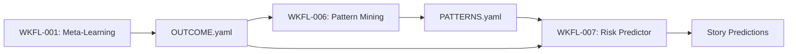

# Story Seed: WKFL-007

## Reality Context

### Baseline Status
- Loaded: No
- Date: N/A
- Gaps: No active baseline exists for workflow-learning epic. This is expected for new meta-system features.

### Relevant Existing Features

| Feature | Status | Relevance |
|---------|--------|-----------|
| Knowledge Base MCP Server | Active | WKFL-007 will query patterns via kb_search |
| OUTCOME.yaml Schema | Active | Source data for similar story analysis |
| PM Story Generation Pipeline | Active | Integration point for risk predictions |
| Pattern Mining (WKFL-006) | Pending | **BLOCKS WKFL-007** - provides pattern data |
| Story YAML Format | Active | Output target for prediction fields |

### Active In-Progress Work

| Story | Phase | Overlap Risk |
|-------|-------|--------------|
| WKFL-002 | In Progress | Low - Different domain (calibration vs prediction) |
| WKFL-003 | In Progress | Low - Different domain (heuristics vs prediction) |

### Constraints to Respect

**From Story Dependencies:**
- WKFL-007 **depends on WKFL-006** (Cross-Story Pattern Mining) for pattern data
- WKFL-006 is currently `pending` status
- **CRITICAL**: WKFL-007 cannot start until WKFL-006 completes and produces:
  - PATTERNS-{month}.yaml with file patterns, AC patterns, cycle predictors
  - AGENT-HINTS.yaml for pattern queries
  - KB entries tagged with 'pattern' for similarity search

**From Architecture:**
- KB schema uses Zod-first types
- MCP tools follow tool-handler pattern with logging, error handling
- Story generation pipeline uses YAML output format
- PM agents must follow sonnet/haiku model guidelines
- Predictions are advisory only, never blocking

**From Workflow Learning Principles (PLAN.meta.md):**
- Proposals over auto-changes: Predictions inform but don't block
- Graceful degradation: Workflow works without predictions
- Measurable impact: Track prediction accuracy for improvement

---

## Retrieved Context

### Related Pattern Mining Output (from WKFL-006)

**PATTERNS-{month}.yaml Structure:**
```yaml
mining_period:
  start: 2026-02-01
  end: 2026-02-28
stories_analyzed: 23

file_patterns:
  - pattern: "**/routes.ts"
    correlation: 0.78
    finding_type: lint_failure
    sample_size: 15

ac_patterns:
  - pattern: "intuitive|obvious|clear"
    correlation: 0.80
    finding_type: verification_failure
    sample_size: 8

cycle_predictors:
  - predictor: "files_touched > 5"
    avg_cycles: 2.8
    baseline_cycles: 1.8
    sample_size: 9
```

**AGENT-HINTS.yaml Structure:**
```yaml
hints:
  code-review-lint:
    - "routes.ts files frequently have import order issues"
  elab-analyst:
    - "Flag ACs containing 'intuitive', 'obvious', 'clear'"
    - "Stories touching >5 files likely need splitting"
```

### Related OUTCOME.yaml Schema

**Data Available for Similar Story Analysis:**
```yaml
schema_version: 1
story_id: WISH-2045
epic_id: wishlist
completed_at: 2026-02-06T15:00:00Z

phases:
  elaboration:
    cycles: 1                # Split risk indicator
  dev_implementation:
    review_cycles: 2         # Prediction target
    findings:
      code-review-security: 3
      code-review-lint: 1

totals:
  tokens_total: 230740       # Token estimate target
  review_cycles: 2

# Future: prediction accuracy tracking
predictions: null
```

### Related PM Story Generation Pipeline

**Integration Point:**
- `pm-story-generation-leader.agent.md` orchestrates story creation
- Workers produce: STORY-SEED.md, TEST-PLAN.md, DEV-FEASIBILITY.md
- Final output: `{story_id}.md` with story YAML

**Risk Predictor Integration:**
- New worker: `pm-story-risk-predictor.agent.md` (haiku model)
- Runs after STORY-SEED.md generation (has AC count context)
- Outputs prediction section merged into final story YAML
- Does NOT block story generation if prediction fails

### Similar Analysis Agents

**Existing Haiku Analysis Agents:**
- `ttdc-metrics-agent.agent.md` - Calculates time-to-dev-complete metrics
- `gap-analytics-agent.agent.md` - Analyzes story gaps and risks
- Pattern: Lightweight computation, YAML input/output, statistical analysis

**Pattern to Follow:**
- Load historical data (OUTCOME.yaml files)
- Apply statistical/heuristic analysis
- Output structured YAML with confidence scores
- Graceful degradation if insufficient data

### Reuse Candidates

**Must Reuse:**
- KB query via `kb_search` for similar stories
- OUTCOME.yaml schema for historical data
- PATTERNS-{month}.yaml from WKFL-006
- Zod-first schema validation
- Agent frontmatter pattern with haiku model

**May Create:**
- `pm-story-risk-predictor.agent.md` (new haiku worker)
- `PredictionSchema` in appropriate __types__ directory
- Prediction output format in story YAML
- Similar story finder algorithm

**Packages:**
- No new packages needed
- All logic in agent markdown
- KB queries via existing MCP tools

---

## Knowledge Context

### Lessons Learned

**From Workflow Learning Stories:**

- **[WKFL-001]** OUTCOME.yaml provides rich signal for learning
  - *Applies because*: WKFL-007 queries OUTCOME.yaml for similar story patterns

- **[WKFL-004]** KB tagging enables efficient queries
  - *Applies because*: Similar story search uses KB tags (epic, phase, complexity)

- **[WKFL-005]** Documentation sync prevents drift
  - *Applies because*: Prediction schema must be documented for maintenance

**From KB Infrastructure Stories:**

- **[KNOW-0051]** MCP tools must include Zod schemas
  - *Applies because*: Prediction output needs schema validation

- **[KNOW-0052]** Search tools require correlation IDs and timeout handling
  - *Applies because*: Similar story queries may search large datasets

**From Pattern Mining (WKFL-006 dependency):**

- **Pattern Correlation Thresholds**: Patterns with correlation > 0.65 are actionable
  - *Applies because*: Risk predictor uses pattern correlation as confidence input

- **Sample Size Minimums**: Require >= 10 stories for statistical significance
  - *Applies because*: Predictions should degrade to heuristics if insufficient data

### Blockers to Avoid (from past stories)

- **Missing Data Handling**: Don't fail when OUTCOME.yaml missing, degrade gracefully
- **Hardcoded Thresholds**: Make risk thresholds configurable, not magic numbers
- **Silent Failures**: Log prediction failures, don't silently skip
- **Over-Precision**: Avoid false precision (0.0-1.0 risk is better than 0.734829)
- **Blocking Predictions**: Never block story generation if prediction fails

### Architecture Decisions (ADRs)

**ADRs Reviewed:** 6 ADRs exist in ADR-LOG.md

**Relevant to WKFL-007:**
- **No ADRs directly constrain** - This is workflow tooling, not application architecture
- ADR-LOG.md is for application-level decisions
- Workflow learning decisions tracked separately in KB with 'wkfl' tags

### Patterns to Follow

**From PLAN.meta.md (Workflow Learning Principles):**
```yaml
# Graceful Degradation
- Predictions are optional enhancements
- Workflow works without predictor running
- Missing pattern data → fall back to heuristics
- Insufficient data → return conservative estimates
```

**From OUTCOME.yaml Format:**
```yaml
# Prediction Tracking (future)
predictions:
  split_risk: 0.3           # 0.0 = unlikely, 1.0 = likely
  review_cycles: 2          # Predicted cycle count
  token_estimate: 150000    # Predicted total tokens
  similar_stories:          # Reference stories used
    - story_id: WISH-2042
      similarity_score: 0.89
      actual_cycles: 2
```

**From Haiku Agent Pattern (ttdc-metrics-agent):**
- Lightweight statistical computation
- Read historical data from YAML files
- Apply heuristics and formulas
- Output structured YAML with confidence
- Log when data insufficient or assumptions violated

### Patterns to Avoid

- **Don't block workflow** - Predictions are advisory, not gates
- **Don't over-engineer** - Simple heuristics beat complex ML for small datasets
- **Don't ignore confidence** - Always include confidence/sample-size with predictions
- **Don't create dependencies** - Predictor should work without WKFL-006 (degraded mode)

---

## Conflict Analysis

### Conflict: Dependency Blocker

- **Severity**: warning
- **Type**: dependency_incomplete
- **Description**: WKFL-007 depends on WKFL-006 (Cross-Story Pattern Mining) which is currently in `pending` status. Pattern mining provides critical inputs:
  - PATTERNS-{month}.yaml with file patterns, AC patterns, cycle predictors
  - AGENT-HINTS.yaml for query optimization
  - KB entries tagged 'pattern' for similar story search

  Without WKFL-006 complete, WKFL-007 must either:
  1. Wait for WKFL-006 completion (recommended)
  2. Implement degraded mode with heuristic-only predictions (fallback)

- **Resolution Hint**:
  - **Recommended**: Block WKFL-007 implementation until WKFL-006 completes
  - **Alternative**: Implement WKFL-007 with fallback heuristics, test with WKFL-006 when available
  - **Integration Path**: WKFL-006 → produces patterns → WKFL-007 queries patterns → produces predictions

- **Impact**:
  - WKFL-007 can be **designed and elaborated** without WKFL-006
  - WKFL-007 **cannot be fully implemented/tested** without WKFL-006 pattern data
  - Seed can proceed with warning noted

---

## Story Seed

### Title
Story Risk Predictor

### Description

**Context:**
Before elaboration begins, PMs and analysts have limited signal about story risk. Questions like "Will this split?" or "How many review cycles?" or "What's the token budget?" rely on manual estimation without historical data. This leads to:
- Under-scoped stories requiring mid-flight splits
- Inaccurate token budgets causing overruns
- No visibility into high-risk stories before commitment

The Workflow Learning System (WKFL epic) is building a learning flywheel: stories complete → outcomes captured (WKFL-001) → patterns mined (WKFL-006) → predictions improve future stories.

**Problem:**
Without predictive signals at story generation time:
- **Split Risk Unknown**: Stories with 10+ ACs often split, but we don't flag this proactively
- **Review Cycle Variance**: Complex stories average 2.8 cycles, simple stories 1.2 cycles - but we can't predict which is which
- **Token Budget Guesswork**: Estimates are based on gut feel, not similar story actuals
- **No Learning Loop**: Pattern mining (WKFL-006) produces insights, but they're not actionable at story creation time

This creates rework, budget overruns, and missed opportunities to split high-risk stories early.

**Solution Direction:**
Build a story risk predictor agent that runs during PM story generation and outputs:

1. **Split Risk (0.0-1.0)**: Probability story will split mid-implementation
   - Based on: AC count, scope keywords, file count estimates
   - Informed by: WKFL-006 patterns (AC patterns, file patterns)
   - Example: Story with 8 ACs touching "frontend + backend + database" → 0.7 split risk

2. **Review Cycles (integer estimate)**: Expected code review iterations
   - Based on: Complexity signals, file types, domain
   - Informed by: WKFL-006 cycle predictors
   - Example: Story touching routes.ts + auth logic → 3 cycles (routes.ts has 0.78 correlation with lint failures)

3. **Token Estimate (integer)**: Predicted total token cost
   - Based on: Similar story token costs (via KB similarity search)
   - Informed by: OUTCOME.yaml from completed stories
   - Example: Similar wishlist CRUD stories averaged 180K tokens → estimate 175K-185K

4. **Similar Stories (reference array)**: Top 3-5 most similar completed stories
   - Based on: KB semantic search + epic/domain matching
   - Includes: story_id, similarity_score, actual outcomes (cycles, tokens, split)
   - Purpose: Transparency - show PM why prediction was made

**Integration:**
- Runs as haiku worker in PM story generation pipeline
- Input: STORY-SEED.md (has AC count, scope description)
- Output: Prediction YAML section merged into story file
- Advisory only: Never blocks story generation
- Tracks accuracy: Predictions vs actuals stored in OUTCOME.yaml for calibration

**Measurable Outcomes:**
- Reduce story splits by 30% (better upfront scoping)
- Improve token estimate accuracy from ±50% to ±25%
- Surface high-risk stories for PM review before elaboration

### Initial Acceptance Criteria

- [ ] AC-1: Predict split_risk (0.0-1.0) based on AC count and scope keywords
  - Parse STORY-SEED.md to count ACs
  - Extract scope keywords (frontend, backend, database, auth, etc.)
  - Apply heuristic: base_risk = (ac_count - 3) * 0.1
  - Apply pattern boost: if scope matches WKFL-006 high-split patterns, +0.2
  - Clamp to [0.0, 1.0], round to 1 decimal place
  - Output: `split_risk: 0.7`

- [ ] AC-2: Predict review_cycles based on complexity signals
  - Parse scope for complexity keywords (multi-file, cross-domain, auth, security)
  - Query WKFL-006 cycle_predictors for matching patterns
  - Apply heuristic: base_cycles = 1 (simple), +1 per complexity signal
  - Apply pattern data: if file patterns match high-cycle patterns, +1
  - Output: `review_cycles: 3`

- [ ] AC-3: Predict token_estimate based on similar stories
  - Query KB for similar stories: `kb_search({query: "{epic} {scope}", tags: ['outcome'], limit: 5})`
  - Filter to stories with OUTCOME.yaml available
  - Calculate median `totals.tokens_total` from similar stories
  - If < 3 similar stories, fall back to epic average (from all OUTCOME.yaml)
  - Output: `token_estimate: 180000`

- [ ] AC-4: Include similar_stories array for reference
  - For each similar story found in AC-3:
    - Extract story_id, similarity_score (from KB search)
    - Load OUTCOME.yaml to get actual_cycles, actual_tokens, split_occurred
  - Sort by similarity_score descending
  - Include top 3-5 stories
  - Output:
    ```yaml
    similar_stories:
      - story_id: WISH-2042
        similarity_score: 0.89
        actual_cycles: 2
        actual_tokens: 175000
        split_occurred: false
    ```

- [ ] AC-5: Track prediction accuracy for improvement
  - When OUTCOME.yaml generated (story complete), compare predictions vs actuals
  - Calculate variance: `|predicted - actual| / actual`
  - Write accuracy metrics to KB with tags: ['prediction-accuracy', 'wkfl-007']
  - Monthly report: aggregate accuracy by prediction type (split_risk, cycles, tokens)
  - Feed accuracy data back to WKFL-006 for pattern refinement

### Non-Goals

- **Pattern mining itself** - WKFL-006 provides pattern data, WKFL-007 consumes it
- **Blocking workflow** - Predictions never prevent story generation
- **Machine learning models** - Simple heuristics + similarity search sufficient
- **Real-time prediction updates** - Predictions generated once at story creation
- **Cross-project patterns** - Single-repo only (per PLAN.md)
- **Automatic story splitting** - Flag risk, don't auto-split (human decision)

### Reuse Plan

**Components:**
- KB MCP tools: `kb_search` for similar story queries
- OUTCOME.yaml from WKFL-001 for historical data
- PATTERNS-{month}.yaml from WKFL-006 for pattern correlations
- AGENT-HINTS.yaml from WKFL-006 for optimized queries

**Patterns:**
- Haiku agent pattern (lightweight analysis, YAML output)
- PM worker agent pattern (spawned by pm-story-generation-leader)
- Graceful degradation (works without WKFL-006, just less accurate)
- KB query-before-write pattern

**Packages:**
- No new packages needed
- Agent logic in `.claude/agents/pm-story-risk-predictor.agent.md`
- Schema definitions inline or in shared __types__

---

## Recommendations for Subsequent Phases

### For Test Plan Writer

**Key Testing Areas:**

1. **Split Risk Calculation:**
   - Test with varying AC counts (1, 3, 5, 8, 12 ACs)
   - Test with scope keywords (frontend-only, backend-only, full-stack)
   - Test with WKFL-006 pattern matches (should boost risk)
   - Test edge cases: 0 ACs, 50+ ACs (should clamp to [0.0, 1.0])
   - Verify output format: single decimal (0.3, not 0.34829)

2. **Review Cycles Prediction:**
   - Test with complexity signals (single-file, multi-file, auth, security)
   - Test with WKFL-006 cycle_predictors match
   - Test fallback when no patterns available
   - Verify integer output (not float)

3. **Token Estimate from Similar Stories:**
   - Test KB query with various epic/scope combinations
   - Test median calculation with 0, 1, 3, 5, 10 similar stories
   - Test fallback to epic average when < 3 similar stories
   - Test fallback to global average when no OUTCOME.yaml exists
   - Verify reasonable output (50K-500K range for typical stories)

4. **Similar Stories Array:**
   - Test similarity_score extraction from KB search results
   - Test OUTCOME.yaml loading for each similar story
   - Test handling missing OUTCOME.yaml (skip story gracefully)
   - Test sorting by similarity_score
   - Test limit to top 3-5 stories

5. **Prediction Accuracy Tracking:**
   - Test accuracy calculation: variance, absolute error
   - Test KB write with correct tags
   - Test monthly aggregation (simulate multiple completed stories)
   - Test handling when predictions missing (story created before WKFL-007)

6. **Graceful Degradation:**
   - Test without WKFL-006 patterns available (heuristic-only mode)
   - Test with KB unavailable (fall back to conservative estimates)
   - Test with no historical OUTCOME.yaml (fall back to hardcoded averages)
   - Test never blocks story generation (predictions can fail, story proceeds)

**Test Data Requirements:**
- Mock STORY-SEED.md with varying AC counts and scopes
- Mock OUTCOME.yaml files for 10+ completed stories across different epics
- Mock PATTERNS-{month}.yaml from WKFL-006
- Mock KB with semantic search results (varying similarity scores)

**Edge Cases:**
- Brand new epic with 0 historical stories
- Epic with only 1-2 completed stories (insufficient for median)
- Story with malformed STORY-SEED.md (missing ACs section)
- WKFL-006 patterns not yet generated (first run)
- KB search timeout or failure

### For UI/UX Advisor

**Not applicable** - this is a backend prediction agent with no user-facing UI.

**Optional Future Enhancement:**
- Visual indicators in story YAML display:
  - 🔴 High split risk (>0.7)
  - 🟡 Medium split risk (0.4-0.7)
  - 🟢 Low split risk (<0.4)
- Clickable similar stories links
- Prediction confidence badges

This is marked as "Optional" and is NOT required for initial implementation.

### For Dev Feasibility

**Implementation Considerations:**

1. **Agent Structure:**
   - Location: `.claude/agents/pm-story-risk-predictor.agent.md`
   - Model: haiku (lightweight computation)
   - Type: worker (spawned by pm-story-generation-leader)
   - Triggers: Part of PM story generation pipeline, after STORY-SEED.md

2. **Data Flow:**
   ```
   STORY-SEED.md (input)
     ↓
   Parse ACs, scope keywords
     ↓
   Query WKFL-006 patterns (if available)
     ↓
   Query KB for similar stories
     ↓
   Calculate predictions (split_risk, cycles, tokens)
     ↓
   Load similar story OUTCOME.yaml
     ↓
   Output prediction YAML
     ↓
   Merge into story file
   ```

3. **Prediction Algorithms:**

   **Split Risk:**
   ```javascript
   base_risk = Math.min(1.0, Math.max(0.0, (ac_count - 3) * 0.1))

   // Pattern boost from WKFL-006
   if (scope matches high-split pattern) {
     base_risk += 0.2
   }

   split_risk = Math.min(1.0, base_risk).toFixed(1)
   ```

   **Review Cycles:**
   ```javascript
   base_cycles = 1

   // Complexity signals
   if (scope includes "frontend" && "backend") base_cycles += 1
   if (scope includes "auth" || "security") base_cycles += 1
   if (scope includes "database migration") base_cycles += 1

   // Pattern boost from WKFL-006 cycle_predictors
   if (file_patterns match high-cycle patterns) base_cycles += 1

   review_cycles = Math.floor(base_cycles)
   ```

   **Token Estimate:**
   ```javascript
   similar_stories = kb_search({
     query: `${epic} ${scope_summary}`,
     tags: ['outcome'],
     limit: 10
   })

   // Load OUTCOME.yaml for each similar story
   token_values = similar_stories
     .map(s => loadOutcome(s.story_id)?.totals?.tokens_total)
     .filter(t => t != null)

   if (token_values.length >= 3) {
     token_estimate = median(token_values)
   } else if (epic_average_available) {
     token_estimate = epic_average_tokens
   } else {
     token_estimate = 150000  // Global fallback
   }
   ```

4. **KB Integration:**
   - Query: `kb_search({query: "{epic} {scope}", tags: ['outcome'], limit: 10})`
   - Similarity threshold: Use top 5 results with score > 0.70
   - Fallback: If KB unavailable, use heuristics only
   - Write accuracy: `kb_add({type: 'lesson', tags: ['prediction-accuracy', 'wkfl-007'], content: {...}})`

5. **WKFL-006 Pattern Integration:**
   - Read `PATTERNS-{month}.yaml` if exists
   - Extract relevant patterns: file_patterns, ac_patterns, cycle_predictors
   - Fallback: If WKFL-006 not run yet, use heuristics only
   - Never fail if patterns missing (degraded mode)

6. **Output Schema:**
   ```yaml
   predictions:
     split_risk: 0.7           # float [0.0, 1.0], 1 decimal
     review_cycles: 3          # integer >= 1
     token_estimate: 180000    # integer, rounded to nearest 1000
     confidence: medium        # high | medium | low (based on sample size)
     similar_stories:
       - story_id: WISH-2042
         similarity_score: 0.89
         actual_cycles: 2
         actual_tokens: 175000
         split_occurred: false
     generated_at: "2026-02-07T10:00:00Z"
     model: haiku
     wkfl_version: "007-v1"
   ```

7. **Integration with PM Pipeline:**
   - Spawned by `pm-story-generation-leader.agent.md`
   - Runs after: pm-story-seed-agent
   - Runs before: final story file write
   - Output merged into story YAML under `predictions:` section
   - Pipeline continues even if predictor fails (log warning)

8. **Error Handling:**
   - STORY-SEED.md missing → Skip prediction, log warning
   - KB unavailable → Use heuristics only, log degraded mode
   - WKFL-006 patterns missing → Use heuristics only
   - OUTCOME.yaml parsing error → Skip that story, continue with others
   - Zero similar stories → Fall back to epic/global averages
   - Invalid scope format → Conservative estimates (high risk, high cycles)

9. **Confidence Levels:**
   ```javascript
   if (similar_stories.length >= 5 && pattern_data_available) {
     confidence = 'high'
   } else if (similar_stories.length >= 3 || pattern_data_available) {
     confidence = 'medium'
   } else {
     confidence = 'low'
   }
   ```

10. **Accuracy Tracking (AC-5):**
    - Triggered when OUTCOME.yaml generated (story complete)
    - Compare `predictions.*` vs `actuals.*` from OUTCOME.yaml
    - Calculate variance: `(predicted - actual) / actual`
    - Write to KB:
      ```javascript
      kb_add_lesson({
        title: `Prediction accuracy for ${story_id}`,
        story_id: story_id,
        category: 'prediction-accuracy',
        content: {
          split_risk_predicted: 0.7,
          split_occurred: false,
          cycles_predicted: 3,
          cycles_actual: 2,
          tokens_predicted: 180000,
          tokens_actual: 175000,
          variance_cycles: 0.5,
          variance_tokens: 0.029
        },
        tags: ['prediction-accuracy', 'wkfl-007', `story:${story_id}`, 'date:2026-02']
      })
      ```

**Potential Blockers:**

1. **WKFL-006 Dependency**: Pattern mining not complete
   - **Mitigation**: Implement degraded mode (heuristics only)
   - **Testing**: Test both with and without WKFL-006 patterns

2. **Insufficient Historical Data**: New epic with < 3 completed stories
   - **Mitigation**: Fall back to global averages or conservative estimates
   - **Testing**: Test with 0, 1, 2, 5, 10+ historical stories

3. **KB Performance**: Semantic search may be slow with large datasets
   - **Mitigation**: Limit queries to 10 results, add timeout handling
   - **Testing**: Test with mock KB latency

4. **OUTCOME.yaml Schema Evolution**: Schema may change over time
   - **Mitigation**: Use safe property access (optional chaining)
   - **Testing**: Test with v1, v2 (future) OUTCOME schemas

**Effort Estimate:**

- Agent implementation: ~15k tokens
- Prediction algorithm logic: ~10k tokens
- KB integration and queries: ~8k tokens
- WKFL-006 pattern parsing: ~5k tokens
- Accuracy tracking: ~7k tokens
- Error handling and logging: ~5k tokens
- Testing fixtures and tests: ~15k tokens
- Documentation: ~5k tokens
- **Total: ~70k tokens** (matches story.yaml estimate)

---

## Additional Context

### Dependency Chain



**Blocks:**
- None - WKFL-007 is a leaf node in the dependency tree

**Blocked By:**
- WKFL-006 (Cross-Story Pattern Mining) - **CRITICAL PATH**

**Enables:**
- Better story scoping (reduce splits)
- More accurate token budgeting
- Data-driven risk assessment
- Foundation for WKFL-010 (Improvement Proposals)

### Open Questions for Elaboration

1. **Prediction Timing**: Should predictor run:
   - After STORY-SEED.md only? (less context)
   - After full PM pipeline (TEST-PLAN, DEV-FEASIBILITY)? (more context)
   - **Recommendation**: After STORY-SEED (AC count available, fast)

2. **Confidence Thresholds**: What sample sizes for high/medium/low confidence?
   - Current proposal: 5+ stories = high, 3-4 = medium, <3 = low
   - Should this be configurable per epic?

3. **Pattern Weight**: How much to weight WKFL-006 patterns vs similar stories?
   - Current: Equal weight (patterns boost heuristics, similar stories inform estimates)
   - Should patterns override heuristics if high correlation?

4. **Prediction Display**: Where in story file should predictions appear?
   - Top-level `predictions:` section? (current proposal)
   - In frontmatter `estimated_risk: 0.7`?
   - Separate PREDICTIONS.yaml file?

5. **Accuracy Feedback Loop**: How to surface prediction accuracy to PMs?
   - Monthly accuracy report? (via WKFL-006 pattern mining)
   - Real-time dashboard? (future enhancement)
   - KB query for past accuracy? (manual)

6. **Split Risk Action**: Should high split_risk trigger automatic PM review?
   - Current: Advisory only, PM decides
   - Alternative: Escalate to human if split_risk > 0.8

7. **Fallback Averages**: What global averages when no historical data?
   - Current proposal: 150K tokens, 2 cycles, 0.3 split risk
   - Should these be configurable or derived from all-time OUTCOME.yaml?

### Integration Points

**Consumed By:**
- PM story generation pipeline (predictions in story YAML)
- Elaboration analysts (use predictions for scoping decisions)
- Token budget tracking (compare predictions vs TOKEN-LOG.md)

**Consumes:**
- OUTCOME.yaml from WKFL-001 (historical outcomes)
- PATTERNS-{month}.yaml from WKFL-006 (mined patterns)
- STORY-SEED.md from pm-story-seed-agent (AC count, scope)
- KB MCP Server (similar story search)

**Output Format:**
```yaml
# Added to story YAML file
predictions:
  split_risk: 0.7
  review_cycles: 3
  token_estimate: 180000
  confidence: medium
  similar_stories:
    - story_id: WISH-2042
      similarity_score: 0.89
      actual_cycles: 2
      actual_tokens: 175000
      split_occurred: false
  generated_at: "2026-02-07T10:00:00Z"
  model: haiku
  wkfl_version: "007-v1"
```

### Success Metrics

| Metric | Baseline | Target | Measurement |
|--------|----------|--------|-------------|
| Story split rate | ~20% | <15% | Track split_risk > 0.7 stories that actually split |
| Token estimate accuracy | ±50% | ±25% | `|predicted - actual| / actual` |
| Review cycle accuracy | ±1.5 cycles | ±1 cycle | Compare predicted vs actual cycles |
| Prediction coverage | 0% | 90%+ | % of stories with predictions generated |
| Confidence calibration | Unknown | >80% | High confidence predictions are correct 80%+ |

**Monthly Review:**
- Aggregate prediction accuracy across all completed stories
- Identify systematic biases (over/under-estimation)
- Feed back to WKFL-006 for pattern refinement
- Tune heuristic weights and thresholds

---

**STORY-SEED COMPLETE WITH WARNINGS: 1 warning**

**Warning:** WKFL-007 depends on WKFL-006 (Cross-Story Pattern Mining) which is currently in `pending` status. Story can proceed to elaboration but implementation should wait for WKFL-006 completion or implement degraded mode with heuristic-only predictions.
