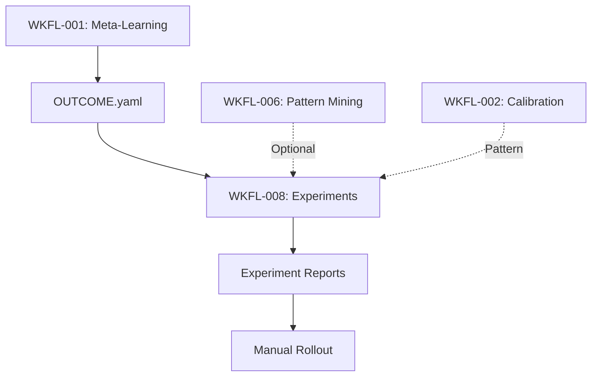

# Story Seed: WKFL-008

## Reality Context

### Baseline Status
- Loaded: No
- Date: N/A
- Gaps: No active baseline exists for workflow-learning epic. This is expected for new meta-system features.

### Relevant Existing Features

| Feature | Status | Relevance |
|---------|--------|-----------|
| OUTCOME.yaml Schema | Active (WKFL-001) | Source data for experiment metrics tracking |
| workflow-retro Agent | Active (WKFL-001) | Pattern detection foundation |
| Story Creation Flow | Active | Integration point for traffic routing |
| PM Story Generation Pipeline | Active | Story tagging mechanism |
| Pattern Mining (WKFL-006) | In Progress | Provides pattern data for experiment design |
| Calibration (WKFL-002) | Ready for QA | Provides accuracy metrics for experiments |

### Active In-Progress Work

| Story | Phase | Overlap Risk |
|-------|-------|--------------|
| WKFL-002 | Ready for QA | Low - Different domain (calibration vs experiments) |
| WKFL-006 | In Progress | Medium - Pattern mining informs experiment design |
| WKFL-003 | UAT | Low - Heuristic evolution separate from experiments |
| WKFL-005 | UAT | Low - Documentation sync |
| WKFL-007 | UAT | Low - Risk prediction separate from experiments |

### Constraints to Respect

**From Story Dependencies:**
- WKFL-008 **depends on WKFL-001** (Meta-Learning Loop) which is **completed**
- WKFL-001 provides OUTCOME.yaml with metrics needed for experiment analysis
- Cannot measure experiment impact without OUTCOME.yaml being generated

**From Architecture:**
- Zod-first types required for all schemas
- Story YAML format must support experiment_variant field
- KB schema follows established patterns
- Agent frontmatter must follow standard format
- Sonnet model for complex analysis (experiment-analyzer)

**From Workflow Learning Principles (PLAN.meta.md):**
- Proposals over auto-changes: Experiments produce recommendations, not automatic rollouts
- Graceful degradation: Workflow continues if experiment framework unavailable
- Measurable impact: All experiments tracked with statistical significance
- Minimum sample sizes: Statistical comparisons require minimum data (10+ stories per variant)

**From Existing Experiment Schema (PLAN.exec.md):**
```yaml
experiments:
  - id: exp-fast-track
    description: "Skip elaboration for trivial stories"
    enabled: true
    traffic: 0.2  # 20% of eligible stories
    eligibility:
      ac_count_max: 2
      complexity: simple
    metrics:
      - gate_pass_rate
      - cycle_time
      - rework_rate
    created_at: 2026-02-06
    created_by: WKFL-008
```

---

## Retrieved Context

### Related Endpoints
Not applicable - this is a workflow experimentation framework with no API endpoints.

### Related Components

**Existing Workflow Components:**
- `pm-story-generation-leader.agent.md` - Orchestrates story creation (traffic routing integration point)
- `pm-story-seed-agent.agent.md` - Initial story generation (eligibility check integration point)
- `dev-documentation-leader.agent.md` - Generates OUTCOME.yaml (experiment metrics source)
- `workflow-retro.agent.md` - Analyzes outcomes (experiment result consumer)

**Existing Data Structures:**
- `.claude/schemas/outcome-schema.md` - OUTCOME.yaml v1 with metrics
- `story.yaml` frontmatter - Needs experiment_variant field
- `.claude/config/` directory - Location for experiments.yaml

**Similar Analysis Agents:**
- `pattern-miner.agent.md` - Cross-story pattern detection
- `pm-story-risk-predictor.agent.md` - Statistical prediction with confidence
- `calibration-agent.agent.md` - Accuracy tracking and comparison
- Pattern: Sonnet analysis agents for complex statistical work

### Reuse Candidates

**Must Reuse:**
- OUTCOME.yaml from WKFL-001 for metrics data
- KB tools (`kb_search`, `kb_add_lesson`) for pattern storage
- Story creation flow from pm-story-generation-leader
- YAML schema patterns (Zod-first validation)
- Statistical significance patterns from calibration (WKFL-002)

**May Create:**
- `.claude/config/experiments.yaml` (experiment definitions)
- `.claude/agents/experiment-analyzer.agent.md` (sonnet worker)
- `.claude/commands/experiment-report.md` command
- `EXPERIMENT-REPORT.yaml` output schema
- Traffic routing logic in story creation

**Packages:**
- No new packages needed
- All logic in agent markdown and config files

---

## Knowledge Context

### Lessons Learned

**From Workflow Learning Stories:**

- **[WKFL-001]** OUTCOME.yaml provides comprehensive metrics for analysis
  - *Applies because*: WKFL-008 queries OUTCOME.yaml for experiment variant metrics

- **[WKFL-004]** Human feedback integration enables validation
  - *Applies because*: Experiment results should be validated against human judgment

- **[WKFL-005]** Documentation sync prevents drift
  - *Applies because*: experiments.yaml schema must be documented

- **[WKFL-006]** Pattern mining requires minimum sample sizes
  - *Applies because*: Statistical significance requires 10+ stories per variant (AC-4)

- **[WKFL-007]** Predictions need confidence levels
  - *Applies because*: Experiment recommendations need confidence based on sample size and p-values

**From Statistical Analysis Patterns:**

- **Minimum Sample Size**: Require >= 10 samples for statistical significance
  - *Applies because*: AC-4 requires minimum 10 stories per variant

- **Conservative Estimates**: Degrade gracefully with insufficient data
  - *Applies because*: Early experiments may have <10 samples

- **Transparent Confidence**: Always report sample size and p-values
  - *Applies because*: AC-5 rollout recommendations need confidence levels

### Blockers to Avoid (from past stories)

- **Premature Statistical Claims**: Don't make recommendations with insufficient data
- **Silent Failures**: Log when experiments can't be analyzed (too few samples)
- **Hardcoded Thresholds**: Make significance thresholds configurable
- **Auto-Rollout Risk**: Never auto-apply winning variants, only recommend
- **Variant Pollution**: Ensure clean traffic routing (story in only one variant or control)
- **Metrics Drift**: Handle OUTCOME.yaml schema evolution gracefully

### Architecture Decisions (ADRs)

**ADRs Reviewed:** 6 ADRs exist in ADR-LOG.md

**Relevant to WKFL-008:**
- **No ADRs directly constrain** - This is workflow tooling, not application architecture
- Workflow learning decisions tracked separately in KB with 'wkfl' tags

### Patterns to Follow

**From PLAN.meta.md (Workflow Learning Principles):**
```yaml
# Graceful Degradation
- Experiments are optional enhancements
- Workflow works without experiment framework
- Missing experiment data → skip analysis
- Insufficient samples → mark as "continue" (need more data)

# Proposals Over Auto-Changes
- Experiments produce recommendations
- Human approves rollout actions
- No automatic workflow changes
```

**From OUTCOME.yaml Format:**
```yaml
# Future: experiment tracking
experiment_variant: "exp-fast-track" | "control" | null
```

**From Statistical Analysis Pattern:**
```yaml
# Statistical Significance
- Use t-test or z-test for metric comparison
- Require p < 0.05 for significance claims
- Report confidence intervals
- Include sample sizes in all reports
```

**From Sonnet Agent Pattern (pattern-miner, workflow-retro):**
- Complex cross-story analysis
- Query historical data from YAML files
- Apply statistical analysis
- Output structured YAML with recommendations
- KB integration for persistent findings

### Patterns to Avoid

- **Don't auto-rollout** - Experiments propose, humans decide
- **Don't pollute variants** - Story can't be in multiple experiments
- **Don't ignore p-values** - Statistical significance required for claims
- **Don't skip sample size checks** - Always verify minimum sample requirements

---

## Conflict Analysis

### Conflict: Dependency Incomplete

- **Severity**: warning
- **Type**: dependency_incomplete
- **Description**: WKFL-008 depends on WKFL-001 (Meta-Learning Loop) which is **completed**. However, for meaningful experiment analysis, we need:
  - Multiple completed stories with OUTCOME.yaml (source data)
  - WKFL-006 (Pattern Mining) completion provides pattern-informed experiments
  - WKFL-002 (Calibration) provides accuracy tracking patterns

  Current state:
  - WKFL-001: ✅ Completed (OUTCOME.yaml schema exists)
  - WKFL-006: 🟡 In Progress (pattern-informed experiments pending)
  - WKFL-002: 🟡 Ready for QA (calibration patterns available)

- **Resolution Hint**:
  - **Recommended Path**: Implement WKFL-008 framework now, run first experiments after WKFL-006 completes
  - **MVP Approach**: Start with simple heuristic experiments (e.g., "AC count < 3" eligibility)
  - **Full Feature**: Enhanced experiments with pattern-based eligibility after WKFL-006

- **Impact**:
  - WKFL-008 can be **designed and implemented** immediately
  - Initial experiments can use simple heuristics
  - Pattern-informed experiments require WKFL-006 completion
  - Seed can proceed with warning noted

---

## Story Seed

### Title
Workflow Experimentation Framework

### Description

**Context:**
The Workflow Learning System captures outcomes (WKFL-001), detects patterns (WKFL-006), and calibrates confidence (WKFL-002). But we lack a mechanism to **safely test workflow variations** before rolling them out broadly. Questions like:
- "Should we skip elaboration for simple stories?" (fast-track)
- "Does parallel QA + code review reduce cycle time?" (parallel review)
- "Do pattern-based hints improve first-pass success?" (agent hints)

Currently require full commitment or manual A/B testing without metrics.

**Problem:**
Without controlled experimentation:
- **No Safe Testing**: Workflow changes apply to 100% of stories (high risk)
- **No Data-Driven Decisions**: Rollout decisions based on intuition, not metrics
- **No Controlled Rollout**: Can't gradually increase traffic to validate at scale
- **No Failure Detection**: Can't detect when experiments degrade quality metrics
- **No Winner Selection**: Can't statistically compare variants to choose best approach

This creates risk aversion (don't experiment) or reckless changes (experiment on everything).

**Solution Direction:**
Build an experimentation framework that:

1. **Define Experiments** (experiments.yaml schema):
   - Experiment ID and description
   - Traffic split (e.g., 20% of eligible stories)
   - Eligibility criteria (AC count, complexity, domain)
   - Metrics to track (primary + secondary)
   - Minimum sample size for statistical significance

2. **Tag Stories with Variants** (story.yaml):
   - During story creation, check active experiments
   - If story matches eligibility, randomly assign to variant (traffic % chance)
   - Store `experiment_variant` in story.yaml
   - Default: `experiment_variant: control` (standard workflow)

3. **Track Metrics by Variant** (OUTCOME.yaml):
   - dev-documentation-leader includes `experiment_variant` in OUTCOME.yaml
   - Metrics queryable by variant: gate_pass_rate, cycle_time, token_cost, review_cycles

4. **Statistical Comparison** (experiment-analyzer agent):
   - Query OUTCOME.yaml for all stories in experiment
   - Group by variant: treatment vs control
   - Compute metric deltas and p-values (t-test)
   - Require minimum sample size (10+ stories per variant per AC-4)
   - Output significance and confidence

5. **Rollout Recommendations** (EXPERIMENT-REPORT.yaml):
   - Action: `expand_traffic` | `rollout` | `stop` | `continue`
   - Rationale: Explain metric deltas and statistical significance
   - Confidence: Based on sample size and p-values
   - Human approval required for all actions

**Integration:**
- Story creation: pm-story-generation-leader checks experiments.yaml, assigns variant
- Outcome tracking: dev-documentation-leader includes experiment_variant in OUTCOME.yaml
- Analysis: `/experiment-report {experiment-id}` runs experiment-analyzer agent
- Rollout: Human reviews EXPERIMENT-REPORT.yaml, updates experiments.yaml (manual)

**Measurable Outcomes:**
- Enable safe testing of 3+ workflow variations by end of quarter
- Reduce rollout risk: test on 10-20% traffic before full rollout
- Data-driven decisions: statistical significance (p < 0.05) for all rollout claims
- Detect failures early: stop experiments if quality metrics degrade

### Initial Acceptance Criteria

- [ ] AC-1: Define experiments with traffic split (e.g., 20%)
  - Create `.claude/config/experiments.yaml` schema
  - Fields: id, description, status (active/paused/complete), traffic (0.0-1.0)
  - Eligibility criteria: ac_count_max, ac_count_min, complexity, domain filters
  - Metrics: primary metric + secondary metrics array
  - Minimum sample size per variant
  - Validation: traffic must be 0.0-1.0, metrics must be valid OUTCOME.yaml fields

- [ ] AC-2: Tag stories with experiment variant
  - Modify story.yaml schema to include `experiment_variant` field
  - Integration in pm-story-generation-leader (or pm-story-seed-agent):
    - Load experiments.yaml
    - For each active experiment, check eligibility (AC count, scope)
    - If eligible, random assignment: if Math.random() < traffic, assign variant
    - Only one experiment per story (first match wins)
    - Default: `experiment_variant: control` if no experiment matches
  - Output: story.yaml includes `experiment_variant: "exp-fast-track"` or `"control"`

- [ ] AC-3: Track metrics per variant (gate_pass_rate, cycle_time, etc.)
  - Modify OUTCOME.yaml schema to include `experiment_variant` field
  - Integration in dev-documentation-leader:
    - Read story.yaml for experiment_variant
    - Include in OUTCOME.yaml: `experiment_variant: "exp-fast-track"`
  - Metrics already captured in OUTCOME.yaml: gate_pass_rate, totals.duration_ms (cycle_time), totals.tokens_total, review_cycles
  - Query pattern: Load all OUTCOME.yaml where experiment_variant = {variant}

- [ ] AC-4: Statistical comparison (min 10 stories per variant)
  - Create `experiment-analyzer.agent.md` (sonnet model)
  - Input: experiment ID
  - Load experiments.yaml to get experiment definition
  - Query all stories with experiment_variant = {experiment_id} (treatment)
  - Query control stories from same time period (experiment_variant = "control")
  - Group metrics by variant
  - Compute:
    - Sample sizes (n_treatment, n_control)
    - Mean and std dev for each metric
    - Delta: (treatment_mean - control_mean)
    - p-value: two-sample t-test
  - Requirements:
    - Both variants must have >= 10 stories (per min_sample_size in experiment config)
    - If insufficient samples, output "continue" recommendation
  - Output: Statistical analysis with significance flags

- [ ] AC-5: Generate rollout recommendation
  - Based on AC-4 statistical analysis, produce recommendation
  - Actions:
    - `expand_traffic`: Primary metric maintained/improved, significant secondary improvements → increase traffic %
    - `rollout`: Primary + secondary metrics improved with high significance → make treatment default
    - `stop`: Primary metric degraded with significance → end experiment, revert to control
    - `continue`: Insufficient data (< min_sample_size) → collect more stories
  - Output: EXPERIMENT-REPORT.yaml with:
    - experiment_id, report_date
    - variants: {control: {metrics}, treatment: {metrics}}
    - analysis: {primary_metric, difference, p_value, confidence}
    - secondary_metrics: {metric: {difference, p_value, confidence}}
    - recommendation: {action, rationale, confidence}
  - Confidence levels:
    - high: p < 0.01, sample_size >= 20 per variant
    - medium: p < 0.05, sample_size >= 10 per variant
    - low: p >= 0.05 or sample_size < 10

### Non-Goals

- **Auto-rollout** - Experiments produce recommendations, humans approve rollout
- **Complex ML-based experiment design** - Simple eligibility rules sufficient (AC count, keywords)
- **Cross-project experiments** - Single-repo only (per PLAN.md scope)
- **Multi-variant experiments** - MVP supports two-arm (treatment vs control), not multi-arm
- **Real-time dashboards** - YAML reports sufficient, no UI required
- **Automatic experiment creation** - Experiments defined manually in experiments.yaml
- **Bayesian analysis** - Frequentist statistics (t-tests) sufficient for MVP

### Reuse Plan

**Components:**
- OUTCOME.yaml from WKFL-001 for metrics data
- Story creation flow from pm-story-generation-leader for variant assignment
- Statistical analysis patterns from WKFL-002 (calibration)
- KB integration for experiment results persistence

**Patterns:**
- Sonnet agent pattern for complex analysis (experiment-analyzer)
- YAML configuration pattern (.claude/config/experiments.yaml)
- Command pattern (/experiment-report)
- Schema evolution pattern (extend story.yaml, OUTCOME.yaml)

**Packages:**
- No new packages needed
- Agent logic in `.claude/agents/experiment-analyzer.agent.md`
- Schema definitions in experiments.yaml and updated schemas

---

## Recommendations for Subsequent Phases

### For Test Plan Writer

**Key Testing Areas:**

1. **Traffic Routing (AC-2):**
   - Test eligibility matching: AC count filters, complexity filters, domain filters
   - Test random assignment: verify traffic % respected (e.g., 20% → ~20 of 100 stories)
   - Test single experiment per story: first match wins, no double-assignment
   - Test control assignment: stories not matching experiments get "control"
   - Test experiments.yaml missing: default to control, log warning

2. **Variant Tagging (AC-2 & AC-3):**
   - Test story.yaml includes experiment_variant field
   - Test OUTCOME.yaml includes experiment_variant field
   - Test variant propagation: story.yaml → OUTCOME.yaml consistency
   - Test invalid variant values: reject unknown variants

3. **Metric Aggregation (AC-3):**
   - Test query all stories by variant
   - Test metrics extraction from OUTCOME.yaml (gate_pass_rate, cycle_time, tokens, review_cycles)
   - Test handling missing OUTCOME.yaml (story incomplete)
   - Test handling malformed OUTCOME.yaml (schema mismatch)

4. **Statistical Analysis (AC-4):**
   - Test sample size checks: < 10 stories → "continue" recommendation
   - Test t-test computation: known datasets with expected p-values
   - Test metric delta calculation: treatment mean - control mean
   - Test significance thresholds: p < 0.05 for medium confidence, p < 0.01 for high
   - Test edge cases: 0 variance, identical distributions, extreme outliers

5. **Rollout Recommendations (AC-5):**
   - Test expand_traffic: primary maintained, secondary improved
   - Test rollout: primary + secondary improved, high significance
   - Test stop: primary degraded significantly
   - Test continue: insufficient samples
   - Test confidence levels: sample size and p-value combinations

6. **Schema Evolution:**
   - Test backward compatibility: OUTCOME.yaml v1 without experiment_variant field
   - Test schema validation: Zod schemas reject invalid experiment configs
   - Test experiment lifecycle: active → paused → complete status transitions

**Test Data Requirements:**
- Mock experiments.yaml with 3+ experiment definitions
- Mock story.yaml files with varying AC counts and scopes
- Mock OUTCOME.yaml files for 20+ stories (10+ per variant)
- Mock statistical scenarios: significant improvements, degradations, no difference

**Edge Cases:**
- Brand new experiment with 0 completed stories
- Experiment with only control stories (no treatment assignments)
- Experiment with 9 control + 1 treatment (insufficient for t-test)
- OUTCOME.yaml with missing metrics fields
- experiments.yaml with invalid traffic values (> 1.0, < 0.0)

### For UI/UX Advisor

**Not applicable** - this is a backend experimentation framework with no user-facing UI.

**Optional Future Enhancement:**
- Visual experiment dashboard showing:
  - Active experiments with current traffic %
  - Sample size progress (10/20 stories collected)
  - Metric comparison charts (treatment vs control)
  - Recommendation confidence indicators
- Color-coded significance indicators (p-value thresholds)

This is marked as "Optional" and is NOT required for initial implementation.

### For Dev Feasibility

**Implementation Considerations:**

1. **Schema Definitions:**

   **experiments.yaml Schema:**
   ```yaml
   experiments:
     - id: string                    # Unique identifier (e.g., "exp-fast-track")
       description: string           # Human-readable description
       status: active | paused | complete
       created_at: datetime
       traffic: number               # 0.0-1.0 (e.g., 0.2 = 20%)

       eligibility:
         ac_count_max?: number       # Optional: max AC count
         ac_count_min?: number       # Optional: min AC count
         complexity?: simple | medium | complex
         domain?: string[]           # Optional: epic/domain filters

       metrics:
         primary: string             # Primary metric (e.g., "gate_pass_rate")
         secondary: string[]         # Secondary metrics (e.g., ["cycle_time", "token_cost"])

       min_sample_size: number       # Minimum stories per variant (default: 10)
   ```

   **story.yaml Extension:**
   ```yaml
   # Add to existing story.yaml frontmatter
   experiment_variant: string | null   # "exp-fast-track" | "control" | null
   ```

   **OUTCOME.yaml Extension:**
   ```yaml
   # Add to existing OUTCOME.yaml
   schema_version: 1
   experiment_variant: string | null   # Copied from story.yaml
   # ... rest of OUTCOME.yaml fields unchanged
   ```

   **EXPERIMENT-REPORT.yaml Schema:**
   ```yaml
   report_date: datetime
   experiment_id: string

   variants:
     control:
       sample_size: number
       metrics:
         gate_pass_rate: number      # Mean
         cycle_time_hours: number    # Mean
         tokens_total: number        # Mean
         review_cycles: number       # Mean

     treatment:
       sample_size: number
       metrics:
         # Same as control

   analysis:
     primary_metric: string
     difference: number              # treatment - control
     p_value: number
     confidence: high | medium | low

   secondary_metrics:
     - metric: string
       difference: number
       p_value: number
       confidence: high | medium | low

   recommendation:
     action: expand_traffic | rollout | stop | continue
     rationale: string
     confidence: high | medium | low
   ```

2. **Traffic Routing Integration:**

   **Location:** `pm-story-generation-leader.agent.md` (or delegate to pm-story-seed-agent)

   **Logic:**
   ```javascript
   // After story seed generation, before final story.yaml write

   // Load experiments config
   const experiments = loadYaml('.claude/config/experiments.yaml')
   const activeExperiments = experiments.experiments.filter(e => e.status === 'active')

   // Check eligibility and assign variant
   let experiment_variant = 'control'

   for (const exp of activeExperiments) {
     if (isEligible(story, exp.eligibility)) {
       // Random traffic routing
       if (Math.random() < exp.traffic) {
         experiment_variant = exp.id
         break  // First match wins, no double-assignment
       }
     }
   }

   // Add to story.yaml
   story.experiment_variant = experiment_variant
   ```

   **Eligibility Check:**
   ```javascript
   function isEligible(story, eligibility) {
     // AC count filter
     if (eligibility.ac_count_max && story.ac_count > eligibility.ac_count_max) {
       return false
     }
     if (eligibility.ac_count_min && story.ac_count < eligibility.ac_count_min) {
       return false
     }

     // Complexity filter (from story scope keywords)
     if (eligibility.complexity) {
       // Heuristic: complexity based on scope keywords
       // simple: single domain, < 3 ACs
       // complex: multi-domain, auth/security, > 5 ACs
       if (story.complexity !== eligibility.complexity) {
         return false
       }
     }

     // Domain filter
     if (eligibility.domain) {
       if (!eligibility.domain.includes(story.epic)) {
         return false
       }
     }

     return true
   }
   ```

3. **OUTCOME.yaml Integration:**

   **Location:** `dev-documentation-leader.agent.md`

   **Logic:**
   ```javascript
   // When generating OUTCOME.yaml

   // Read story.yaml for experiment_variant
   const story = loadYaml(`{story_dir}/story.yaml`)

   // Include in OUTCOME.yaml
   const outcome = {
     schema_version: 1,
     story_id: story.id,
     experiment_variant: story.experiment_variant || null,
     // ... rest of outcome fields
   }
   ```

4. **Experiment Analyzer Agent:**

   **Location:** `.claude/agents/experiment-analyzer.agent.md`

   **Model:** sonnet (complex statistical analysis)

   **Core Algorithm:**
   ```javascript
   // Load experiment definition
   const experiment = experiments.experiments.find(e => e.id === experiment_id)

   // Query stories by variant
   const treatmentStories = findStories(story_dir => {
     const outcome = loadOutcome(story_dir)
     return outcome?.experiment_variant === experiment_id
   })

   const controlStories = findStories(story_dir => {
     const outcome = loadOutcome(story_dir)
     const story = loadStory(story_dir)
     // Control stories from same time period
     return outcome?.experiment_variant === 'control' &&
            isInTimeRange(story.created_at, experiment.created_at)
   })

   // Check sample size
   if (treatmentStories.length < experiment.min_sample_size ||
       controlStories.length < experiment.min_sample_size) {
     return {
       recommendation: {
         action: 'continue',
         rationale: `Insufficient data: ${treatmentStories.length} treatment, ${controlStories.length} control (need ${experiment.min_sample_size}+ each)`,
         confidence: 'low'
       }
     }
   }

   // Extract metrics
   const treatmentMetrics = extractMetrics(treatmentStories, experiment.metrics)
   const controlMetrics = extractMetrics(controlStories, experiment.metrics)

   // Statistical comparison
   const primaryAnalysis = tTest(
     controlMetrics[experiment.metrics.primary],
     treatmentMetrics[experiment.metrics.primary]
   )

   const secondaryAnalyses = experiment.metrics.secondary.map(metric => ({
     metric,
     ...tTest(controlMetrics[metric], treatmentMetrics[metric])
   }))

   // Generate recommendation
   const recommendation = generateRecommendation(
     primaryAnalysis,
     secondaryAnalyses,
     treatmentStories.length
   )

   return {
     report_date: new Date().toISOString(),
     experiment_id,
     variants: {
       control: {
         sample_size: controlStories.length,
         metrics: controlMetrics
       },
       treatment: {
         sample_size: treatmentStories.length,
         metrics: treatmentMetrics
       }
     },
     analysis: primaryAnalysis,
     secondary_metrics: secondaryAnalyses,
     recommendation
   }
   ```

   **Statistical Functions:**
   ```javascript
   function tTest(controlValues, treatmentValues) {
     const controlMean = mean(controlValues)
     const treatmentMean = mean(treatmentValues)
     const controlStd = stdDev(controlValues)
     const treatmentStd = stdDev(treatmentValues)

     const n1 = controlValues.length
     const n2 = treatmentValues.length

     // Welch's t-test (unequal variances)
     const pooledStd = Math.sqrt(
       (controlStd ** 2 / n1) + (treatmentStd ** 2 / n2)
     )

     const t = (treatmentMean - controlMean) / pooledStd
     const df = n1 + n2 - 2
     const pValue = tDistribution(t, df)  // Two-tailed

     const confidence = pValue < 0.01 && n1 >= 20 && n2 >= 20 ? 'high' :
                       pValue < 0.05 && n1 >= 10 && n2 >= 10 ? 'medium' :
                       'low'

     return {
       difference: treatmentMean - controlMean,
       p_value: pValue,
       confidence
     }
   }

   function generateRecommendation(primaryAnalysis, secondaryAnalyses, sampleSize) {
     const primaryImproved = primaryAnalysis.difference > 0
     const primarySignificant = primaryAnalysis.p_value < 0.05
     const primaryMaintained = Math.abs(primaryAnalysis.difference) < 0.05  // < 5% change

     const secondaryImprovements = secondaryAnalyses.filter(
       s => s.difference < 0 && s.p_value < 0.05  // Negative = improvement for cycle_time, tokens
     ).length

     // Decision logic
     if (primaryImproved && primarySignificant) {
       return {
         action: 'rollout',
         rationale: `Primary metric improved significantly (${primaryAnalysis.difference.toFixed(2)}, p=${primaryAnalysis.p_value.toFixed(3)})`,
         confidence: primaryAnalysis.confidence
       }
     } else if (primaryMaintained && secondaryImprovements >= 1) {
       return {
         action: 'expand_traffic',
         rationale: `Primary metric maintained, ${secondaryImprovements} secondary metrics improved`,
         confidence: 'medium'
       }
     } else if (!primaryMaintained && primarySignificant && !primaryImproved) {
       return {
         action: 'stop',
         rationale: `Primary metric degraded significantly (${primaryAnalysis.difference.toFixed(2)}, p=${primaryAnalysis.p_value.toFixed(3)})`,
         confidence: primaryAnalysis.confidence
       }
     } else {
       return {
         action: 'continue',
         rationale: `No significant difference detected, collect more data`,
         confidence: 'low'
       }
     }
   }
   ```

5. **/experiment-report Command:**

   **Location:** `.claude/commands/experiment-report.md`

   **Usage:**
   ```bash
   /experiment-report exp-fast-track
   /experiment-report exp-parallel-review --output-dir plans/future/workflow-learning/experiments/
   ```

   **Flow:**
   1. Parse experiment ID from command
   2. Spawn experiment-analyzer agent
   3. Agent generates EXPERIMENT-REPORT.yaml
   4. Display summary in console
   5. Write full report to output directory

6. **Metric Extraction:**

   **From OUTCOME.yaml:**
   ```javascript
   function extractMetrics(stories, metricsConfig) {
     const metricValues = {}

     for (const metric of [metricsConfig.primary, ...metricsConfig.secondary]) {
       metricValues[metric] = stories.map(story => {
         const outcome = loadOutcome(story)

         switch (metric) {
           case 'gate_pass_rate':
             return outcome.qa_gate.verdict === 'PASS' ? 1.0 : 0.0

           case 'cycle_time':
             return outcome.totals.duration_ms / (1000 * 60 * 60)  // hours

           case 'token_cost':
             return outcome.totals.tokens_total

           case 'review_cycles':
             return outcome.totals.review_cycles

           case 'rework_rate':
             return outcome.totals.gate_attempts > 1 ? 1.0 : 0.0

           default:
             return null
         }
       }).filter(v => v !== null)
     }

     return metricValues
   }
   ```

7. **Error Handling:**

   - experiments.yaml missing → Default to no experiments (all stories "control")
   - experiments.yaml malformed → Log warning, skip experiment assignment
   - No active experiments → All stories "control"
   - OUTCOME.yaml missing for story → Skip story in analysis
   - Insufficient samples → Return "continue" recommendation
   - Invalid metric names → Log warning, skip metric in analysis

8. **Rollout Process (Manual):**

   After EXPERIMENT-REPORT.yaml shows `action: rollout`:

   1. Human reviews report
   2. Updates experiments.yaml:
      - Set experiment status to "complete"
      - Update workflow defaults to use winning variant
   3. Commit changes
   4. Archive EXPERIMENT-REPORT.yaml to experiments/ directory

   No automatic rollout mechanism.

**Potential Blockers:**

1. **Insufficient Historical Data**: Need completed stories with OUTCOME.yaml
   - **Mitigation**: Wait for 10+ completed stories before running experiments
   - **Testing**: Test with mock OUTCOME.yaml data

2. **Statistical Library Dependency**: Need t-test implementation
   - **Mitigation**: Implement basic Welch's t-test in JavaScript (no external deps)
   - **Alternative**: Use simplified z-test for large samples (n > 30)

3. **Metric Definition Ambiguity**: What counts as "cycle_time"?
   - **Mitigation**: Document metric calculations clearly in schema
   - **Testing**: Verify metrics match OUTCOME.yaml fields exactly

4. **Variant Pollution**: Story accidentally in multiple experiments
   - **Mitigation**: "First match wins" logic ensures single experiment per story
   - **Testing**: Test multiple active experiments with overlapping eligibility

**Effort Estimate:**

- experiments.yaml schema: ~5k tokens
- Traffic routing integration: ~10k tokens
- OUTCOME.yaml extension: ~3k tokens
- experiment-analyzer agent: ~25k tokens
- Statistical functions (t-test): ~8k tokens
- /experiment-report command: ~5k tokens
- EXPERIMENT-REPORT.yaml schema: ~5k tokens
- Error handling and logging: ~7k tokens
- Testing fixtures and tests: ~12k tokens
- Documentation: ~5k tokens
- **Total: ~85k tokens** (slightly over story.yaml estimate of 80k, within tolerance)

---

## Additional Context

### Dependency Chain



**Blocks:**
- None - WKFL-008 is a leaf node

**Blocked By:**
- WKFL-001 (Meta-Learning) - ✅ **COMPLETED** (dependency satisfied)

**Enables:**
- Safe workflow variation testing
- Data-driven rollout decisions
- Foundation for WKFL-010 (Improvement Proposals)

### Open Questions for Elaboration

1. **Time Period for Control Group**: How to select control stories?
   - Same calendar period as experiment? (Jan 1-31)
   - Rolling window? (Last N control stories)
   - **Recommendation**: Same calendar period (experiment.created_at to present)

2. **Experiment Lifecycle**: When to mark experiment "complete"?
   - After rollout recommendation? (manual)
   - After human approves? (manual)
   - Auto-complete after N days? (risky)
   - **Recommendation**: Manual status update after human decision

3. **Multi-Experiment Stories**: Can story be eligible for multiple experiments?
   - Current: First match wins (single experiment)
   - Alternative: Priority-based assignment
   - **Recommendation**: Stick with "first match wins" for simplicity

4. **Metric Normalization**: Should metrics be normalized (e.g., per AC)?
   - cycle_time per AC? (normalize for story size)
   - token_cost per AC? (normalize for story size)
   - **Recommendation**: Start with raw metrics, add normalized in future

5. **Experiment Archival**: Where to store completed experiment reports?
   - plans/future/workflow-learning/experiments/?
   - KB with tags?
   - Both?
   - **Recommendation**: YAML files in experiments/ + KB write for searchability

6. **Confidence Threshold for Rollout**: What confidence level required?
   - Always require "high" confidence? (conservative)
   - Allow "medium" for low-risk experiments? (pragmatic)
   - **Recommendation**: "medium" minimum, document rationale in report

7. **Fallback Statistics**: What if t-test assumptions violated?
   - Non-normal distributions? (use Mann-Whitney U test)
   - Small samples with outliers? (use median instead of mean)
   - **Recommendation**: Document assumptions, flag violations in report

### Integration Points

**Consumed By:**
- Story creation pipeline (variant assignment)
- Outcome tracking (variant propagation)
- Workflow retro (experiment-aware pattern detection)

**Consumes:**
- OUTCOME.yaml from WKFL-001 (metrics data)
- story.yaml frontmatter (variant field)
- experiments.yaml config (experiment definitions)

**Output Format:**

**experiments.yaml:**
```yaml
experiments:
  - id: exp-fast-track
    description: "Skip elaboration for trivial stories"
    status: active
    created_at: "2026-02-01T00:00:00Z"
    traffic: 0.2
    eligibility:
      ac_count_max: 2
      complexity: simple
    metrics:
      primary: gate_pass_rate
      secondary:
        - cycle_time
        - rework_rate
        - token_cost
    min_sample_size: 10
```

**EXPERIMENT-REPORT.yaml:**
```yaml
report_date: "2026-02-15T10:00:00Z"
experiment_id: exp-fast-track

variants:
  control:
    sample_size: 45
    metrics:
      gate_pass_rate: 0.82
      cycle_time_hours: 4.2
      token_cost: 156000
      review_cycles: 1.8

  treatment:
    sample_size: 12
    metrics:
      gate_pass_rate: 0.83
      cycle_time_hours: 2.8
      token_cost: 98000
      review_cycles: 1.4

analysis:
  primary_metric: gate_pass_rate
  difference: 0.01
  p_value: 0.45
  confidence: low

secondary_metrics:
  - metric: cycle_time
    difference: -1.4
    p_value: 0.02
    confidence: high

  - metric: token_cost
    difference: -58000
    p_value: 0.01
    confidence: high

recommendation:
  action: expand_traffic
  rationale: |
    Gate pass rate maintained (0.83 vs 0.82, p=0.45).
    Significant cycle time reduction (-33%, p=0.02).
    Significant token cost reduction (-37%, p=0.01).
    Recommend expanding to 50% traffic for more data.
  confidence: medium
```

### Success Metrics

| Metric | Baseline | Target | Measurement |
|--------|----------|--------|-------------|
| Experiments running | 0 | 3+ | Count active experiments in experiments.yaml |
| Stories in experiments | 0% | 20-30% | % stories with experiment_variant != "control" |
| Data-driven rollouts | 0 | 2+ | Count experiments with "rollout" recommendation |
| False positive rollouts | Unknown | <10% | % rollouts where quality degraded post-rollout |
| Experiment cycle time | N/A | <30 days | Time from experiment start to rollout decision |

**Quarterly Review:**
- Aggregate all EXPERIMENT-REPORT.yaml files
- Identify successful experiments (rollout action)
- Identify failed experiments (stop action)
- Track recommendation accuracy (were rollouts successful?)
- Feed back to experiment design process

---

**STORY-SEED COMPLETE WITH WARNINGS: 1 warning**

**Warning:** WKFL-008 depends on WKFL-001 (Meta-Learning Loop) which is **completed**, satisfying the core dependency. However, for enhanced experiments with pattern-based eligibility, WKFL-006 (Pattern Mining) should complete first. Story can proceed to elaboration and implementation with MVP heuristic-based experiments, with pattern-informed experiments as a follow-up enhancement after WKFL-006 completion.
