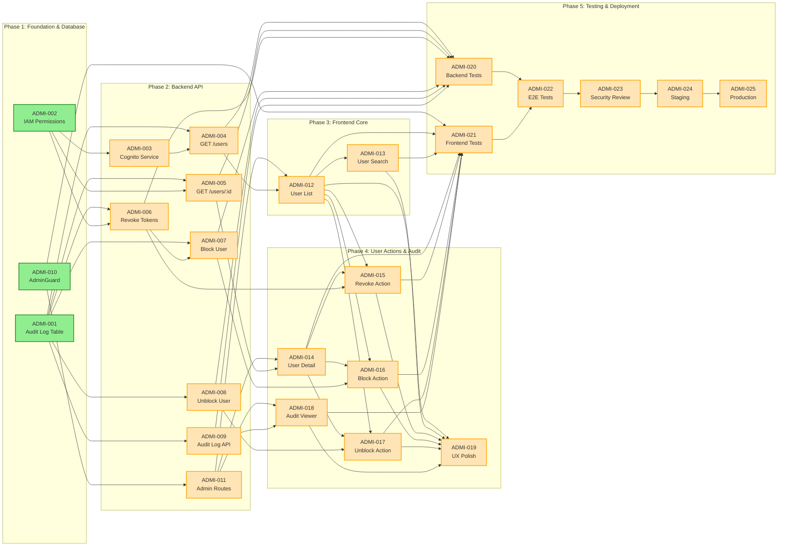

# ADMI — Story Roadmap

Visual representation of story dependencies and execution order.

---

## Dependency Graph

Shows which stories block downstream work.



**Legend:** Green = Ready to Start | Orange = Blocked (waiting for dependencies) | Blue = Done

---

## Completion Order (Gantt View)

```mermaid
gantt
    title ADMI Story Execution Order
    dateFormat X
    axisFormat %s

    section Phase 1
    ADMI-001 Audit Log    :s001, 0, 1
    ADMI-002 IAM Perms    :s002, 0, 1
    ADMI-010 AdminGuard   :s010, 0, 1

    section Phase 2a
    ADMI-003 Cognito Svc  :s003, after s002, 1
    ADMI-011 Routes       :s011, after s010, 1

    section Phase 2b
    ADMI-004 List Users   :s004, after s003 s001, 1
    ADMI-005 User Detail  :s005, after s002 s001, 1
    ADMI-006 Revoke Token :s006, after s002 s001, 1
    ADMI-008 Unblock      :s008, after s001, 1
    ADMI-009 Audit Log API :s009, after s001, 1

    section Phase 2c
    ADMI-007 Block User   :s007, after s006 s001, 1

    section Phase 3
    ADMI-012 User List UI :s012, after s011 s004, 1
    ADMI-013 Search       :s013, after s012, 1
    ADMI-014 Detail View  :s014, after s011 s005, 1

    section Phase 4
    ADMI-015 Revoke Act   :s015, after s014 s006, 1
    ADMI-016 Block Act    :s016, after s014 s007, 1
    ADMI-017 Unblock Act  :s017, after s014 s008, 1
    ADMI-018 Audit View   :s018, after s011 s009, 1
    ADMI-019 Polish       :s019, after s012 s013 s015 s016 s017 s018, 1

    section Phase 5
    ADMI-020 Backend Test :s020, after s004 s005 s006 s007 s008 s009, 1
    ADMI-021 Frontend Test :s021, after s010 s012 s013 s014 s015 s016 s017 s018, 1
    ADMI-022 E2E Test     :s022, after s020 s021, 1
    ADMI-023 Security     :s023, after s022, 1
    ADMI-024 Staging      :s024, after s023, 1
    ADMI-025 Production   :s025, after s024, 1
```



---

## Critical Path

The longest chain of dependent stories that determines minimum project duration:

```
ADMI-001 → ADMI-002 → ADMI-003 → ADMI-004 → ADMI-012 →
ADMI-013 → ADMI-019 → ADMI-020 → ADMI-021 → ADMI-022 →
ADMI-023 → ADMI-024 → ADMI-025
```

**Critical path length:** 13 stories

**Estimated minimum duration:** 2-3 weeks (assuming typical story velocity)

---

## Parallel Opportunities

Stories that can be worked simultaneously to accelerate delivery:

| Parallel Group | Stories | After | Duration |
|---|---|---|---|
| **Group 1** (Phase 1 Foundation) | ADMI-001, ADMI-002, ADMI-010 | — (Start) | Day 1 |
| **Group 2** (Phase 2a) | ADMI-003, ADMI-011 | Group 1 | Day 2 |
| **Group 3** (Phase 2b Backend) | ADMI-004, ADMI-005, ADMI-006, ADMI-008, ADMI-009 | Group 2 (ADMI-003 blocks ADMI-004, ADMI-011 blocks ADMI-014) | Days 3-5 |
| **Group 4** (Phase 2c) | ADMI-007 | Group 3 (depends on ADMI-006) | Day 6 |
| **Group 5** (Phase 3 Frontend) | ADMI-012, ADMI-013, ADMI-014, ADMI-018 | Group 3 (backend ready) | Days 7-9 |
| **Group 6** (Phase 4 Actions) | ADMI-015, ADMI-016, ADMI-017 | Group 5 | Days 10-11 |
| **Group 7** (Polish) | ADMI-019 | Group 6 | Day 12 |
| **Group 8** (Testing Parallel) | ADMI-020, ADMI-021 | Group 7 (code complete) | Days 13-14 |
| **Group 9** (E2E Testing) | ADMI-022 | Group 8 | Day 15 |
| **Group 10** (Security & Deploy) | ADMI-023 → ADMI-024 → ADMI-025 | Group 9 | Days 16-18 |

**Maximum parallelization:** 5-6 stories at peak (Phase 2b, Phase 3, or Phase 4)

---

## Risk Indicators

| Story | Risk Level | Reason | Mitigation |
|-------|---|---|---|
| ADMI-006, ADMI-007 | **High** | Cognito API failures could prevent revocation; auth middleware bypass could render blocking ineffective | Apply-level is_suspended flag as fail-safe; comprehensive auth middleware review; extensive testing |
| ADMI-003, ADMI-004, ADMI-013 | **Medium** | Cognito rate limits (60 req/sec) could cause search/listing failures under load | Client-side caching, debounced search, graceful degradation |
| ADMI-002 | **Medium** | IAM permission issues could prevent Cognito operations from working | Validate permissions in staging; document required permissions |
| ADMI-016 | **Medium** | Accidental user blocks could cause support burden | Confirmation dialogs, easy unblock, comprehensive audit trail |
| ADMI-004, ADMI-005, ADMI-007 | **Low** | Missing user_quotas records for Cognito users could cause errors | Handle gracefully; consider auto-creating records on first access |
| ADMI-009, ADMI-018 | **Low** | Large audit log could cause performance degradation | Pagination, archival strategy, database indexes |

---

## Swimlane View (by Domain)

```
Infrastructure (Phase 1)
├─ ADMI-001 (Database)
└─ ADMI-002 (IAM)

Backend Services (Phase 2)
├─ ADMI-003 (Cognito Service)
├─ ADMI-004 (User List API)
├─ ADMI-005 (User Detail API)
├─ ADMI-006 (Revoke Tokens API) ← Critical
├─ ADMI-007 (Block User API) ← Critical
├─ ADMI-008 (Unblock User API)
└─ ADMI-009 (Audit Log API)

Frontend Protection (Phase 3)
├─ ADMI-010 (AdminGuard Component)
└─ ADMI-011 (Admin Routes)

Frontend UI (Phase 3-4)
├─ ADMI-012 (User List Page) ← Critical
├─ ADMI-013 (Search Feature) ← Critical
├─ ADMI-014 (Detail Modal)
├─ ADMI-015 (Revoke Action)
├─ ADMI-016 (Block Action)
├─ ADMI-017 (Unblock Action)
└─ ADMI-018 (Audit Viewer)

Quality & Polish (Phase 4-5)
├─ ADMI-019 (Loading & Error States) ← Critical
├─ ADMI-020 (Backend Unit Tests) ← Critical
├─ ADMI-021 (Frontend Tests) ← Critical
├─ ADMI-022 (E2E Integration Tests) ← Critical
├─ ADMI-023 (Security Review) ← Critical
├─ ADMI-024 (Staging Deploy) ← Critical
└─ ADMI-025 (Production Deploy) ← Critical
```

---

## Quick Reference

| Metric | Value |
|--------|-------|
| **Total Stories** | 25 |
| **Ready to Start** | 3 (ADMI-001, ADMI-002, ADMI-010) |
| **Critical Path Length** | 13 stories |
| **Max Parallel** | 5-6 stories |
| **Phases** | 5 |
| **Backend Stories** | 9 |
| **Frontend Stories** | 10 |
| **Infrastructure Stories** | 2 |
| **Testing Stories** | 4 |
| **Estimated Duration** | 2-3 weeks |
| **Stories with Warnings** | 1 (ADMI-022 - E2E testing) |

---

## Update Log

| Date | Change | Stories Affected |
|------|--------|---|
| 2026-02-04 | Initial roadmap generation | All 25 stories |
