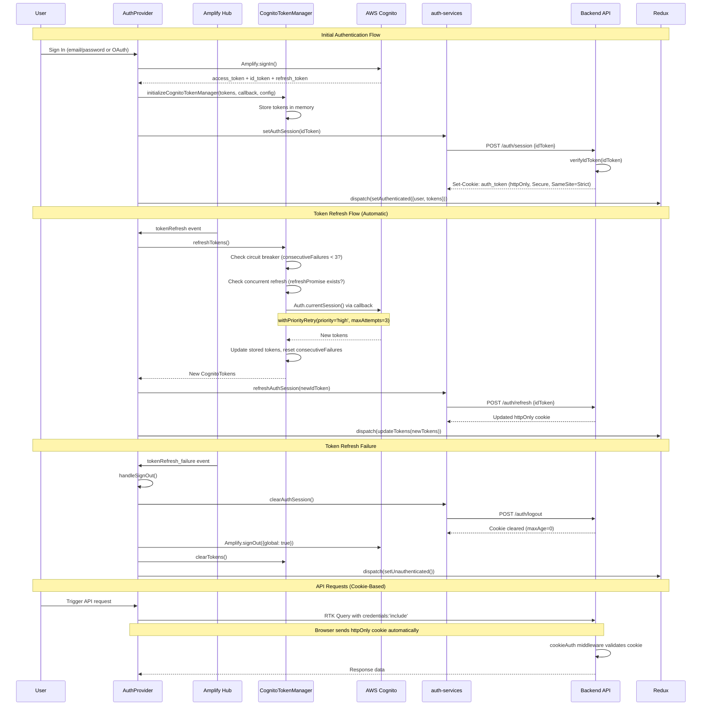
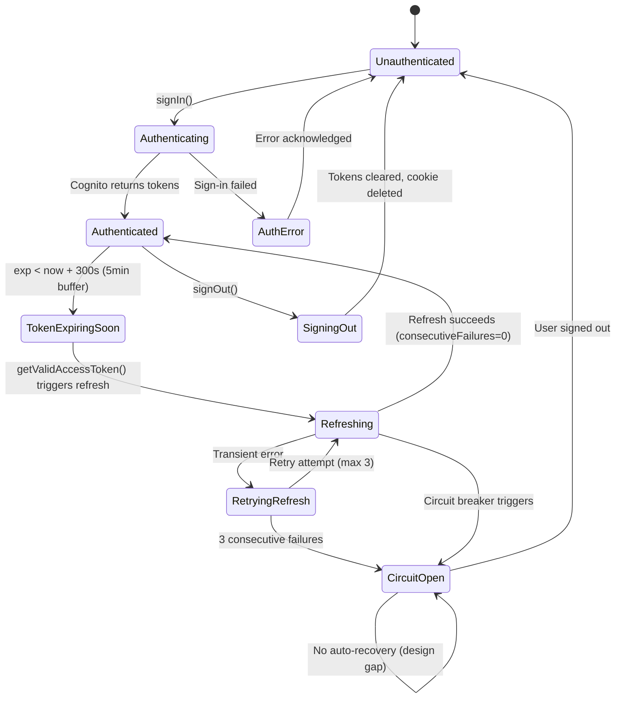

# SECURITY-REVIEW.md - BUGF-026: Auth Token Refresh Security Review

**Date:** 2026-02-11
**Author:** Security Architecture Review (Automated)
**Story:** BUGF-026
**Blocks:** BUGF-005 (Create Shared Auth Hooks Package)
**Status:** COMPLETE

---

## Table of Contents

1. [Token Refresh Architecture Documentation (AC-1)](#1-token-refresh-architecture-documentation-ac-1)
2. [Threat Model - STRIDE Methodology (AC-2)](#2-threat-model---stride-methodology-ac-2)
3. [Auth Hook Contract Specification (AC-3)](#3-auth-hook-contract-specification-ac-3)
4. [Security Acceptance Criteria for BUGF-005 (AC-4)](#4-security-acceptance-criteria-for-bugf-005-ac-4)
5. [Vulnerability Assessment (AC-5)](#5-vulnerability-assessment-ac-5)
6. [Summary and Recommendations (AC-6)](#6-summary-and-recommendations-ac-6)

---

## 1. Token Refresh Architecture Documentation (AC-1)

### 1.1 System Overview

The authentication system uses AWS Cognito as the identity provider with a multi-layer architecture:

| Layer | Component | File | Lines | Responsibility |
|-------|-----------|------|-------|----------------|
| UI | AuthProvider | `apps/web/main-app/src/services/auth/AuthProvider.tsx` | 685 | React context, Hub event handling, auth flow orchestration |
| Client | CognitoTokenManager | `packages/core/api-client/src/auth/cognito-integration.ts` | 498 | Token lifecycle, retry logic, circuit breaker, metrics |
| Client | AuthMiddleware | `packages/core/api-client/src/auth/auth-middleware.ts` | 316 | Request authentication context, token caching |
| Client | RTK Auth Integration | `packages/core/api-client/src/auth/rtk-auth-integration.ts` | 320 | Cookie-based auth for RTK Query, error handling |
| Service | Auth Session Services | `packages/core/auth-services/src/session/index.ts` | 161 | Backend httpOnly cookie synchronization |
| Hooks | useModuleAuth | `packages/core/auth-hooks/src/useModuleAuth.ts` | 147 | Module-level authorization |
| Hooks | usePermissions | `packages/core/auth-hooks/src/usePermissions.ts` | 137 | Permissions, quotas, tiers |
| Backend | Auth Routes | `apps/api/lego-api/domains/auth/routes.ts` | ~163 | Session endpoints, cookie management |
| Backend | Cookie Auth Middleware | `apps/api/lego-api/middleware/cookie-auth.ts` | ~119 | Request authentication validation |

### 1.2 Token Refresh Sequence Diagram



### 1.3 Token Lifecycle State Transitions



### 1.4 Security-Critical Decision Points

| # | Decision Point | Location | Current Behavior | Security Implication |
|---|---------------|----------|------------------|---------------------|
| 1 | When to refresh | CTM `getValidAccessToken()` | 5-minute buffer before exp | Prevents mid-request auth failures |
| 2 | When to retry | CTM `refreshTokens()` | Up to 3 retries, exponential backoff | Balances recovery vs. server load |
| 3 | When to open circuit | CTM circuit breaker | After 3 consecutive failures | Prevents cascading failures |
| 4 | When to clear tokens | CTM `refreshTokens()` catch | On ANY refresh failure | **Issue:** Too aggressive - clears on transient errors |
| 5 | When to sign out | AuthProvider Hub listener | On `tokenRefresh_failure` event | Forces re-authentication |
| 6 | When to sync cookie | AuthProvider | After login and after refresh | Keeps backend session in sync |
| 7 | When to bypass auth | Backend middleware | `AUTH_BYPASS` env var (dev only) | Development convenience |

### 1.5 Token Storage Matrix

| Token Type | Storage Location | Accessible to JS | Sent Automatically | Expiry |
|-----------|-----------------|-------------------|-------------------|--------|
| Access Token | CognitoTokenManager (memory) | Yes (in-memory) | No | 1 hour |
| ID Token | httpOnly cookie (backend) | No (httpOnly) | Yes (browser) | 1 hour |
| Refresh Token | CognitoTokenManager (memory) | Yes (in-memory) | No | 30 days |
| Session Cookie | Browser cookie store | No (httpOnly) | Yes (SameSite=Strict) | 1 hour |

### 1.6 Backend Cookie Configuration

```
Cookie Name: auth_token
httpOnly: true
secure: true (production) / false (development)
sameSite: Strict
path: /
maxAge: 3600 (1 hour)
```

**CORS Configuration:**
- Production origins: `https://lego-moc-instructions.com`
- Development origins: `http://localhost:3002`, `http://localhost:5173`
- `credentials: true` enabled
- `X-CSRF-Token` header allowed

---

## 2. Threat Model - STRIDE Methodology (AC-2)

### 2.1 Threat Model Matrix

| # | STRIDE Category | Threat | Severity | Current Mitigation | Gap? | Recommended Action |
|---|----------------|--------|----------|-------------------|------|-------------------|
| T1 | **Spoofing** | Forged JWT tokens | High | Cognito signature verification (backend) | No | None needed |
| T2 | **Spoofing** | Client-side JWT decode without signature verification | Medium | Comment: "client-side only, not for security" | Minor | Add JSDoc warnings on decode methods |
| T3 | **Spoofing** | Token replay attack | Low | Short-lived tokens (1hr), HTTPS, httpOnly cookies | No | Document token rotation strategy |
| T4 | **Tampering** | Cookie manipulation | Low | httpOnly + SameSite=Strict + Secure (prod) | No | None needed |
| T5 | **Tampering** | ID token modification in POST body | Medium | HTTPS required, backend validates signature | No | Add HTTPS enforcement check |
| T6 | **Tampering** | CSRF on session endpoints | Medium | SameSite=Strict cookies | Minor | Enable optional X-CSRF-Token enforcement |
| T7 | **Tampering** | Redux state manipulation via XSS | Medium | No localStorage, tokens in memory | Minor | Add CSP headers |
| T8 | **Repudiation** | Session operations without audit trail | Medium | Logger integration, Hub event logging | Yes | Add session ID to all session operation logs |
| T9 | **Repudiation** | Token refresh without timestamps | Low | Metrics track counts but not timestamps | Minor | Add timestamps to refresh metrics |
| T10 | **Info Disclosure** | Raw Amplify error messages to users | Medium | Partial error mapping implemented | Yes | Create centralized error sanitization utility |
| T11 | **Info Disclosure** | Access token payload readable by JS | Low | By design (JWT claims), backend validates | No | Document as accepted risk |
| T12 | **Info Disclosure** | Email in sessionStorage during verification | Low | sessionStorage cleared on tab close | Minor | Clear immediately after use |
| T13 | **DoS** | Circuit breaker stuck open permanently | High | None - no auto-recovery mechanism | **Yes** | Implement HALF_OPEN state with timeout |
| T14 | **DoS** | Token refresh bombing | Medium | Concurrent refresh prevention | Minor | Add global rate limiting |
| T15 | **DoS** | Excessive failed sign-in attempts | Medium | Cognito rate limiting (backend) | No | Add frontend exponential backoff |
| T16 | **DoS** | Auth cache stale after logout | Medium | `clearAuthCache()` called on logout | No | None needed |
| T17 | **Elevation** | Role claims modified in memory | Medium | Backend validates roles on every request | No | None needed (if backend enforces) |
| T18 | **Elevation** | Admin flag derivation from API | Low | Server-side permission check | No | Verify backend validates admin on sensitive ops |
| T19 | **Elevation** | Suspended user bypass | Low | Both useModuleAuth and usePermissions check | No | None needed |

### 2.2 Severity Distribution

```
Critical: 0
High:     2 (T1-mitigated, T13-gap)
Medium:   10 (T2, T5, T6, T7, T8, T10, T14, T15, T17)
Low:      7 (T3, T4, T9, T11, T12, T16, T18, T19)
```

### 2.3 Identified Gaps Requiring Action

| Priority | Threat | Gap Description | Recommended Fix | Effort |
|----------|--------|----------------|-----------------|--------|
| **HIGH** | T13 | Circuit breaker has no recovery mechanism | Implement CLOSED/OPEN/HALF_OPEN state machine with 30s timeout | 2-3 hours |
| **HIGH** | T10 | Raw Amplify errors reach users | Create centralized error mapper utility | 2-3 hours |
| **MEDIUM** | T8 | Session audit logging incomplete | Add session IDs and user IDs to all session operation logs | 1-2 hours |
| **MEDIUM** | T6 | CSRF token enforcement disabled | Enable X-CSRF-Token for session mutation endpoints | 2-3 hours |
| **MEDIUM** | T14 | No global rate limiting on refresh | Add max-requests-per-minute for auth operations | 2-3 hours |
| **LOW** | T2 | Client-side JWT decode lacks warnings | Add JSDoc security annotations | 30 min |
| **LOW** | T9 | Missing timestamps in refresh metrics | Add lastRefreshTimestamp to metrics | 30 min |

### 2.4 Existing Security Mitigations (Strengths)

1. **httpOnly Cookies** - Session cookie inaccessible to JavaScript, preventing XSS token theft
2. **SameSite=Strict** - Prevents CSRF by blocking cross-origin cookie sending
3. **No localStorage** - Tokens stored only in memory, reducing XSS attack surface
4. **Circuit Breaker** - Prevents cascading auth failures (though needs recovery mechanism)
5. **Concurrent Refresh Prevention** - `refreshPromise` pattern prevents thundering herd
6. **Token Expiration Buffer** - 5-minute buffer prevents mid-request auth failures
7. **Zod Schema Validation** - Response integrity validation on session endpoints
8. **Non-Retryable Status Codes** - 401/403/404 immediately surfaced, preventing auth retry loops
9. **Backend Token Verification** - Cognito signature verification on every request
10. **CORS with Explicit Origins** - No wildcard CORS in production

---

## 3. Auth Hook Contract Specification (AC-3)

### 3.1 Current Auth Hook Interface

The shared auth hooks package (`@repo/auth-hooks`) currently exports two hooks:

#### useModuleAuth

```typescript
import { z } from 'zod'

// Auth hook return type
const ModuleAuthResultSchema = z.object({
  /** Whether the user has basic access (authenticated, not suspended) */
  hasAccess: z.boolean(),
  /** Whether the user can edit resources (admin or authenticated, not suspended) */
  canEdit: z.boolean(),
  /** Whether the user can delete resources (admin only) */
  canDelete: z.boolean(),
  /** Check if user has a specific permission */
  hasPermission: z.function()
    .args(z.string())
    .returns(z.boolean()),
  /** Trigger permission refetch */
  refreshAuth: z.function()
    .returns(z.void()),
  /** Whether permissions are still loading */
  isLoading: z.boolean(),
  /** Whether the user is an admin */
  isAdmin: z.boolean(),
})

type ModuleAuthResult = z.infer<typeof ModuleAuthResultSchema>
```

#### usePermissions

```typescript
const PermissionsResultSchema = z.object({
  /** Full permissions object from API */
  permissions: z.object({
    isAdmin: z.boolean(),
    isSuspended: z.boolean(),
    tier: z.string(),
    features: z.array(z.string()),
    quotas: z.record(z.string(), z.object({
      used: z.number(),
      limit: z.number(),
      remaining: z.number(),
    })),
  }).nullable(),
  /** Loading state */
  isLoading: z.boolean(),
  /** Error state */
  error: z.unknown().optional(),
  /** Refetch permissions */
  refetch: z.function().returns(z.void()),
})

type PermissionsResult = z.infer<typeof PermissionsResultSchema>
```

### 3.2 Auth Hook Contract for BUGF-005 Consolidation

When consolidating auth hooks into `@repo/auth-hooks`, the following contract MUST be maintained:

#### Security Boundaries

```
+--------------------------------------------------+
|  @repo/auth-hooks (Shared Package)                |
|                                                    |
|  MUST:                                             |
|  - Read auth state from Redux store               |
|  - Read permissions from RTK Query cache          |
|  - Provide derived boolean states (hasAccess,     |
|    canEdit, canDelete, isAdmin)                   |
|  - Default to DENY (false) for all permissions    |
|    when state is loading or missing               |
|  - Block suspended users from all access          |
|                                                    |
|  MUST NOT:                                         |
|  - Store, cache, or manage tokens directly        |
|  - Make auth API calls (login, refresh, logout)   |
|  - Access CognitoTokenManager directly            |
|  - Modify auth state (only read)                  |
|  - Trust client-side role claims for authorization|
|  - Use localStorage or sessionStorage for auth    |
|                                                    |
|  DELEGATES TO:                                     |
|  - AuthProvider: Token management, Hub events     |
|  - CognitoTokenManager: Token refresh, circuit    |
|    breaker, retry logic                           |
|  - auth-services: Backend session sync            |
|  - Backend: All authorization decisions           |
+--------------------------------------------------+
```

#### State Synchronization Requirements

1. **Single Source of Truth**: Redux store `auth` slice is the single source of auth state
2. **No Local State**: Auth hooks MUST NOT maintain local state for authentication (use `useMemo` for derived values only)
3. **Permission Refresh**: `refreshAuth()` / `refetch()` must trigger RTK Query refetch, not local state update
4. **Error Propagation**: Auth errors must be surfaced via the hook, not silently swallowed
5. **Loading States**: All hooks must expose loading state; consumers must handle loading gracefully

#### Error Handling and Fallback Behavior

```typescript
// Required error handling pattern for auth hooks
const useModuleAuth = (): ModuleAuthResult => {
  const { permissions, isLoading, error } = usePermissions()

  // SECURITY: Default to DENY while loading or on error
  if (isLoading || error || !permissions) {
    return {
      hasAccess: false,
      canEdit: false,
      canDelete: false,
      hasPermission: () => false,
      refreshAuth: () => {},
      isLoading,
      isAdmin: false,
    }
  }

  // SECURITY: Always check suspended status first
  if (permissions.isSuspended) {
    return {
      hasAccess: false,
      canEdit: false,
      canDelete: false,
      hasPermission: () => false,
      refreshAuth: refetch,
      isLoading: false,
      isAdmin: false,
    }
  }

  // Normal permission derivation
  // ...
}
```

### 3.3 Usage Patterns for Consuming Apps

```typescript
// CORRECT: Import from shared package
import { useModuleAuth, usePermissions } from '@repo/auth-hooks'

// In component
function ProtectedComponent() {
  const { hasAccess, canEdit, canDelete, isLoading } = useModuleAuth()

  // CORRECT: Handle loading state
  if (isLoading) return <Skeleton />

  // CORRECT: Check access before rendering
  if (!hasAccess) return <Unauthorized />

  return (
    <div>
      {canEdit && <EditButton />}
      {canDelete && <DeleteButton />}
    </div>
  )
}
```

```typescript
// WRONG: Do not import auth hooks from individual apps
// These stubs will be REMOVED by BUGF-005
import { useModuleAuth } from '../hooks/use-module-auth'  // REMOVE
```

### 3.4 Cross-App State Isolation

Each app (`main-app`, `app-dashboard`, `app-inspiration-gallery`, etc.) shares the same Redux store and RTK Query cache within its runtime. The shared hooks read from this shared state.

**Key constraint:** Auth hooks must NOT create per-app auth state. All 6 apps must see identical auth state from the same Redux store instance.

---

## 4. Security Acceptance Criteria for BUGF-005 (AC-4)

### 4.1 Required Security Tests

BUGF-005 implementation MUST include the following tests before merging:

#### Unit Tests (Required)

| # | Test | Description | File Target |
|---|------|-------------|-------------|
| ST-1 | Default deny on loading | `useModuleAuth` returns `false` for all permissions while loading | `@repo/auth-hooks/src/__tests__/useModuleAuth.test.tsx` |
| ST-2 | Default deny on error | `useModuleAuth` returns `false` for all permissions on API error | Same |
| ST-3 | Suspended user blocked | All permission checks return `false` for suspended users | Same |
| ST-4 | Admin bypass works | Admin users get `true` for all permission checks | Same |
| ST-5 | Feature-based permissions | `hasPermission()` correctly checks feature list | Same |
| ST-6 | Delete restricted to admin | `canDelete` returns `false` for non-admin users | Same |
| ST-7 | Permission refetch | `refreshAuth()` triggers RTK Query refetch | Same |
| ST-8 | No token access | Verify hooks do not import or reference CognitoTokenManager | Code review |

#### Integration Tests (Required)

| # | Test | Description |
|---|------|-------------|
| IT-1 | Auth state propagation | Verify auth state changes in Redux are reflected in hook output |
| IT-2 | Concurrent permission checks | Multiple components using `useModuleAuth` see consistent state |
| IT-3 | Permission refetch after token refresh | After token refresh event, permissions are re-fetched |
| IT-4 | Logout clears all auth state | After logout, all hooks return unauthenticated state |

#### E2E Tests (Required)

| # | Test | Description |
|---|------|-------------|
| E2E-1 | Login flow with permissions | User logs in and sees correct permission-gated UI |
| E2E-2 | Session expiry handling | After session expires, user is redirected to login |
| E2E-3 | Cross-app permission consistency | Same user sees same permissions across all 6 apps |

### 4.2 Security Integration Test Scenarios

These scenarios test token refresh edge cases that BUGF-005 must not break:

```typescript
// Scenario 1: Concurrent refresh from multiple components
it('should not trigger multiple concurrent token refreshes', async () => {
  // Setup: 3 components calling useModuleAuth simultaneously
  // When: All 3 trigger refreshAuth()
  // Then: Only 1 actual API call is made (via RTK Query dedup)
})

// Scenario 2: Circuit breaker does not affect permission reads
it('should still read cached permissions when circuit breaker is open', async () => {
  // Setup: Token refresh fails 3 times (circuit breaker opens)
  // When: useModuleAuth is called
  // Then: Returns last known permissions from cache (not default deny)
})

// Scenario 3: Token expiration race condition
it('should handle permission check during token refresh', async () => {
  // Setup: Token is expiring (within 5-minute buffer)
  // When: useModuleAuth is called during refresh
  // Then: Returns current permissions (not loading state)
})
```

### 4.3 Rollback Criteria

BUGF-005 implementation MUST be rolled back if ANY of the following occur:

1. **Auth state leak**: Any app sees a different user's auth state
2. **Permission escalation**: Non-admin users gain admin access after consolidation
3. **Session instability**: Token refresh failures increase by > 10% after deployment
4. **XSS vector introduced**: Any new localStorage/sessionStorage usage for auth data
5. **CSRF regression**: Any change to cookie security attributes (httpOnly, SameSite, Secure)
6. **Auth bypass**: Any path that allows unauthenticated access to protected resources

### 4.4 Definition of Done for BUGF-005 Security Requirements

- [ ] All 8 unit tests (ST-1 through ST-8) pass
- [ ] All 4 integration tests (IT-1 through IT-4) pass
- [ ] All 3 E2E tests (E2E-1 through E2E-3) pass
- [ ] No new `localStorage` or `sessionStorage` usage for auth data
- [ ] Auth hooks do not import or reference `CognitoTokenManager` directly
- [ ] Auth hooks default to DENY (false) when state is loading, error, or missing
- [ ] Suspended user check is present in consolidated hook
- [ ] No token values logged in any new code
- [ ] Code review confirms no new security vulnerabilities
- [ ] 6 per-app `use-module-auth.ts` stubs are deleted
- [ ] All consuming apps updated to import from `@repo/auth-hooks`
- [ ] Auth state is consistent across all 6 apps using the same Redux store

---

## 5. Vulnerability Assessment (AC-5)

### 5.1 Findings Summary

| # | Finding | Severity | STRIDE | Component | Mitigation Status |
|---|---------|----------|--------|-----------|------------------|
| V1 | Circuit breaker has no recovery mechanism | **High** | DoS | CognitoTokenManager | Not mitigated |
| V2 | Tokens cleared on ANY refresh failure | **High** | DoS | CognitoTokenManager | Not mitigated |
| V3 | JWT base64url decoding inconsistency | **Medium** | Tampering | CognitoTokenManager | Not mitigated |
| V4 | CSRF token enforcement disabled by default | **Medium** | Tampering | RTK Auth Integration | Partially mitigated (SameSite=Strict) |
| V5 | Raw Amplify error messages reach users | **Medium** | Info Disclosure | AuthProvider | Partially mitigated |
| V6 | No frontend rate limiting on auth operations | **Medium** | DoS | AuthProvider | Backend handles via Cognito |
| V7 | Session audit logging incomplete | **Medium** | Repudiation | auth-services | Partially mitigated |
| V8 | Auth cache TTL potentially stale (5 min) | **Low** | DoS | AuthMiddleware | Mitigated on logout |
| V9 | Client-side JWT decode without signature | **Low** | Spoofing | CognitoTokenManager | Mitigated (comments + backend validates) |
| V10 | Interface types instead of Zod schemas in CognitoTokenManager | **Low** | Code Quality | CognitoTokenManager | Not mitigated |

### 5.2 Detailed Findings

#### V1: Circuit Breaker Has No Recovery Mechanism (HIGH)

**Location:** `packages/core/api-client/src/auth/cognito-integration.ts`, lines 238-244

**Description:** After 3 consecutive token refresh failures, the circuit breaker opens and stays open permanently. There is no `HALF_OPEN` state transition or timeout-based recovery. Users become permanently stuck in a failed auth state.

**Current code:**
```typescript
if (this.config.enableCircuitBreaker && this.metrics.consecutiveFailures >= 3) {
  logger.warn('Token refresh circuit breaker open, skipping refresh attempt')
  return undefined
}
```

**Impact:** Once triggered (e.g., by a temporary network outage), users cannot recover without a full page refresh or re-login. This creates a denial-of-service condition for legitimate users.

**Note:** The `retry-logic.ts` module in the same package has a proper three-state circuit breaker (CLOSED/OPEN/HALF_OPEN) with a 30-second recovery timeout. The CognitoTokenManager does not use this implementation.

**Recommended Mitigation:**
- Implement CLOSED/OPEN/HALF_OPEN state machine matching `retry-logic.ts`
- Add 30-second timeout for OPEN -> HALF_OPEN transition
- Allow one probe request in HALF_OPEN state
- Reset to CLOSED on successful probe

**Effort:** 2-3 hours
**Blocking BUGF-005?** No - but should be addressed before or alongside BUGF-005.

---

#### V2: Tokens Cleared on Any Refresh Failure (HIGH)

**Location:** `packages/core/api-client/src/auth/cognito-integration.ts`, lines 174-191

**Description:** When `refreshTokens()` fails for ANY reason (including transient network errors), `this.clearTokens()` is called immediately. This means a temporary network blip causes total token loss, forcing re-authentication.

**Current code:**
```typescript
catch (error) {
  this.metrics.failedRefreshes++
  this.metrics.consecutiveFailures++
  logger.error('Token refresh failed', error, {...})
  this.clearTokens()  // Clears ALL tokens on any failure
  throw error
}
```

**Impact:** Transient network issues cause unnecessary logouts. Users lose their session state even when the error would resolve on retry.

**Recommended Mitigation:**
- Only clear tokens on non-retryable errors (401, 403)
- Keep tokens for transient errors (network timeout, 5xx)
- Clear tokens only after circuit breaker opens

**Effort:** 1-2 hours
**Blocking BUGF-005?** No - but impacts user experience.

---

#### V3: JWT Base64url Decoding Inconsistency (MEDIUM)

**Location:** `packages/core/api-client/src/auth/cognito-integration.ts`, lines 258, 294

**Description:** JWT tokens use base64url encoding (with `-` and `_` instead of `+` and `/`). The `isTokenExpiredOrExpiringSoon()` and `decodeToken()` methods use `atob()` directly without converting from base64url to base64.

**Current code (cognito-integration.ts):**
```typescript
const payload = JSON.parse(atob(token.split('.')[1]))
```

**Correct code (auth-utils/src/jwt/index.ts):**
```typescript
const base64 = payloadBase64.replace(/-/g, '+').replace(/_/g, '/')
const payload = JSON.parse(atob(base64))
```

**Impact:** Tokens containing URL-safe characters may fail to decode, causing false expiration detection and unnecessary refresh cycles.

**Recommended Mitigation:**
- Use the `decodeJwtPayload()` function from `@repo/auth-utils` instead of inline decoding
- Or add base64url-to-base64 conversion before `atob()`

**Effort:** 30 minutes
**Blocking BUGF-005?** No.

---

#### V4: CSRF Token Enforcement Disabled (MEDIUM)

**Location:** `packages/core/api-client/src/auth/rtk-auth-integration.ts`, config

**Description:** CSRF token support is feature-flagged and disabled by default (`enableCsrf: false`). While `SameSite=Strict` cookies provide strong CSRF protection, enabling the X-CSRF-Token header would add defense-in-depth.

**Impact:** If `SameSite` enforcement is relaxed (e.g., to `Lax` for SSO), CSRF protection would be lost. The framework is ready but not enabled.

**Recommended Mitigation:**
- Enable CSRF token enforcement for session mutation endpoints
- Generate CSRF token on page load, include in meta tag
- Validate X-CSRF-Token header on backend for POST/PUT/DELETE

**Effort:** 2-3 hours
**Blocking BUGF-005?** No.

---

#### V5: Raw Amplify Error Messages Reach Users (MEDIUM)

**Location:** `apps/web/main-app/src/services/auth/AuthProvider.tsx`, various error handlers

**Description:** Some Amplify error handlers map errors to user-friendly messages (good), but the fallback for unknown errors returns `error.message` directly, which may contain internal implementation details.

**Example (good):**
```typescript
if (error.name === 'CodeMismatchException') {
  errorMessage = 'Invalid verification code. Please check and try again.'
}
```

**Example (risky):**
```typescript
} else if (error.message) {
  errorMessage = error.message  // May contain internal details
}
```

**Recommended Mitigation:**
- Create centralized error mapper that whitelists known error types
- Default to generic message for unknown errors

**Effort:** 2-3 hours
**Blocking BUGF-005?** No.

---

#### V6: No Frontend Rate Limiting on Auth Operations (MEDIUM)

**Location:** `apps/web/main-app/src/services/auth/AuthProvider.tsx`

**Description:** `handleSignIn()`, `handleSignUp()`, and `confirmSignUp()` have no frontend rate limiting. While Cognito enforces rate limits server-side, this creates unnecessary load and poor UX when users rapidly retry.

**Recommended Mitigation:**
- Implement exponential backoff after N failed attempts (disable button, show cooldown)
- Frontend rate limit: max 5 attempts per minute

**Effort:** 2-3 hours
**Blocking BUGF-005?** No.

---

#### V7: Session Audit Logging Incomplete (MEDIUM)

**Location:** `packages/core/auth-services/src/session/index.ts`

**Description:** Session operations (`setAuthSession`, `refreshAuthSession`, `clearAuthSession`) log success/failure but do not include session identifiers or user IDs, making it difficult to trace session lifecycle in production.

**Recommended Mitigation:**
- Include user ID and session ID in all session operation logs
- Log timestamps for session creation, refresh, and revocation

**Effort:** 1-2 hours
**Blocking BUGF-005?** No.

---

#### V8-V10: Low Severity Findings

| # | Finding | Location | Recommendation |
|---|---------|----------|---------------|
| V8 | Auth cache TTL 5 minutes, stale after logout | auth-middleware.ts | Already mitigated by `clearAuthCache()` on logout |
| V9 | Client-side JWT decode without signature | cognito-integration.ts | Already documented as "not for security", add JSDoc |
| V10 | TypeScript interfaces instead of Zod | cognito-integration.ts | Should use Zod per CLAUDE.md, address in BUGF-005 |

### 5.3 Test Coverage Gaps

| Component | Current Coverage | Security-Critical Gaps |
|-----------|-----------------|----------------------|
| AuthProvider.tsx | **Tests SKIPPED** | Hub event handling, token refresh flow, session sync |
| CognitoTokenManager | Partial (15 tests) | Circuit breaker recovery, concurrent refresh, expiration buffer edge cases |
| auth-services session | Not found | Session create/refresh/clear error handling |
| useModuleAuth | Good (244 lines) | No security-specific tests |
| JWT utilities (auth-utils) | Good (431 lines) | Good coverage |
| Backend auth routes | Good | Cookie flags, token validation |

**Critical Gap:** AuthProvider.test.tsx has ALL tests marked as `it.skip()` due to Hub.listen mocking issues. This means the core auth orchestration logic is completely untested.

---

## 6. Summary and Recommendations (AC-6)

### 6.1 Overall Security Posture

The authentication system demonstrates **good security fundamentals** with several areas needing improvement:

**Strengths:**
- httpOnly cookies with SameSite=Strict (prevents XSS token theft and CSRF)
- No localStorage/sessionStorage for tokens (reduces XSS attack surface)
- Backend token verification via Cognito (server-side signature validation)
- Circuit breaker pattern (prevents cascading failures, though needs recovery)
- Concurrent refresh prevention (prevents thundering herd)
- Zod schema validation (response integrity)
- Cookie-based auth over RTK Query (no Bearer tokens in JS)

**Weaknesses:**
- Circuit breaker has no recovery mechanism (V1 - HIGH)
- Tokens cleared too aggressively on transient errors (V2 - HIGH)
- JWT decoding inconsistency between packages (V3 - MEDIUM)
- CSRF token enforcement disabled (V4 - MEDIUM)
- AuthProvider tests completely skipped (critical coverage gap)

### 6.2 Recommendations by Priority

#### Before BUGF-005 (Blocking or Strongly Recommended)

| # | Action | Severity | Effort | Rationale |
|---|--------|----------|--------|-----------|
| R1 | Define auth hook contract with Zod schemas | Required | 2-3 hrs | BUGF-005 needs clear contract |
| R2 | Ensure default-deny pattern in shared hooks | Required | 1 hr | Security requirement for consolidation |
| R3 | Verify all 6 app stubs match contract | Required | 1 hr | Ensure no app-specific auth logic lost |
| R4 | Create security test suite for BUGF-005 | Required | 4-6 hrs | See Section 4 acceptance criteria |

#### Alongside BUGF-005 (High Priority)

| # | Action | Severity | Effort | Rationale |
|---|--------|----------|--------|-----------|
| R5 | Fix circuit breaker recovery (V1) | High | 2-3 hrs | Prevents permanent auth lockout |
| R6 | Fix token clearing on transient errors (V2) | High | 1-2 hrs | Prevents unnecessary logouts |
| R7 | Fix JWT base64url decoding (V3) | Medium | 30 min | Prevents false expiration detection |

#### After BUGF-005 (Follow-up)

| # | Action | Severity | Effort | Rationale |
|---|--------|----------|--------|-----------|
| R8 | Enable CSRF token enforcement (V4) | Medium | 2-3 hrs | Defense-in-depth |
| R9 | Create error sanitization utility (V5) | Medium | 2-3 hrs | Information disclosure prevention |
| R10 | Add frontend auth rate limiting (V6) | Medium | 2-3 hrs | DoS prevention |
| R11 | Improve session audit logging (V7) | Medium | 1-2 hrs | Repudiation prevention |
| R12 | Fix AuthProvider.test.tsx skipped tests | Medium | 4-6 hrs | Critical coverage gap |
| R13 | Add CSP headers | Low | 1-2 hrs | XSS defense-in-depth |

### 6.3 BUGF-005 Unblocking Decision

**Verdict: BUGF-005 is UNBLOCKED with conditions.**

SEC-002 ("Auth hook consolidation must not consolidate auth state unsafely") is addressed by:

1. **Auth hook contract** (Section 3) defines clear security boundaries
2. **Security acceptance criteria** (Section 4) provide measurable test requirements
3. **Vulnerability assessment** (Section 5) identifies no blocking vulnerabilities in the auth hook layer itself

**Conditions:**
- BUGF-005 MUST implement all security tests defined in Section 4.1
- BUGF-005 MUST follow the auth hook contract in Section 3.2
- BUGF-005 MUST meet the Definition of Done in Section 4.4
- V1 (circuit breaker) and V2 (token clearing) SHOULD be addressed alongside BUGF-005 but are not blocking

### 6.4 Files Reviewed

| File | Lines | Review Depth |
|------|-------|-------------|
| `apps/web/main-app/src/services/auth/AuthProvider.tsx` | 685 | Full |
| `packages/core/api-client/src/auth/cognito-integration.ts` | 498 | Full |
| `packages/core/api-client/src/auth/auth-middleware.ts` | 316 | Full |
| `packages/core/api-client/src/auth/rtk-auth-integration.ts` | 320 | Full |
| `packages/core/api-client/src/retry/retry-logic.ts` | 520 | Security-relevant sections |
| `packages/core/auth-services/src/session/index.ts` | 161 | Full |
| `packages/core/auth-hooks/src/useModuleAuth.ts` | 147 | Full |
| `packages/core/auth-hooks/src/usePermissions.ts` | 137 | Full |
| `packages/core/auth-utils/src/jwt/index.ts` | 131 | Full |
| `apps/api/lego-api/domains/auth/routes.ts` | ~163 | Full |
| `apps/api/lego-api/middleware/cookie-auth.ts` | ~119 | Full |
| `apps/api/lego-api/server.ts` | CORS config | Security-relevant sections |
| `apps/api/infrastructure/auth/cognito.ts` | Config | Security-relevant sections |
| Test files (5 files) | ~1,535 | Coverage analysis |

---

## Appendix A: Reference Standards

- **OWASP ASVS** v4.0 - Sections V2 (Authentication), V3 (Session Management)
- **OWASP Top 10** 2021 - A01 (Broken Access Control), A07 (Auth Failures)
- **AWS Cognito Security Best Practices** - Token handling, OAuth 2.0 flows
- **STRIDE** Threat Modeling Methodology

## Appendix B: Glossary

| Term | Definition |
|------|-----------|
| CTM | CognitoTokenManager - client-side token management class |
| Hub | Amplify Hub - event system for auth events |
| RTK | Redux Toolkit - state management with RTK Query for API calls |
| SameSite | Cookie attribute controlling cross-origin sending behavior |
| httpOnly | Cookie attribute preventing JavaScript access |
| Circuit Breaker | Pattern that stops operations after N consecutive failures |
| HALF_OPEN | Circuit breaker state allowing probe requests after timeout |
