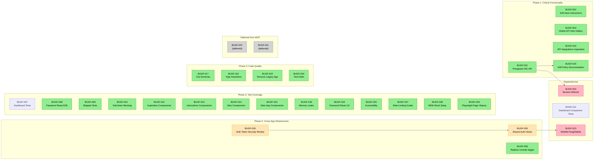

# BUGF — Story Roadmap

Visual representation of story dependencies and execution order.

---

## Dependency Graph

Shows which stories block downstream work.



**Legend:** Green = Ready | Yellow = Blocked | Pink = Has Dependencies

---

## Completion Order (Gantt View)

```mermaid
gantt
    title BUGF Story Execution Order
    dateFormat X
    axisFormat %s

    section Phase 1
    BUGF-001 Presigned URL        :s001, 0, 1
    BUGF-002 Edit Save Instructions :s002, 0, 1
    BUGF-003 Delete API Sets       :s003, 0, 1
    BUGF-016 API Integrations      :s016, 0, 1

    section Phase 1 Dependencies
    BUGF-025 IAM Policy Docs       :s025, after s001, 1
    BUGF-004 Session Refresh       :s004, after s001, 1

    section Phase 2
    BUGF-026 Auth Security Review  :s026, 0, 1
    BUGF-006 Logger Integration    :s006, 0, 1

    section Phase 2 Dependencies
    BUGF-005 Auth Hooks            :s005, after s026, 1

    section Phase 3
    BUGF-008 Password Reset E2E    :s008, 0, 1
    BUGF-009 Skipped Tests         :s009, 0, 1
    BUGF-010 Hub.listen Mocking    :s010, 0, 1
    BUGF-012 Inspiration Tests     :s012, 0, 1
    BUGF-013 Instructions Tests    :s013, 0, 1
    BUGF-014 Sets Tests            :s014, 0, 1
    BUGF-015 Main App Tests        :s015, 0, 1
    BUGF-018 Memory Leaks          :s018, 0, 1
    BUGF-019 Password Reset UX     :s019, 0, 1
    BUGF-020 Accessibility         :s020, 0, 1
    BUGF-027 Rate Limit Guide      :s027, 0, 1
    BUGF-028 MSW Mock Setup        :s028, 0, 1
    BUGF-029 Playwright Page Objs  :s029, 0, 1

    section Phase 3 Dependencies
    BUGF-023 Wishlist Drag/Delete  :s023, after s005, 1

    section Phase 4
    BUGF-017 Zod Schemas           :s017, 0, 1
    BUGF-021 Type Assertions       :s021, 0, 1
    BUGF-022 Remove Legacy App     :s022, 0, 1
    BUGF-024 Tech Debt             :s024, 0, 1
```



---

## Critical Path

The longest chain of dependent stories:

```
BUGF-026 → BUGF-005 → BUGF-023
```

**Critical path length:** 3 stories

**Stories on critical path:**
- BUGF-026 (Auth Token Refresh Security Review) - blocks BUGF-005
- BUGF-005 (Shared Auth Hooks Package) - depends on BUGF-026, blocks BUGF-023
- BUGF-023 (Wishlist Drag/Delete) - depends on BUGF-005

---

## Parallel Opportunities

| Parallel Group | Stories | After | Count |
|---|---|---|---|
| Group 1 (Phase 1) | BUGF-001, BUGF-002, BUGF-003, BUGF-016 | — (start) | 4 |
| Group 1b (Phase 1 Docs) | BUGF-025 | Group 1 complete | 1 |
| Group 2 (Phase 2 Security) | BUGF-026 | — (start, parallel with Group 1) | 1 |
| Group 2b (Phase 2 Other) | BUGF-006 | — (start, parallel with Group 1) | 1 |
| Group 2c (Phase 2 Impl) | BUGF-005 | Group 2 complete | 1 |
| Group 3 (Phase 1 Deps) | BUGF-004 | Group 1 complete | 1 |
| Group 4 (Phase 3 Main) | BUGF-008, BUGF-009, BUGF-010, BUGF-012, BUGF-013, BUGF-014, BUGF-015, BUGF-018, BUGF-019, BUGF-020 | — (start) | 10 |
| Group 4b (Phase 3 Infra) | BUGF-027, BUGF-028, BUGF-029 | — (start, early Phase 3) | 3 |
| Group 5 (Phase 3 Deps) | BUGF-023 | Group 2c complete | 1 |
| Group 6 (Phase 4) | BUGF-017, BUGF-021, BUGF-022, BUGF-024 | — (start, can be parallel) | 4 |

**Maximum parallelization:** 10 stories at once (Phase 1 + Phase 2 + Phase 3 initial)

---

## Swimlane View by Domain

### API & Infrastructure (Phase 1)
- BUGF-001: Presigned URL API
- BUGF-002: Edit Save Instructions
- BUGF-003: Delete API Sets
- BUGF-004: Session Refresh (depends BUGF-001)
- BUGF-016: API Integrations Inspiration
- BUGF-025: IAM Policy Documentation (depends BUGF-001)

### Shared Infrastructure (Phase 2)
- BUGF-026: Auth Token Refresh Security Review
- BUGF-005: Create Shared Auth Hooks (depends BUGF-026)
- BUGF-006: Logger Integration

### Testing & Quality (Phase 3)
- BUGF-008: Password Reset E2E
- BUGF-009: Skipped Tests
- BUGF-010: Hub.listen Mocking
- BUGF-012: Inspiration Components
- BUGF-013: Instructions Components
- BUGF-014: Sets Components
- BUGF-015: Main App Components
- BUGF-018: Memory Leaks
- BUGF-019: Password Reset UX
- BUGF-020: Accessibility
- BUGF-027: Rate Limiting Implementation Guide
- BUGF-028: MSW Mock Infrastructure (early Phase 3)
- BUGF-029: Playwright Page Objects (early Phase 3)
- BUGF-023: Wishlist Drag/Delete (depends BUGF-005)

### Deferred Items (MVP)
- BUGF-007: Dashboard Tests (deferred)
- BUGF-011: Dashboard Components (deferred)

### Code Quality (Phase 4)
- BUGF-017: Zod Schemas
- BUGF-021: Type Assertions
- BUGF-022: Remove Legacy App
- BUGF-024: Technical Debt

---

## Risk Indicators

| Story | Risk Level | Reason | Mitigation |
|-------|------------|--------|-----------|
| BUGF-001 | High | Backend API endpoints may not exist | Early coordination with backend team |
| BUGF-026 | High | Security review blocks auth implementation | Schedule early, allocate security resources |
| BUGF-004 | High | Depends on BUGF-001 | Prioritize BUGF-001 completion |
| BUGF-005 | High | Cross-cutting change affecting 6 apps; blocked by security review | Careful migration strategy, feature flags, complete BUGF-026 first |
| BUGF-016 | High | Multiple API endpoints requiring backend | Early backend team engagement |
| BUGF-003 | High | Requires backend API coordination | Parallel backend development |
| BUGF-009 | Medium | Skipped tests may uncover deeper issues | Plan for refactoring cycles |
| BUGF-012 | Medium | Drag testing complexity | Use drag testing libraries, setup helpers |
| BUGF-015 | Medium | Large scope (29 components) | Prioritize admin/auth components first |
| BUGF-017 | Medium | Large-scale refactor (100+ interfaces) | Incremental by app/feature area |
| BUGF-023 | Medium | Depends on BUGF-005 + drag complexity | Ensure auth hooks and security review complete first |
| BUGF-028 | Medium | Requires mock S3 service configuration | Use MSW documentation, start early |
| BUGF-029 | Medium | Requires consistent selector patterns | Establish page object conventions early |

---

## Quick Reference

| Metric | Value |
|--------|-------|
| Total Stories | 29 |
| Active Stories (MVP) | 27 |
| Deferred Stories | 2 |
| Ready to Start | 24 |
| Blocked Stories | 2 |
| Phases | 4 |
| Critical Path Length | 3 stories |
| Max Parallel | 10 stories |
| High Risk Stories | 6 |
| High Sizing Warning Stories | 8 |

---

## Update Log

| Date | Change | Stories Affected |
|------|--------|------------------|
| 2026-02-10 | Initial roadmap generated | All 24 stories |
| 2026-02-11 | Phase 4 elaboration updates: Added 5 new stories, marked 2 as deferred, updated critical path, added risk notes | BUGF-025, BUGF-026, BUGF-027, BUGF-028, BUGF-029, BUGF-007, BUGF-011, BUGF-001, BUGF-005 |
