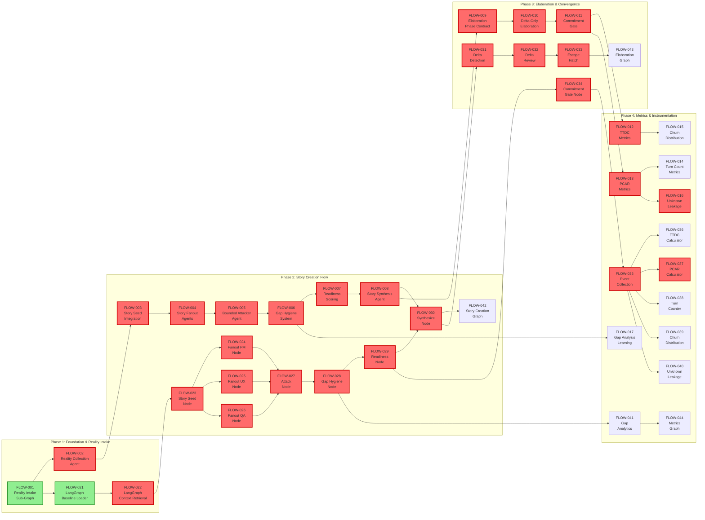

# FLOW — Story Roadmap

Visual representation of story dependencies, execution order, and critical path for the flow-convergence feature.

---

## Dependency Graph

Shows which stories block downstream work, organized by phase.



**Legend:** Green = Ready to Start | Yellow = Blocked by Dependencies | Red = Critical Path

---

## Completion Order (Gantt View)

```mermaid
gantt
    title FLOW Story Execution Timeline
    dateFormat X
    axisFormat %s

    section Phase 1
    FLOW-001 Foundation    :s001, 0, 1
    FLOW-021 LG Baseline   :s021, 0, 1

    section Phase 1 (cont)
    FLOW-002 Reality Agent    :s002, after s001, 3
    FLOW-022 LG Context      :s022, after s021, 3

    section Phase 2a (Claude)
    FLOW-003 Seed Integration :s003, after s002, 2
    FLOW-004 Fanout Agents    :s004, after s003, 3
    FLOW-005 Attacker         :s005, after s004, 2
    FLOW-006 Gap Hygiene      :s006, after s005, 2
    FLOW-007 Readiness        :s007, after s006, 2
    FLOW-008 Synthesis        :s008, after s007, 2

    section Phase 2b (LangGraph)
    FLOW-023 Seed Node     :s023, after s022, 2
    FLOW-024 Fanout PM     :s024, after s023, 2
    FLOW-025 Fanout UX     :s025, after s023, 2
    FLOW-026 Fanout QA     :s026, after s023, 2
    FLOW-027 Attack Node   :s027, after s024 s025 s026, 2
    FLOW-028 Gap Hygiene   :s028, after s027, 2
    FLOW-029 Readiness     :s029, after s028, 2
    FLOW-030 Synthesize    :s030, after s029, 2
    FLOW-042 Story Graph   :s042, after s030 s008, 2

    section Phase 3 (Claude)
    FLOW-009 Phase Contract :s009, after s008, 2
    FLOW-010 Delta Elab     :s010, after s009, 3
    FLOW-011 Gate           :s011, after s010, 2

    section Phase 3 (LangGraph)
    FLOW-031 Delta Detect  :s031, after s030, 2
    FLOW-032 Delta Review  :s032, after s031, 2
    FLOW-033 Escape Hatch  :s033, after s032, 2
    FLOW-034 Gate Node     :s034, after s029, 2
    FLOW-043 Elab Graph    :s043, after s033, 2

    section Phase 4a (Claude)
    FLOW-012 TTDC          :s012, after s011, 2
    FLOW-013 PCAR          :s013, after s011, 2
    FLOW-014 Turn Count    :s014, after s013, 2
    FLOW-015 Churn         :s015, after s012, 2
    FLOW-016 Unknowns      :s016, after s013, 2
    FLOW-017 Gap Learning  :s017, after s006, 2

    section Phase 4b (LangGraph)
    FLOW-035 Event Collect :s035, after s034, 2
    FLOW-036 TTDC Calc     :s036, after s035, 2
    FLOW-037 PCAR Calc     :s037, after s035, 2
    FLOW-038 Turn Counter  :s038, after s035, 2
    FLOW-039 Churn Dist    :s039, after s035, 2
    FLOW-040 Unknowns Leak :s040, after s035, 2
    FLOW-041 Gap Analytics :s041, after s028, 2
    FLOW-044 Metrics Graph :s044, after s041, 2
```



---

## Critical Path

The longest chain of dependent stories determines project completion time:

```
FLOW-001 (Foundation)
  ↓
FLOW-002 (Reality Collection)
  ↓
FLOW-003 (Seed Integration)
  ↓
FLOW-004 (Fanout Agents)
  ↓
FLOW-005 (Bounded Attacker)
  ↓
FLOW-006 (Gap Hygiene)
  ↓
FLOW-007 (Readiness Scoring)
  ↓
FLOW-008 (Story Synthesis)
  ↓
FLOW-009 (Phase Contract)
  ↓
FLOW-010 (Delta Elaboration)
  ↓
FLOW-011 (Commitment Gate)
  ↓
FLOW-013 (PCAR Metrics)
  ↓
FLOW-016 (Unknown Leakage)
```

**Critical Path Length:** 13 stories

---

## Parallel Opportunities

Stories that can be worked in parallel to accelerate delivery:

| Parallel Group | Stories | After | Benefit |
|---|---|---|---|
| **Group 1** | FLOW-001, FLOW-021 | — (start immediately) | Establish both workflow infrastructures in parallel |
| **Group 2** | FLOW-002, FLOW-022 | Group 1 | Both reality intake systems in parallel (8 token savings) |
| **Group 3** | FLOW-003, FLOW-023 | Group 2 | Claude + LangGraph seed implementations |
| **Group 4** | FLOW-004/024/025/026 | Group 3 | All fanout variants in parallel (leverage same gap taxonomies) |
| **Group 5** | FLOW-005, FLOW-027 | Group 4 | Both attacker implementations |
| **Group 6** | FLOW-006, FLOW-028 | Group 5 | Both gap hygiene systems |
| **Group 7** | FLOW-007, FLOW-029 | Group 6 | Both readiness scorers |
| **Group 8** | FLOW-008, FLOW-030 | Group 7 | Both synthesis agents |
| **Group 9** | FLOW-009, FLOW-031 | Group 8 | Both elaboration preparations |
| **Group 10** | FLOW-010, FLOW-032 | Group 9 | Both delta implementations |
| **Group 11** | FLOW-011, FLOW-033, FLOW-034 | Group 10 | All commitment/gate implementations |
| **Group 12** | FLOW-012/013/015/016 + FLOW-035/036/037/038/039/040 | Group 11 | 8 metrics nodes in parallel across both tracks |
| **Group 13** | FLOW-017, FLOW-041 | Group 6 | Gap learning metrics (decoupled from main flow) |
| **Group 14** | FLOW-042, FLOW-043 | Group 11 | Graph compositions |
| **Group 15** | FLOW-044 | Group 14 | Final metrics graph (downstream of all metrics nodes) |

**Maximum Parallelization:** 8 stories at once (Group 4)

---

## Risk Indicators

| Story | Risk Level | Reason | Mitigation |
|-------|--|---|---|
| FLOW-002 | **HIGH** | Complex codebase scanning logic; scope boundary definition critical | Prototype scanning logic early; define clear boundaries |
| FLOW-004 | **HIGH** | Multi-agent coordination; conflicting perspectives possible | Establish taxonomy upfront; test merge strategy |
| FLOW-010 | **HIGH** | Delta detection accuracy critical; can miss cross-cutting changes | Extensive test coverage; escape hatch triggers essential |
| FLOW-006 | **HIGH** | Gap storage and ranking design affects downstream systems | Validate design with metrics; allow schema evolution |
| FLOW-042 | **MEDIUM** | Graph composition complexity; state management challenges | Leverage LangGraph patterns; incremental testing |
| FLOW-043 | **MEDIUM** | Conditional routing in elaborate graphs; error handling | Build with extensive logging; test edge cases |
| FLOW-007 | **MEDIUM** | Readiness threshold calibration; risk of gaming metrics | Start conservative; refine based on real data |
| FLOW-001 | **MEDIUM** | Workflow shift definition unclear | Consult with team on shift semantics early |
| FLOW-005 | **LOW** | Bounded exploration may be too aggressive or conservative | Iterate on bounds based on results |
| FLOW-003 | **LOW** | Integration straightforward given dependencies ready | Standard integration pattern |

---

## Swimlane View (By Domain)

### Claude Code Workflow (FLOW-001–FLOW-017)

**Timeline:** Phase 1 (1 story) + Phase 2 (7 stories) + Phase 3 (3 stories) + Phase 4 (6 stories) = 17 stories

Key deliverables:
- Reality intake agent infrastructure
- Story seed + fanout + attack + synthesis agents
- Elaboration phase contracts + delta system + commitment gate
- Metrics collection agents (TTDC, PCAR, turns, churn, unknowns, gap learning)

Dependencies: Sequential within phases, but parallelizable across tracks

### LangGraph Implementation (FLOW-021–FLOW-044)

**Timeline:** Phase 1 (2 stories) + Phase 2 (11 stories + 1 graph) + Phase 3 (4 stories + 1 graph) + Phase 4 (7 stories + 1 graph) = 24 stories

Key deliverables:
- Reality intake nodes (baseline loader, context retrieval)
- Story nodes (seed, 3× fanout, attack, gap hygiene, readiness, synthesize)
- Elaboration nodes (delta detect, delta review, escape hatch)
- Commitment gate node
- Metrics nodes (7 calculator/tracker nodes)
- 3 graph compositions (story creation, elaboration, metrics)

Dependencies: Same critical path as Claude track, but composed into LangGraph

---

## Quick Reference

| Metric | Value |
|--------|-------|
| **Total Stories** | 41 |
| **Ready to Start** | 2 (FLOW-001, FLOW-021) |
| **Critical Path Length** | 13 stories |
| **Max Parallel** | 8 stories |
| **Number of Phases** | 4 |
| **Stories with Sizing Warnings** | 5 (FLOW-002, FLOW-004, FLOW-010, FLOW-042, FLOW-043) |
| **Highest Risk** | FLOW-002, FLOW-004, FLOW-010, FLOW-006 |

---

## Update Log

| Date | Change | Stories Affected |
|------|--------|------------------|
| 2026-01-31 | Initial roadmap generated | All (FLOW-001 through FLOW-044) |

---
