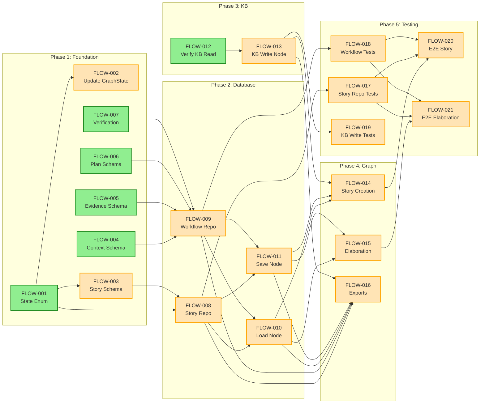
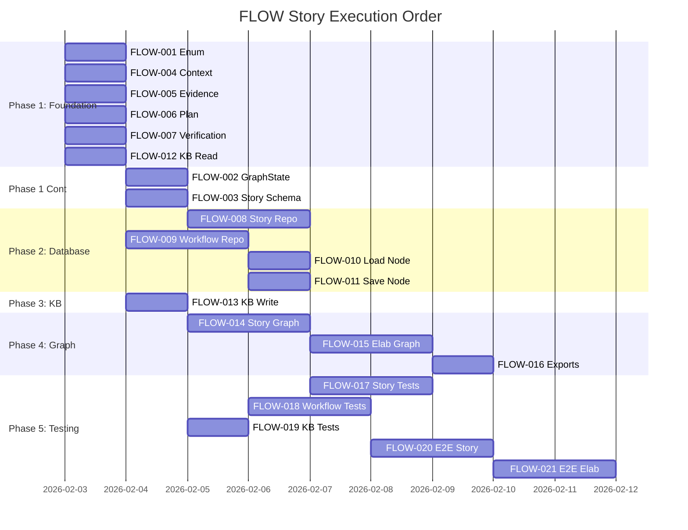

# FLOW — Story Roadmap

Visual representation of story dependencies, execution order, and critical path analysis.

---

## Dependency Graph

Shows which stories block downstream work. Green = Ready to start | Yellow = Blocked | Blue = Done



---

## Completion Order (Gantt View)

Timeline showing realistic story execution sequence with phase boundaries:



---

## Critical Path

The longest chain of dependent stories that determines minimum project duration:

```
FLOW-001 (State Enum)
  ↓
FLOW-003 (Story Schema)
  ↓
FLOW-008 (Story Repository)
  ↓
FLOW-009 (Workflow Repository)
  ↓
FLOW-010 (Load Node)
  ↓
FLOW-014 (Story Creation Graph)
  ↓
FLOW-020 (E2E Story Creation)
```

**Critical path length:** 7 stories
**Estimated duration:** 10-12 working days (assuming 1-2 days per story)

---

## Parallel Opportunities

Stories that can be worked simultaneously (grouped by dependency wave):

| Wave | Group | Stories | After | Max Parallel |
|------|-------|---------|-------|--------------|
| 1 | Group 1 | FLOW-001, FLOW-004, FLOW-005, FLOW-006, FLOW-007, FLOW-012 | — (start) | 6 |
| 2 | Group 2 | FLOW-002, FLOW-003 | Group 1 | 2 |
| 3 | Group 3 | FLOW-008, FLOW-009 | Group 2 | 2 |
| 4 | Group 4 | FLOW-010, FLOW-011, FLOW-013 | Group 3 | 3 |
| 5 | Group 5 | FLOW-014, FLOW-015, FLOW-016 | Group 4 | 3 |
| 6 | Group 6 | FLOW-017, FLOW-018, FLOW-019 | Group 5 | 3 |
| 7 | Group 7 | FLOW-020, FLOW-021 | Group 6 | 2 |

**Maximum parallelization:** 6 stories at once (Phase 1 foundation work)

**Recommended team size:** 3-4 developers for optimal throughput

---

## Risk Indicators

Stories with special concerns requiring attention:

| Story | Risk Level | Risk Description | Mitigation |
|-------|------------|------------------|-----------|
| FLOW-002 | High | Breaking change to GraphState - existing graphs may break | Plan migration strategy; test with actual orchestrator |
| FLOW-003 | High | Breaking change to story artifact schema - data migration needed | Document schema change; create migration tests |
| FLOW-007 | High | Merging two schemas (review.ts + qa-verify.ts) - data consolidation | Plan field mapping; backup before migration |
| FLOW-008 | High | Requires deployed database schema (002_workflow_tables.sql) | Coordinate with infrastructure; unblock before starting |
| FLOW-009 | High | Requires all workflow database tables - blocking for persistence | Verify schema deployment before starting |
| FLOW-013 | Medium | Deduplication threshold (0.85) may need tuning | Use configurable threshold; document tuning process |
| FLOW-014 | Medium | Graph structure changes may break existing workflows | Test with real graph instances; validate transitions |
| FLOW-015 | Medium | State transition logic (PASS→ready-to-work, FAIL→backlog) critical | Test both paths thoroughly; add comprehensive integration tests |
| FLOW-020 | Low | E2E test may be flaky without proper isolation | Use transaction rollback; mock external services |
| FLOW-021 | Low | E2E test must cover both PASS and FAIL flows | Test matrix for both scenarios |

---

## Swimlane View (By Domain)

Story grouping by technical domain:

### Core Schema Updates (Phase 1)
- FLOW-001: State Enum
- FLOW-002: GraphState Schema
- FLOW-003: Story Artifact Schema
- FLOW-004: Context Artifact Schema
- FLOW-005: Evidence Artifact Schema
- FLOW-006: Plan Artifact Schema
- FLOW-007: Verification Artifact Schema

### Database Layer (Phase 2)
- FLOW-008: Story Repository
- FLOW-009: Workflow Repository
- FLOW-010: Load from Database Node
- FLOW-011: Save to Database Node

### Knowledge Base (Phase 3)
- FLOW-012: Verify KB Read Integration
- FLOW-013: KB Write Node (persist learnings)

### Graph Wiring (Phase 4)
- FLOW-014: Update Story Creation Graph
- FLOW-015: Update Elaboration Graph
- FLOW-016: Update Module Exports

### Testing & Validation (Phase 5)
- FLOW-017: Unit Tests - Story Repository
- FLOW-018: Unit Tests - Workflow Repository
- FLOW-019: Unit Tests - KB Write Node
- FLOW-020: Integration Tests - Story Creation
- FLOW-021: Integration Tests - Elaboration

---

## Quick Reference

| Metric | Value | Notes |
|--------|-------|-------|
| Total Stories | 21 | Across 5 phases |
| Ready to Start | 6 | FLOW-001, 004-007, 012 |
| In Flight (Blocked) | 15 | Depend on earlier stories |
| Critical Path Length | 7 stories | FLOW-001 → FLOW-020 |
| Max Parallel | 6 stories | Phase 1 foundation work |
| Phases | 5 | Foundation → Testing |
| High-Risk Stories | 6 | Schema/DB/graph changes |
| Estimated Timeline | 10-12 days | At 1-2 days per story |

---

## Dependencies Summary

### Foundation Dependencies (Phase 1)
- FLOW-001 → FLOW-002, FLOW-003
- FLOW-004, FLOW-005, FLOW-006, FLOW-007, FLOW-012 → no dependencies

### Database Dependencies (Phase 2)
- FLOW-001, FLOW-003 → FLOW-008
- FLOW-004, FLOW-005, FLOW-006, FLOW-007 → FLOW-009
- FLOW-008, FLOW-009 → FLOW-010, FLOW-011

### KB Dependencies (Phase 3)
- FLOW-012 → FLOW-013

### Graph Dependencies (Phase 4)
- FLOW-010, FLOW-011, FLOW-013 → FLOW-014, FLOW-015, FLOW-016

### Testing Dependencies (Phase 5)
- FLOW-008 → FLOW-017
- FLOW-009 → FLOW-018
- FLOW-013 → FLOW-019
- FLOW-014, FLOW-017, FLOW-018 → FLOW-020
- FLOW-015, FLOW-017, FLOW-018 → FLOW-021

---

## Update Log

| Date | Change | Stories Affected | Status |
|------|--------|------------------|--------|
| 2026-02-01 | Initial roadmap from Phase 1 analysis | All | GENERATION COMPLETE |
