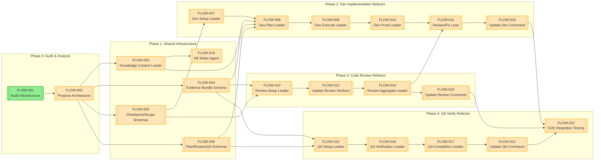

# FLOW — Story Roadmap

Visual representation of story dependencies and execution order.

---

## Dependency Graph

Shows which stories block downstream work.



**Legend:** Green = Ready | Yellow = Blocked | Blue = Done

---

## Completion Order (Gantt View)

```mermaid
gantt
    title FLOW Story Execution Order
    dateFormat X
    axisFormat %s

    section Phase 0
    FLOW-001 Audit             :s001, 0, 1
    FLOW-002 Propose Arch      :s002, after s001, 1

    section Phase 1
    FLOW-003 Loader            :s003, after s002, 1
    FLOW-004 Evidence Schema   :s004, after s002, 1
    FLOW-005 Checkpoint Schema :s005, after s002, 1
    FLOW-006 Plan/Review Schema :s006, after s002, 1
    FLOW-018 KB Writer         :s018, after s003, 1

    section Phase 2
    FLOW-007 Dev Setup         :s007, after s005, 1
    FLOW-008 Dev Plan          :s008, after s003 s004 s006 s007, 1
    FLOW-009 Dev Execute       :s009, after s008, 1
    FLOW-010 Dev Proof         :s010, after s009, 1
    FLOW-011 Review/Fix Loop   :s011, after s010, 1
    FLOW-019 Update Dev Cmd    :s019, after s011, 1

    section Phase 3
    FLOW-012 Review Setup      :s012, after s004 s005, 1
    FLOW-013 Update Workers    :s013, after s012, 1
    FLOW-014 Review Aggregate  :s014, after s013, 1
    FLOW-020 Update Review Cmd :s020, after s014, 1

    section Phase 4
    FLOW-015 QA Setup          :s015, after s004 s006, 1
    FLOW-016 QA Verify         :s016, after s015, 1
    FLOW-017 QA Completion     :s017, after s016, 1
    FLOW-021 Update QA Cmd     :s021, after s017, 1
    FLOW-022 E2E Integration   :s022, after s019 s020 s021, 1
```



---

## Critical Path

The longest chain of dependent stories:

```
FLOW-001 → FLOW-002 → FLOW-005 → FLOW-007 → FLOW-008 → FLOW-009 →
FLOW-010 → FLOW-014 → FLOW-011 → FLOW-019 → FLOW-020 → FLOW-021 → FLOW-022
```

**Critical path length:** 13 stories

---

## Parallel Opportunities

| Parallel Group | Stories | After | Notes |
|---|---|---|---|
| Group 1 | FLOW-001 | — (start) | Initial audit |
| Group 2 | FLOW-002 | Group 1 | Architecture proposal |
| Group 3 | FLOW-003, FLOW-004, FLOW-005, FLOW-006 | Group 2 | Infrastructure schemas (4 parallel) |
| Group 4 | FLOW-007, FLOW-012, FLOW-018 | Group 3 | Setup leaders + KB writer (3 parallel) |
| Group 5 | FLOW-008, FLOW-013 | Group 4 | Plan/worker updates (2 parallel) |
| Group 6 | FLOW-009, FLOW-014, FLOW-015 | Group 5 | Execute/aggregate/QA setup (3 parallel) |
| Group 7 | FLOW-010, FLOW-016 | Group 6 | Proof/verify leaders (2 parallel) |
| Group 8 | FLOW-011, FLOW-017 | Group 7 | Review/fix loop + QA completion (2 parallel) |
| Group 9 | FLOW-019, FLOW-020, FLOW-021 | Group 8 | Command updates (3 parallel) |
| Group 10 | FLOW-022 | Group 9 | E2E integration testing |

**Maximum parallelization:** 4 stories at once

---

## Risk Indicators

| Story | Risk Level | Reason |
|---|---|---|
| FLOW-009 | High | Complex orchestration logic with multiple workers |
| FLOW-013 | High | Multiple review workers to update and maintain |
| FLOW-016 | High | Core QA verification logic; must maintain quality |
| FLOW-022 | High | Full integration testing across all phases |
| FLOW-008 | High | Knowledge context loader integration complexity |
| FLOW-002 | Medium | Architecture decisions affect all downstream work |
| FLOW-003 | Medium | KB dependency may fail in some environments |
| FLOW-012 | Medium | Diff-aware worker selection complexity |
| FLOW-001 | Low | Straightforward audit/inventory task |
| FLOW-004 | Low | Schema definition is bounded task |
| FLOW-005 | Low | Schema definition is bounded task |
| FLOW-006 | Low | Schema definition is bounded task |
| FLOW-007 | Low | Setup leader, straightforward pattern |
| FLOW-010 | Low | Proof generation from existing evidence |
| FLOW-011 | Low | Integration of existing review workflow |
| FLOW-014 | Low | Aggregation of structured outputs |
| FLOW-015 | Low | Setup leader, straightforward pattern |
| FLOW-017 | Low | Completion leader, straightforward pattern |
| FLOW-018 | Low | Focused agent for lesson write-back |
| FLOW-019 | Low | Command wrapper over new leaders |
| FLOW-020 | Low | Command wrapper over new leaders |
| FLOW-021 | Low | Command wrapper over new leaders |

---

## Swimlane View

### By Domain

| Domain | Stories | Dependencies | Status |
|---|---|---|---|
| **Audit** | FLOW-001, FLOW-002 | None | Start first |
| **Shared Infra** | FLOW-003, FLOW-004, FLOW-005, FLOW-006, FLOW-018 | After audit | Can parallelize |
| **Dev Refactor** | FLOW-007, FLOW-008, FLOW-009, FLOW-010, FLOW-011, FLOW-019 | After shared infra | Critical path |
| **Review Refactor** | FLOW-012, FLOW-013, FLOW-014, FLOW-020 | Parallel to dev | Medium priority |
| **QA Refactor** | FLOW-015, FLOW-016, FLOW-017, FLOW-021 | Parallel to review | Medium priority |
| **Integration** | FLOW-022 | All refactors done | Final validation |

---

## Quick Reference

| Metric | Value |
|--------|-------|
| Total Stories | 22 |
| Ready to Start | 1 |
| Critical Path Length | 13 stories |
| Max Parallel | 4 stories |
| Phases | 5 |
| High-Risk Stories | 4 |
| Estimated Dev Time | 3-4 weeks (parallel execution) |

---

## Update Log

| Date | Change | Stories Affected |
|---|---|---|
| 2026-02-01 | Initial roadmap generation | All 22 stories |
