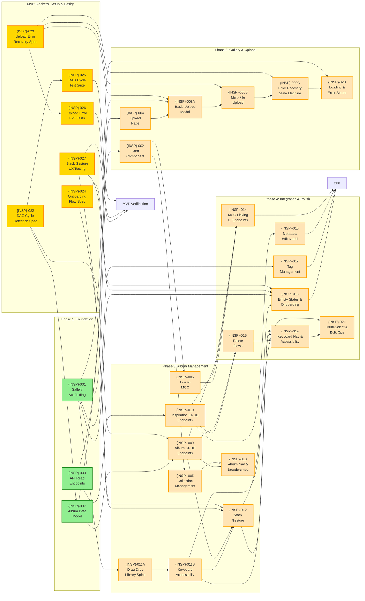

# INSP — Story Roadmap

Visual representation of story dependencies and execution order for the Inspiration Gallery feature.

---

## Dependency Graph

Shows which stories block downstream work. Updated to include 6 MVP blocker stories and story splits.



**Legend:** Green = Ready to Start | Yellow = Blocked (waiting) | Blue = Complete

---

## Completion Order (Gantt View)

```mermaid
gantt
    title INSP Story Execution Order with MVP Blocker Stories
    dateFormat X
    axisFormat %s

    section MVP Blockers: Setup & Design
    INSP-022 DAG Cycle Detection    :s022, 0, 1
    INSP-023 Upload Error Recovery  :s023, 0, 1
    INSP-024 Onboarding Flow        :s024, 0, 1
    INSP-025 DAG Test Suite         :s025, 0, 1
    INSP-026 Upload Error E2E Tests :s026, 0, 1
    INSP-027 Stack Gesture UX Test  :s027, 0, 1

    section Phase 1: Foundation
    INSP-001 Gallery Scaffolding    :s001, after s022, 1
    INSP-003 API Read Endpoints     :s003, after s022, 1
    INSP-007 Album Data Model       :s007, after s022, 1

    section Phase 2: Gallery & Upload
    INSP-002 Card Component         :s002, after s001, 1
    INSP-004 Upload Page            :s004, after s003, 1
    INSP-008A Basic Upload Modal    :s008a, after s004 s007 s023, 1
    INSP-008B Multi-File Upload     :s008b, after s008a, 1
    INSP-008C Error Recovery        :s008c, after s008b s026, 1
    INSP-020 Loading States         :s020, after s001 s008c, 1

    section Phase 3: Album Management
    INSP-005 Collection Mgmt        :s005, after s002, 1
    INSP-006 Link to MOC            :s006, after s002, 1
    INSP-009 Album CRUD             :s009, after s007 s025, 1
    INSP-010 Inspiration CRUD       :s010, after s003, 1
    INSP-011A Drag-Drop Library     :s011a, after s001 s002, 1
    INSP-011B Keyboard Accessibility :s011b, after s011a, 1
    INSP-012 Stack Gesture          :s012, after s011b s009 s027, 1
    INSP-013 Album Nav              :s013, after s005 s009, 1

    section Phase 4: Integration & Polish
    INSP-014 MOC Linking            :s014, after s006 s009 s010, 1
    INSP-015 Delete Flows           :s015, after s009 s010, 1
    INSP-016 Metadata Edit          :s016, after s010, 1
    INSP-017 Tag Management         :s017, after s001 s010, 1
    INSP-018 Empty States           :s018, after s001 s012 s024, 1
    INSP-019 Accessibility          :s019, after s011b s012 s015, 1
    INSP-021 Multi-Select           :s021, after s011b s019, 1
```



---

## Critical Path

The longest chain of dependent stories that determines minimum project duration:

**Main Path (with MVP blockers):**
```
INSP-022 (DAG Cycle Detection Spec)
  ↓
INSP-007 (Album Data Model)
  ↓
INSP-009 (Album CRUD Endpoints)
  ↓
INSP-012 (Stack Gesture)
  ↓
INSP-019 (Accessibility)
  ↓
INSP-021 (Multi-Select)
```

**Alternative Path (UX/Onboarding):**
```
INSP-027 (Stack Gesture UX Testing)
  ↓
INSP-024 (Onboarding Flow)
  ↓
INSP-018 (Empty States & Onboarding)
  ↓
INSP-019 (Accessibility)
```

**Alternative Path (Upload):**
```
INSP-023 (Upload Error Recovery Spec)
  ↓
INSP-008A (Basic Upload Modal)
  ↓
INSP-008B (Multi-File Upload)
  ↓
INSP-008C (Error Recovery)
  ↓
INSP-026 (Upload E2E Tests)
```

**Critical path length:** 6 stories (minimum sequential dependencies with MVP blockers)

**Note:** INSP-022, INSP-023, INSP-024, INSP-025, INSP-026, INSP-027 can execute in parallel with each other before Phase 1 starts. They must complete before their dependent stories can begin.

---

## Parallel Opportunities

| Group | Stories | Start Condition | Count |
|-------|---------|---|---|
| MVP Blockers (Parallel) | INSP-022, INSP-023, INSP-024, INSP-025, INSP-026, INSP-027 | Immediate (no dependencies) | 6 |
| Phase 1 (Parallel) | INSP-001, INSP-003, INSP-007 | After MVP blockers complete | 3 |
| Phase 2A | INSP-002, INSP-004 | After Phase 1 (INSP-001, INSP-003) | 2 |
| Phase 2B | INSP-008A, INSP-008B, INSP-008C | After Phase 1 (INSP-007) + INSP-023 + INSP-004 | 3 |
| Phase 2C | INSP-020 | After INSP-008C | 1 |
| Phase 3A | INSP-005, INSP-006, INSP-010 | After Phase 2 foundations | 3 |
| Phase 3B | INSP-009 | After INSP-007 + INSP-025 | 1 |
| Phase 3C | INSP-011A | After INSP-001, INSP-002 | 1 |
| Phase 3D | INSP-011B | After INSP-011A | 1 |
| Phase 3E | INSP-012, INSP-013 | After INSP-009, INSP-011B, INSP-027 | 2 |
| Phase 4 (Parallel) | INSP-014, INSP-015, INSP-016, INSP-017, INSP-018 | After Phase 3 CRUD complete | 5 |
| Phase 4 (Dependent) | INSP-019, INSP-021 | After interaction patterns (INSP-011B, INSP-012, INSP-015) | 2 |

**Maximum parallelization:** 6 stories at once (MVP Blockers phase)

---

## Risk Indicators

| Story | Risk Level | Reason | Mitigation |
|-------|-----------|--------|-----------|
| INSP-022 | **Critical** | DAG algorithm choice impacts all album features | Engineering spike to evaluate and specify algorithm before coding |
| INSP-023 | **Critical** | Upload error recovery is complex cross-cutting concern | Engineering spike to design state machine before implementation |
| INSP-025 | **Critical** | DAG cycle detection must be thoroughly tested | Comprehensive test suite with edge cases before MVP launch |
| INSP-026 | **Critical** | Upload error handling is complex with multiple failure modes | E2E test coverage with mocked S3 errors before MVP launch |
| INSP-027 | **Critical** | Novel stack gesture must validate user discoverability | Usability testing with 5+ participants validates learnability (80%+ discovery, 90%+ task completion) |
| INSP-007 | **High** | Complex DAG structure depends on INSP-022 spec | Spec first, then robust backend validation, comprehensive test coverage (INSP-025) |
| INSP-008-A/B/C | **High** | Multi-file upload, previews, partial failure handling | INSP-023 spec first, split stories for parallel work, prototype early |
| INSP-011-A/B | **High** | Drag-and-drop library choice and keyboard accessibility | Library evaluation spike (INSP-011A), extensive user testing |
| INSP-012 | **Medium** | Novel interaction pattern depends on UX validation (INSP-027) | Onboarding (INSP-024), tooltips (INSP-018), keyboard fallback |
| INSP-019 | **Medium** | Comprehensive accessibility across all features | WCAG AA testing, screen reader validation, keyboard nav audit |
| INSP-013 | **Medium** | Session-based navigation with multi-parent albums | Clear UX design, user testing, consider "All paths" view for future |
| INSP-009 | **Medium** | Cascade delete behavior depends on DAG spec (INSP-022) | Clear business rules, thorough testing of edge cases (INSP-025) |

---

## Swimlane View (by Domain)

### Backend Infrastructure (Foundation)
- INSP-007: Album data model
- INSP-003: Initial API endpoints
- INSP-009: Album CRUD endpoints
- INSP-010: Inspiration CRUD endpoints
- INSP-014: MOC linking endpoints

### Frontend Components (UI Layer)
- INSP-001: Gallery scaffolding
- INSP-002: Card components
- INSP-004: Upload page
- INSP-008: Upload modal
- INSP-016: Metadata modal
- INSP-018: Empty states

### Interactions & Gestures
- INSP-011: Drag-and-drop
- INSP-012: Stack gesture
- INSP-013: Album navigation
- INSP-021: Multi-select

### Quality & Accessibility
- INSP-015: Delete flows
- INSP-017: Tag management
- INSP-019: Keyboard nav & accessibility
- INSP-020: Loading/error states

---

## Quick Reference

| Metric | Value | Details |
|--------|-------|---------|
| Total Stories | 27 | INSP-001 through INSP-027 (includes 6 MVP blocker stories) |
| Original Stories | 21 | INSP-001 through INSP-021 |
| MVP Blocker Stories | 6 | INSP-022 through INSP-027 (specs, tests, validation) |
| Story Splits | 2 | INSP-008 (split to A/B/C), INSP-011 (split to A/B) |
| Superseded Stories | 2 | INSP-008, INSP-011 (replaced by splits) |
| Ready to Start | 6 | INSP-022-027 (MVP blockers - parallel work) |
| Critical Path Length | 6 stories | INSP-022 → INSP-007 → INSP-009 → INSP-012 → INSP-019 → INSP-021 |
| Max Parallel | 6 stories | MVP Blocker phase (INSP-022-027 all parallel) |
| Phases | 4 | Foundation, Gallery & Upload, Album Management, Integration & Polish |
| Critical Risk Stories | 5 | INSP-022, INSP-023, INSP-025, INSP-026, INSP-027 (MVP blockers) |
| Sizing Warnings | 6 | INSP-007, INSP-008-A/B/C, INSP-011-A/B, INSP-019, INSP-021 |

---

## Update Log

| Date | Change | Stories Affected | Reason |
|------|--------|------------------|--------|
| 2026-02-04 | Initial roadmap | INSP-001 through INSP-021 | Bootstrap generation phase 2 |
| 2026-02-04 | Epic elaboration updates | INSP-022-027 added, INSP-008/011 split | Applied decisions from epic elaboration phase: 6 MVP blockers accepted, story splits approved |

---
