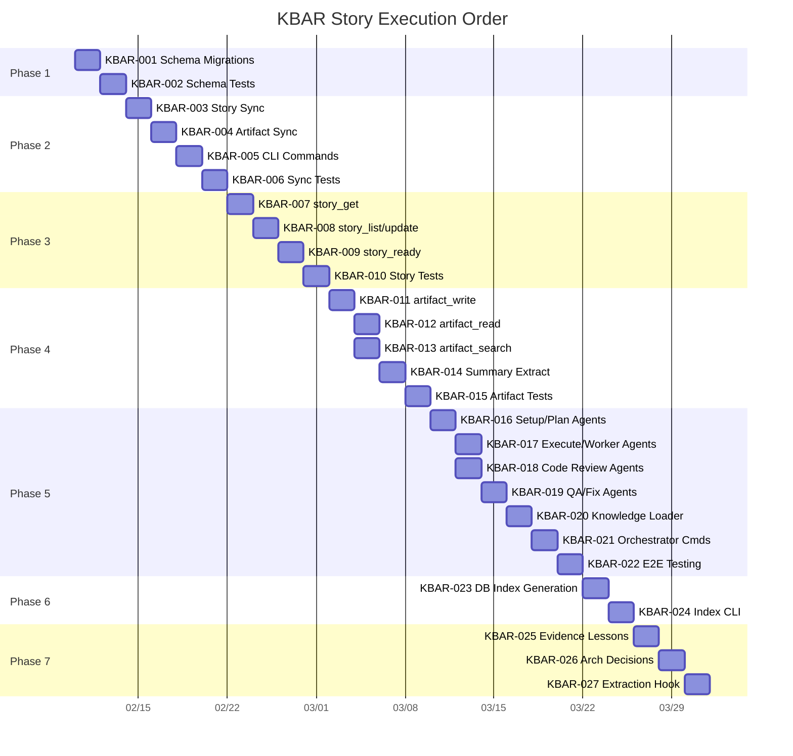

# KBAR — Story Roadmap

Visual representation of story dependencies, phases, and execution order.

---

## Dependency Graph

Shows which stories block downstream work.

```mermaid
flowchart LR
    subgraph Phase1["Phase 1: Database Schema"]
        S001["KBAR-001<br/>Schema Migrations"]
        S002["KBAR-002<br/>Schema Tests"]
    end

    subgraph Phase2["Phase 2: Sync Infrastructure"]
        S003["KBAR-003<br/>Story Sync"]
        S004["KBAR-004<br/>Artifact Sync"]
        S005["KBAR-005<br/>CLI Commands"]
        S006["KBAR-006<br/>Sync Tests"]
    end

    subgraph Phase3["Phase 3: MCP Story Tools"]
        S007["KBAR-007<br/>story_get"]
        S008["KBAR-008<br/>story_list/update"]
        S009["KBAR-009<br/>story_ready"]
        S010["KBAR-010<br/>Story Tests"]
    end

    subgraph Phase4["Phase 4: MCP Artifact Tools"]
        S011["KBAR-011<br/>artifact_write"]
        S012["KBAR-012<br/>artifact_read"]
        S013["KBAR-013<br/>artifact_search"]
        S014["KBAR-014<br/>Summary Extract"]
        S015["KBAR-015<br/>Artifact Tests"]
    end

    subgraph Phase5["Phase 5: Agent Updates"]
        S016["KBAR-016<br/>Setup/Plan"]
        S017["KBAR-017<br/>Execute/Workers"]
        S018["KBAR-018<br/>Code Review"]
        S019["KBAR-019<br/>QA/Fix"]
        S020["KBAR-020<br/>Knowledge Loader"]
        S021["KBAR-021<br/>Orchestrator"]
        S022["KBAR-022<br/>E2E Testing"]
    end

    subgraph Phase6["Phase 6: Index Generation"]
        S023["KBAR-023<br/>DB-Driven Index"]
        S024["KBAR-024<br/>Index CLI"]
    end

    subgraph Phase7["Phase 7: Lesson Extraction"]
        S025["KBAR-025<br/>Evidence Lessons"]
        S026["KBAR-026<br/>Arch Decisions"]
        S027["KBAR-027<br/>Extraction Hook"]
    end

    %% Phase 1 dependencies
    S001 --> S002

    %% Phase 2 dependencies
    S002 --> S003
    S003 --> S004
    S004 --> S005
    S005 --> S006

    %% Phase 3 dependencies
    S006 --> S007
    S007 --> S008
    S008 --> S009
    S009 --> S010

    %% Phase 4 dependencies
    S010 --> S011
    S011 --> S012
    S011 --> S013
    S012 --> S014
    S013 --> S014
    S014 --> S015

    %% Phase 5 dependencies
    S015 --> S016
    S016 --> S017
    S016 --> S018
    S017 --> S019
    S018 --> S019
    S019 --> S020
    S020 --> S021
    S021 --> S022

    %% Phase 6 dependencies
    S022 --> S023
    S023 --> S024

    %% Phase 7 dependencies
    S024 --> S025
    S025 --> S026
    S026 --> S027

    %% Styling
    classDef ready fill:#90EE90,stroke:#228B22,color:#000
    classDef blocked fill:#FFE4B5,stroke:#FFA500,color:#000
    classDef done fill:#87CEEB,stroke:#4682B4,color:#000

    class S001 ready
    class S002,S003,S004,S005,S006,S007,S008,S009,S010,S011,S012,S013,S014,S015,S016,S017,S018,S019,S020,S021,S022,S023,S024,S025,S026,S027 blocked
```



**Legend:** Green = Ready | Yellow = Blocked | Blue = Done

---

## Completion Order (Gantt View)

Visual timeline showing when each story can be completed.



---

## Critical Path

The longest chain of dependent stories that determines minimum project duration:

```
KBAR-001 → KBAR-002 → KBAR-003 → KBAR-004 → KBAR-005 → KBAR-006
→ KBAR-007 → KBAR-008 → KBAR-009 → KBAR-010 → KBAR-011 → KBAR-012
→ KBAR-014 → KBAR-015 → KBAR-016 → KBAR-017 → KBAR-019 → KBAR-020
→ KBAR-021 → KBAR-022 → KBAR-023 → KBAR-024 → KBAR-025 → KBAR-026
→ KBAR-027
```

**Critical path length:** 27 stories (54 days at 2 days per story, 27 days with 2 parallel)

---

## Parallel Opportunities

| Parallel Group | Stories | After | Notes |
|---|---|---|---|
| Group 1 | KBAR-001 | — | Start immediately |
| Group 2 | KBAR-002 | Group 1 | Schema validation |
| Group 3 | KBAR-003 | Group 2 | Story sync foundation |
| Group 4 | KBAR-004 | Group 3 | Artifact sync |
| Group 5 | KBAR-005 | Group 4 | CLI commands |
| Group 6 | KBAR-006 | Group 5 | Sync integration tests |
| Group 7 | KBAR-007 | Group 6 | Story query tool |
| Group 8 | KBAR-008 | Group 7 | Story list/update tools |
| Group 9 | KBAR-009 | Group 8 | Story ready-to-start tool |
| Group 10 | KBAR-010 | Group 9 | Story tools integration tests |
| Group 11 | KBAR-011 | Group 10 | Artifact write tool |
| Group 12 | KBAR-012, KBAR-013 | Group 11 | Artifact read and search (parallel) |
| Group 13 | KBAR-014 | Group 12 | Artifact summary extraction |
| Group 14 | KBAR-015 | Group 13 | Artifact tools integration tests |
| Group 15 | KBAR-016 | Group 14 | Setup & plan agent updates |
| Group 16 | KBAR-017, KBAR-018 | Group 15 | Execute and code review agent updates (parallel) |
| Group 17 | KBAR-019 | Group 16 | QA & fix agent updates |
| Group 18 | KBAR-020 | Group 17 | Knowledge context loader update |
| Group 19 | KBAR-021 | Group 18 | Orchestrator command updates |
| Group 20 | KBAR-022 | Group 19 | Agent migration E2E testing |
| Group 21 | KBAR-023 | Group 20 | DB-driven index generation |
| Group 22 | KBAR-024 | Group 21 | Index regeneration CLI |
| Group 23 | KBAR-025 | Group 22 | Evidence lesson extraction |
| Group 24 | KBAR-026 | Group 23 | Architectural decision extraction |
| Group 25 | KBAR-027 | Group 24 | Extraction integration hook |

**Maximum parallelization:** 2 stories at once (KBAR-012+KBAR-013, KBAR-017+KBAR-018)

---

## Risk Indicators

| Story | Risk Level | Category | Reason |
|-------|---|---|---|
| KBAR-001 | High | Schema | Database schema changes may break workflow if migration fails |
| KBAR-002 | High | Schema | Must validate foreign keys and index performance correctly |
| KBAR-003 | Medium | Sync | File-to-DB sync may drift without regular validation |
| KBAR-004 | Medium | Sync | Must handle corrupt YAML and missing files gracefully |
| KBAR-005 | Medium | Sync | Incremental sync logic is complex; performance critical |
| KBAR-011 | Medium | MCP | KB write failures could block or cause artifact loss |
| KBAR-016-021 | High | Agents | Agent updates affect production workflows; high rollout risk |
| KBAR-025 | Low | ML | Extraction quality depends on evidence structure consistency |

---

## Domain Swimlanes

Stories organized by architectural domain:

### Database Domain (KBAR-001 to KBAR-002)
- Schema design and validation
- Migration infrastructure

### Sync Domain (KBAR-003 to KBAR-006)
- File-to-DB synchronization
- Hash-based change detection
- Integration testing

### Story Query/Update Domain (KBAR-007 to KBAR-010)
- MCP tools for story management
- Dependency resolution
- State transitions

### Artifact Domain (KBAR-011 to KBAR-015)
- Dual-write infrastructure (files + KB)
- Semantic search
- Summary extraction

### Agent Domain (KBAR-016 to KBAR-022)
- Agent migrations to MCP
- Backward compatibility
- E2E validation

### Index Domain (KBAR-023 to KBAR-024)
- DB-driven generation
- Index regeneration automation

### Learning Domain (KBAR-025 to KBAR-027)
- Lesson extraction from evidence
- Architectural decision indexing
- Auto-extraction integration

---

## Swimlane View

```
Database          KBAR-001 ────────────── KBAR-002 ─────┐
                                                         │
Sync              ─────────────────────────────────── KBAR-003 ──── KBAR-004 ──── KBAR-005 ──── KBAR-006 ─────┐
                                                                                                              │
Story Tools       ──────────────────────────────────────────────────────────────────────── KBAR-007 ────── KBAR-008 ──── KBAR-009 ──── KBAR-010 ─┐
                                                                                                                                                 │
Artifact Tools    ───────────────────────────────────────────────────────────────────────────────────────────── KBAR-011 ── KBAR-012 ┐         │
                                                                                                                           └─ KBAR-013 ┤ KBAR-014 ── KBAR-015 ─┐
                                                                                                                                   │        │
Agents            ─────────────────────────────────────────────────────────────────────────────────────────────────────────────────────── KBAR-016 ──┬─ KBAR-017 ┐
                                                                                                                                                   ├─ KBAR-018 ┤ KBAR-019 ── KBAR-020 ── KBAR-021 ── KBAR-022 ─┐
                                                                                                                                                   └────────────┘                                      │
Index             ─────────────────────────────────────────────────────────────────────────────────────────────────────────────────────────────────────────────────────────────────────── KBAR-023 ── KBAR-024 ─┐
                                                                                                                                                                                                             │
Lessons           ─────────────────────────────────────────────────────────────────────────────────────────────────────────────────────────────────────────────────────────────────────────────────────── KBAR-025 ── KBAR-026 ── KBAR-027
```

---

## Quick Reference

| Metric | Value |
|--------|-------|
| Total Stories | 27 |
| Ready to Start | 1 (KBAR-001) |
| Critical Path Length | 27 stories |
| Max Parallel | 2 stories |
| Phases | 7 |
| Estimated Duration | 27 days (2 parallel) / 54 days (serial) |
| Stories with Sizing Warnings | 1 (KBAR-011) |
| High-Risk Stories | 3 (KBAR-001, KBAR-002, KBAR-016-021) |

---

## Update Log

| Date | Change | Stories Affected |
|------|--------|------------------|
| 2026-02-05 | Initial roadmap generation | All (KBAR-001 to KBAR-027) |
