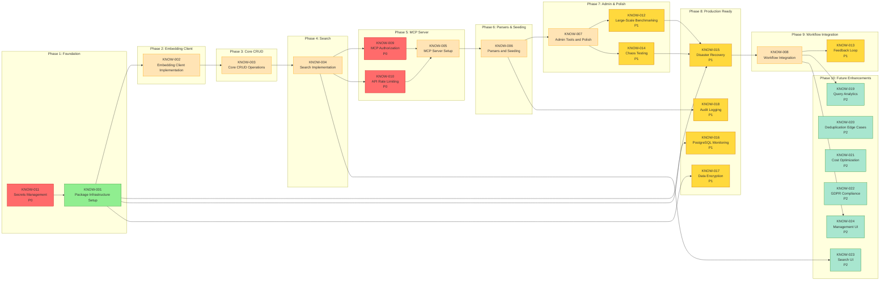

# KNOW — Story Roadmap

Visual representation of story dependencies and execution order.

---

## Dependency Graph

Shows which stories block downstream work.



**Legend:** Green = Ready | Yellow = Blocked | Blue = Done

---

## Completion Order (Gantt View)

```mermaid
gantt
    title KNOW Story Execution Order
    dateFormat X
    axisFormat %s

    section Phase 1
    KNOW-001 Package Infrastructure    :s001, 0, 1

    section Phase 2
    KNOW-002 Embedding Client          :s002, after s001, 1

    section Phase 3
    KNOW-003 Core CRUD                 :s003, after s002, 1

    section Phase 4
    KNOW-004 Search                    :s004, after s003, 1

    section Phase 5
    KNOW-005 MCP Server                :s005, after s004, 1

    section Phase 6
    KNOW-006 Parsers & Seeding         :s006, after s005, 1

    section Phase 7
    KNOW-007 Admin & Polish            :s007, after s006, 1

    section Phase 8
    KNOW-008 Workflow Integration      :s008, after s007, 1
```



---

## Critical Path

The longest chain of dependent stories (before production deployment):

```
KNOW-011 → KNOW-001 → KNOW-002 → KNOW-003 → KNOW-004 → KNOW-009 → KNOW-005 → KNOW-006 → KNOW-007 → KNOW-012 → KNOW-015 → KNOW-008
```

**Critical path length:** 12 stories (including P0 and P1 security/reliability stories)

**Foundation Phase:** KNOW-011 (secrets) must complete first
**Security Phase:** KNOW-009, KNOW-010 must be completed before KNOW-005 production deployment
**Validation Phase:** KNOW-012, KNOW-014 must be completed before KNOW-008 integration
**Production Ready:** KNOW-015, KNOW-016, KNOW-017, KNOW-018 must be completed before full deployment

---

## Parallel Opportunities

| Phase | Stories | Dependencies | Notes |
|-------|---------|---|---|
| Phase 0: Foundation | KNOW-011 | — (start) | Secrets management must be done first |
| Phase 1: Infrastructure | KNOW-001 | after KNOW-011 | Can run with P0 security stories |
| Phase 1b: Production Setup (parallel) | KNOW-015, KNOW-016, KNOW-017 | after KNOW-001 | DR, monitoring, encryption setup |
| Phase 2: Embedding | KNOW-002 | after KNOW-001 | Sequential, depends on secrets (KNOW-011) |
| Phase 3: CRUD | KNOW-003 | after KNOW-002 | Sequential |
| Phase 4: Search | KNOW-004 | after KNOW-003 | Sequential |
| Phase 4b: Security (parallel) | KNOW-009, KNOW-010 | after KNOW-004 | P0 security stories, must complete before KNOW-005 |
| Phase 5: MCP Server | KNOW-005 | after KNOW-009, KNOW-010 | Depends on P0 security |
| Phase 6: Seeding | KNOW-006 | after KNOW-005 | Sequential |
| Phase 7a: Admin & Testing | KNOW-007, KNOW-012, KNOW-014 | after KNOW-006 | Can test in parallel |
| Phase 7b: Observability (parallel) | KNOW-018 (audit) | after KNOW-006 | Can run in parallel with KNOW-007 |
| Phase 8: Integration Prep | KNOW-015, KNOW-016 (if not done earlier) | before KNOW-008 | Must be complete before workflow integration |
| Phase 9: Workflow | KNOW-008 | after KNOW-007, KNOW-015, KNOW-016 | Requires phased pilot approach |
| Phase 9b: Feedback (parallel) | KNOW-013 | parallel with KNOW-008 | Can collect feedback during pilot |
| Phase 10: Future | KNOW-019, KNOW-020, KNOW-021, KNOW-022, KNOW-023, KNOW-024 | after KNOW-008 | P2 stories for future roadmap |

**Maximum parallelization:** 3-4 stories at once in well-planned phases
- Phase 1b: KNOW-015, KNOW-016, KNOW-017 can run in parallel after KNOW-001
- Phase 4b: KNOW-009, KNOW-010 can run in parallel after KNOW-004
- Phase 7a: KNOW-012, KNOW-014 can test in parallel with KNOW-007

---

## Risk Indicators

### Critical Blockers (Must Address Before Production)

| Story | Risk Level | Mitigation | Priority |
|-------|------------|-----------|----------|
| KNOW-011 | Critical | Implement secrets management first | P0 |
| KNOW-009 | Critical | Implement auth/authorization before KNOW-005 | P0 |
| KNOW-010 | Critical | Implement rate limiting before KNOW-005 | P0 |

### High-Risk Stories

| Story | Risk Level | Reason | Mitigation |
|-------|------------|--------|-----------|
| KNOW-008 | High | Workflow disruption; agent file modifications; potential regressions | Phased rollout with feature flags; 2-3 pilot stories; comprehensive regression testing |
| KNOW-006 | High | Content migration data loss; markdown parsing; bulk import performance | Dual-write during migration period; strict YAML validation; performance testing |
| KNOW-002 | High | OpenAI API reliability; rate limits; transient failures | Retry logic with exponential backoff; budget alerts; queue/semaphore pattern |
| KNOW-015 | High | Disaster recovery validation; backup/restore procedures | Practice disaster recovery; define RTO/RPO; automate restore testing |

### Medium-Risk Stories

| Story | Risk Level | Reason | Mitigation |
|-------|------------|--------|-----------|
| KNOW-004 | Medium | RRF algorithm tuning; performance at scale; fallback behavior | Test fixtures with known relevant/irrelevant entries; performance benchmarking |
| KNOW-005 | Medium | MCP SDK patterns; Claude Code communication; error handling | Integration test harness; mock MCP protocol; chaos testing |
| KNOW-007 | Medium | Performance at scale (1000+ entries); rebuild costs | Load testing with concurrent queries; cost tracking and alerts |
| KNOW-001 | Medium | pgvector compatibility; Docker setup version requirements | Test with realistic data; validate index tuning; document version requirements |
| KNOW-003 | Medium | Deduplication reliability; content_hash collisions; re-embedding | Test edge cases; implement SHA-256 validation; coordinate updates carefully |
| KNOW-012 | Medium | Large-scale test infrastructure; realistic dataset creation | Create 10k+ entry test dataset; concurrent agent simulation |
| KNOW-014 | Medium | Chaos testing infrastructure; failure scenarios | Test API failures, DB outages, network partitions; document recovery procedures |
| KNOW-016 | Medium | Monitoring alert configuration; metric selection | Define SLOs (99.9% uptime); create CloudWatch dashboards; test alert triggers |
| KNOW-017 | Medium | Encryption key management; performance impact | Document key rotation procedures; validate performance with encryption enabled |
| KNOW-018 | Medium | Audit log volume; retention policy enforcement | Define retention policy; implement log rotation; validate query performance |

---

## Quick Reference

| Metric | Value |
|--------|-------|
| Total Stories | 24 |
| Core Stories (KNOW-001-008) | 8 |
| New P0 Stories | 3 (KNOW-009, KNOW-010, KNOW-011) |
| New P1 Stories | 8 (KNOW-012 through KNOW-018) |
| New P2 Stories | 5 (KNOW-019 through KNOW-024, minus one) |
| Ready to Start | 1 (after KNOW-011) |
| Critical Path Length | 12 stories (including security/reliability) |
| Max Parallel | 3-4 stories in optimal phases |
| Phases | 10 |
| Critical Blockers | 3 (KNOW-011, KNOW-009, KNOW-010) |
| High-Risk Stories | 4 |
| Medium-Risk Stories | 9 |
| Stories Requiring Dependency Updates | 8 |
| Stories with Risk Notes Added | 8 |
| New Stories Added | 16 |

---

## Update Log

| Date | Change | Stories Affected |
|------|--------|------------------|
| 2026-01-24 | Initial roadmap | KNOW-001 through KNOW-008 |
| 2026-01-25 | Phase 4 Updates: Added 16 new stories from accepted elaboration findings | KNOW-009 through KNOW-024 |
| 2026-01-25 | Phase 4 Updates: Added risk notes and findings to existing stories | KNOW-001 through KNOW-008 |
| 2026-01-25 | Phase 4 Updates: Updated critical path to include P0 security stories | All stories |
| 2026-01-25 | Phase 4 Updates: Identified parallel opportunities and phasing | All stories |
