# Agent Spawn Hierarchy Graph

**Generated**: 2026-02-14
**Visualization**: Mermaid diagram of agent spawn relationships

## Spawn Graph

```mermaid
graph TD
    architect_api_leader[architect-api-leader] --> architect_hexagonal_worker[architect-hexagonal-worker]
    architect_api_leader[architect-api-leader] --> architect_route_worker[architect-route-worker]
    architect_api_leader[architect-api-leader] --> architect_service_worker[architect-service-worker]
    architect_frontend_leader[architect-frontend-leader] --> architect_barrel_worker[architect-barrel-worker]
    architect_frontend_leader[architect-frontend-leader] --> architect_component_worker[architect-component-worker]
    architect_frontend_leader[architect-frontend-leader] --> architect_import_worker[architect-import-worker]
    architect_packages_leader[architect-packages-leader] --> architect_boundary_worker[architect-boundary-worker]
    architect_packages_leader[architect-packages-leader] --> architect_circular_worker[architect-circular-worker]
    architect_packages_leader[architect-packages-leader] --> architect_workspace_worker[architect-workspace-worker]
    architect_types_leader[architect-types-leader] --> architect_interface_worker[architect-interface-worker]
    architect_types_leader[architect-types-leader] --> architect_schema_worker[architect-schema-worker]
    architect_types_leader[architect-types-leader] --> architect_zod_worker[architect-zod-worker]
    cron[cron] --> kb_compressor[kb-compressor]
    dev_implement_story[dev-implement-story] --> commitment_gate_agent[commitment-gate-agent]
    dev_implement_story[dev-implement-story] --> ttdc_metrics_agent[ttdc-metrics-agent]
    dev_plan_leader[dev-plan-leader] --> knowledge_context_loader[knowledge-context-loader]
    dev_setup_leader[dev-setup-leader] --> knowledge_context_loader[knowledge-context-loader]
    dev_verification_leader[dev-verification-leader] --> churn_index_metrics_agent[churn-index-metrics-agent]
    dev_verification_leader[dev-verification-leader] --> leakage_metrics_agent[leakage-metrics-agent]
    dev_verification_leader[dev-verification-leader] --> pcar_metrics_agent[pcar-metrics-agent]
    dev_verification_leader[dev-verification-leader] --> turn_count_metrics_agent[turn-count-metrics-agent]
    elab_completion_leader[elab-completion-leader] --> elab_delta_review_agent[elab-delta-review-agent]
    elab_completion_leader[elab-completion-leader] --> elab_escape_hatch_agent[elab-escape-hatch-agent]
    elab_completion_leader[elab-completion-leader] --> elab_phase_contract_agent[elab-phase-contract-agent]
    elab_delta_review_agent[elab-delta-review-agent] --> elab_escape_hatch_agent[elab-escape-hatch-agent]
    elab_setup_leader[elab-setup-leader] --> elab_phase_contract_agent[elab-phase-contract-agent]
    elab_story[elab-story] --> elab_delta_review_agent[elab-delta-review-agent]
    elab_story[elab-story] --> elab_escape_hatch_agent[elab-escape-hatch-agent]
    manual[manual] --> kb_compressor[kb-compressor]
    pm_story_adhoc_leader[pm-story-adhoc-leader] --> gap_analytics_agent[gap-analytics-agent]
    pm_story_adhoc_leader[pm-story-adhoc-leader] --> gap_hygiene_agent[gap-hygiene-agent]
    pm_story_adhoc_leader[pm-story-adhoc-leader] --> knowledge_context_loader[knowledge-context-loader]
    pm_story_adhoc_leader[pm-story-adhoc-leader] --> pm_story_seed_agent[pm-story-seed-agent]
    pm_story_adhoc_leader[pm-story-adhoc-leader] --> readiness_score_agent[readiness-score-agent]
    pm_story_adhoc_leader[pm-story-adhoc-leader] --> story_attack_agent[story-attack-agent]
    pm_story_adhoc_leader[pm-story-adhoc-leader] --> story_fanout_pm[story-fanout-pm]
    pm_story_adhoc_leader[pm-story-adhoc-leader] --> story_fanout_qa[story-fanout-qa]
    pm_story_adhoc_leader[pm-story-adhoc-leader] --> story_fanout_ux[story-fanout-ux]
    pm_story_adhoc_leader[pm-story-adhoc-leader] --> story_synthesize_agent[story-synthesize-agent]
    pm_story_followup_leader[pm-story-followup-leader] --> pm_story_seed_agent[pm-story-seed-agent]
    pm_story_generation_leader[pm-story-generation-leader] --> gap_analytics_agent[gap-analytics-agent]
    pm_story_generation_leader[pm-story-generation-leader] --> gap_hygiene_agent[gap-hygiene-agent]
    pm_story_generation_leader[pm-story-generation-leader] --> knowledge_context_loader[knowledge-context-loader]
    pm_story_generation_leader[pm-story-generation-leader] --> pm_dev_feasibility_review[pm-dev-feasibility-review]
    pm_story_generation_leader[pm-story-generation-leader] --> pm_draft_test_plan[pm-draft-test-plan]
    pm_story_generation_leader[pm-story-generation-leader] --> pm_story_risk_predictor[pm-story-risk-predictor]
    pm_story_generation_leader[pm-story-generation-leader] --> pm_story_seed_agent[pm-story-seed-agent]
    pm_story_generation_leader[pm-story-generation-leader] --> pm_uiux_recommendations[pm-uiux-recommendations]
    pm_story_generation_leader[pm-story-generation-leader] --> readiness_score_agent[readiness-score-agent]
    pm_story_generation_leader[pm-story-generation-leader] --> story_attack_agent[story-attack-agent]
    pm_story_generation_leader[pm-story-generation-leader] --> story_fanout_pm[story-fanout-pm]
    pm_story_generation_leader[pm-story-generation-leader] --> story_fanout_qa[story-fanout-qa]
    pm_story_generation_leader[pm-story-generation-leader] --> story_fanout_ux[story-fanout-ux]
    pm_story_generation_leader[pm-story-generation-leader] --> story_synthesize_agent[story-synthesize-agent]
    pm_story_seed_agent[pm-story-seed-agent] --> knowledge_context_loader[knowledge-context-loader]
    pm_story_split_leader[pm-story-split-leader] --> pm_story_seed_agent[pm-story-seed-agent]
    scrum_master_loop_leader[scrum-master-loop-leader] --> churn_index_metrics_agent[churn-index-metrics-agent]
    scrum_master_loop_leader[scrum-master-loop-leader] --> elab_phase_contract_agent[elab-phase-contract-agent]
    scrum_master_loop_leader[scrum-master-loop-leader] --> leakage_metrics_agent[leakage-metrics-agent]
    scrum_master_loop_leader[scrum-master-loop-leader] --> pcar_metrics_agent[pcar-metrics-agent]
    scrum_master_loop_leader[scrum-master-loop-leader] --> ttdc_metrics_agent[ttdc-metrics-agent]
    scrum_master_loop_leader[scrum-master-loop-leader] --> turn_count_metrics_agent[turn-count-metrics-agent]

    %% Styling by agent type
    style elab_completion_leader fill:#e3f2fd,stroke:#1976d2
    style scrum_master_loop_leader fill:#e3f2fd,stroke:#1976d2
    style architect_packages_leader fill:#e3f2fd,stroke:#1976d2
    style elab_setup_leader fill:#e3f2fd,stroke:#1976d2
    style pm_story_split_leader fill:#e3f2fd,stroke:#1976d2
    style architect_api_leader fill:#e3f2fd,stroke:#1976d2
    style pm_story_followup_leader fill:#e3f2fd,stroke:#1976d2
    style dev_setup_leader fill:#e3f2fd,stroke:#1976d2
    style pm_story_adhoc_leader fill:#e3f2fd,stroke:#1976d2
    style pm_story_generation_leader fill:#e3f2fd,stroke:#1976d2
    style architect_frontend_leader fill:#e3f2fd,stroke:#1976d2
    style dev_plan_leader fill:#e3f2fd,stroke:#1976d2
    style dev_verification_leader fill:#e3f2fd,stroke:#1976d2
    style architect_types_leader fill:#e3f2fd,stroke:#1976d2
    style pm_dev_feasibility_review fill:#f3e5f5,stroke:#7b1fa2
    style architect_schema_worker fill:#f3e5f5,stroke:#7b1fa2
    style turn_count_metrics_agent fill:#f3e5f5,stroke:#7b1fa2
    style architect_boundary_worker fill:#f3e5f5,stroke:#7b1fa2
    style churn_index_metrics_agent fill:#f3e5f5,stroke:#7b1fa2
    style readiness_score_agent fill:#f3e5f5,stroke:#7b1fa2
    style story_fanout_pm fill:#f3e5f5,stroke:#7b1fa2
    style architect_service_worker fill:#f3e5f5,stroke:#7b1fa2
    style architect_zod_worker fill:#f3e5f5,stroke:#7b1fa2
    style architect_workspace_worker fill:#f3e5f5,stroke:#7b1fa2
    style elab_delta_review_agent fill:#f3e5f5,stroke:#7b1fa2
    style ttdc_metrics_agent fill:#f3e5f5,stroke:#7b1fa2
    style story_fanout_ux fill:#f3e5f5,stroke:#7b1fa2
    style story_fanout_qa fill:#f3e5f5,stroke:#7b1fa2
    style pcar_metrics_agent fill:#f3e5f5,stroke:#7b1fa2
    style story_attack_agent fill:#f3e5f5,stroke:#7b1fa2
    style pm_story_risk_predictor fill:#f3e5f5,stroke:#7b1fa2
    style elab_escape_hatch_agent fill:#f3e5f5,stroke:#7b1fa2
    style pm_draft_test_plan fill:#f3e5f5,stroke:#7b1fa2
    style architect_hexagonal_worker fill:#f3e5f5,stroke:#7b1fa2
    style architect_interface_worker fill:#f3e5f5,stroke:#7b1fa2
    style leakage_metrics_agent fill:#f3e5f5,stroke:#7b1fa2
    style kb_compressor fill:#f3e5f5,stroke:#7b1fa2
    style architect_component_worker fill:#f3e5f5,stroke:#7b1fa2
    style architect_circular_worker fill:#f3e5f5,stroke:#7b1fa2
    style pm_story_seed_agent fill:#f3e5f5,stroke:#7b1fa2
    style gap_analytics_agent fill:#f3e5f5,stroke:#7b1fa2
    style architect_import_worker fill:#f3e5f5,stroke:#7b1fa2
    style commitment_gate_agent fill:#f3e5f5,stroke:#7b1fa2
    style architect_route_worker fill:#f3e5f5,stroke:#7b1fa2
    style gap_hygiene_agent fill:#f3e5f5,stroke:#7b1fa2
    style story_synthesize_agent fill:#f3e5f5,stroke:#7b1fa2
    style elab_phase_contract_agent fill:#f3e5f5,stroke:#7b1fa2
    style architect_barrel_worker fill:#f3e5f5,stroke:#7b1fa2
    style knowledge_context_loader fill:#f3e5f5,stroke:#7b1fa2
    style pm_uiux_recommendations fill:#f3e5f5,stroke:#7b1fa2
```

## Legend

- **Blue nodes**: Leader agents (orchestrators)
- **Purple nodes**: Worker agents
- **Arrows**: Spawn relationships (parent → child)

## Spawn Chains Summary

- **Total spawn relationships**: 62
- **Agents with parents**: 36
- **Agents that spawn**: 20