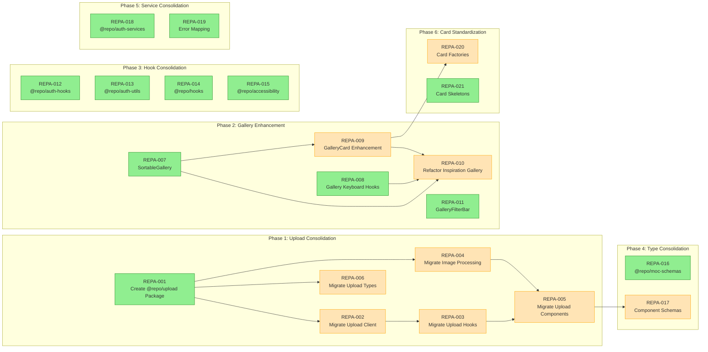

# REPA — Story Roadmap

Visual representation of story dependencies and execution order.

---

## Dependency Graph

Shows which stories block downstream work.



**Legend:** Green = Ready | Yellow = Blocked | Blue = Done

---

## Completion Order (Gantt View)

```mermaid
gantt
    title REPA Story Execution Order
    dateFormat X
    axisFormat %s

    section Phase 1
    REPA-001 Create @repo/upload Package    :s001, 0, 1
    REPA-002 Migrate Upload Client          :s002, after s001, 1
    REPA-004 Migrate Image Processing       :s004, after s001, 1
    REPA-006 Migrate Upload Types           :s006, after s001, 1
    REPA-003 Migrate Upload Hooks           :s003, after s002, 1
    REPA-005 Migrate Upload Components      :s005, after s003 s004, 1

    section Phase 2
    REPA-007 SortableGallery                :s007, 0, 1
    REPA-008 Gallery Keyboard Hooks         :s008, 0, 1
    REPA-011 GalleryFilterBar               :s011, 0, 1
    REPA-009 GalleryCard Enhancement        :s009, after s007, 1
    REPA-010 Refactor Inspiration Gallery   :s010, after s007 s008 s009, 1

    section Phase 3
    REPA-012 @repo/auth-hooks               :s012, 0, 1
    REPA-013 @repo/auth-utils               :s013, 0, 1
    REPA-014 @repo/hooks                    :s014, 0, 1
    REPA-015 @repo/accessibility            :s015, 0, 1

    section Phase 4
    REPA-016 @repo/moc-schemas              :s016, 0, 1
    REPA-017 Component Schemas              :s017, after s005, 1

    section Phase 5
    REPA-018 @repo/auth-services            :s018, 0, 1
    REPA-019 Error Mapping                  :s019, 0, 1

    section Phase 6
    REPA-020 Card Factories                 :s020, after s009, 1
    REPA-021 Card Skeletons                 :s021, 0, 1
```



---

## Critical Path

The longest chain of dependent stories:

```
REPA-001 → REPA-002 → REPA-003 → REPA-005 → REPA-017
```

**Critical path length:** 5 stories

---

## Parallel Opportunities

| Parallel Group | Stories | After |
|----------------|---------|-------|
| Group 1 | REPA-001, REPA-007, REPA-008, REPA-011, REPA-012, REPA-013, REPA-014, REPA-015, REPA-016, REPA-018, REPA-019, REPA-021 | — (start) |
| Group 2 | REPA-002, REPA-004, REPA-006 | REPA-001 |
| Group 3 | REPA-003 | REPA-002 |
| Group 4 | REPA-009 | REPA-007 |
| Group 5 | REPA-005 | REPA-003, REPA-004 |
| Group 6 | REPA-010 | REPA-007, REPA-008, REPA-009 |
| Group 7 | REPA-017 | REPA-005 |
| Group 8 | REPA-020 | REPA-009 |

**Maximum parallelization:** 12 stories at once

---

## Risk Indicators

| Story | Risk Level | Reason |
|-------|------------|--------|
| REPA-003 | High | Breaking changes during upload hook migration |
| REPA-005 | High | 7 components to consolidate across multiple apps |
| REPA-007 | Medium | API design may not cover all app needs |
| REPA-010 | Medium | Full app refactor with 3 dependencies |
| REPA-002 | Low | Package deprecation needed |
| REPA-006 | Low | Package deprecation needed |

---

## Quick Reference

| Metric | Value |
|--------|-------|
| Total Stories | 21 |
| Ready to Start | 12 |
| Critical Path Length | 5 stories |
| Max Parallel | 12 stories |
| Phases | 6 |

---

## Update Log

| Date | Change | Stories Affected |
|------|--------|------------------|
| 2026-02-09 | Initial roadmap | All |
