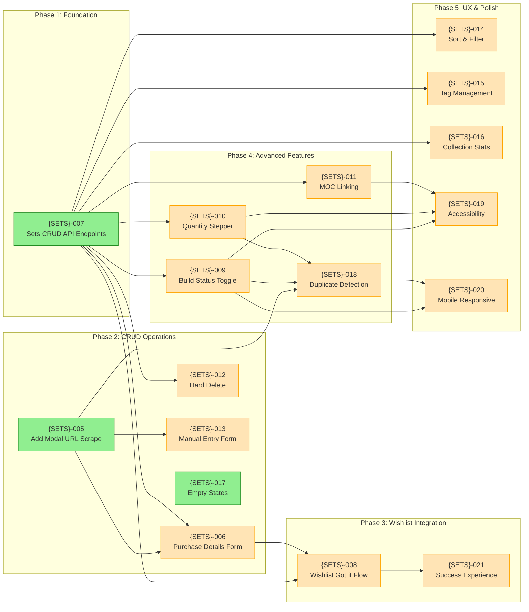

# SETS — Story Roadmap

Visual representation of story dependencies and execution order.

---

## Dependency Graph

Shows which stories block downstream work.



**Legend:** Green = Ready | Yellow = Blocked | Blue = Done

---

## Completion Order (Gantt View)

```mermaid
gantt
    title SETS Story Execution Order
    dateFormat X
    axisFormat %s

    section Phase 1
    SETS-007 API           :s007, 0, 1

    section Phase 2
    SETS-005 Add Modal     :s005, 0, 1
    SETS-017 Empty States  :s017, 0, 1
    SETS-006 Purchase Form :s006, after s005, 1
    SETS-012 Hard Delete   :s012, after s007, 1
    SETS-013 Manual Entry  :s013, after s005, 1

    section Phase 3
    SETS-008 Wishlist Flow :s008, after s006 s007, 1
    SETS-021 Success UX    :s021, after s008, 1

    section Phase 4
    SETS-009 Build Toggle  :s009, after s007, 1
    SETS-010 Quantity      :s010, after s007, 1
    SETS-011 MOC Linking   :s011, after s007, 1
    SETS-018 Duplicates    :s018, after s005 s010, 1

    section Phase 5
    SETS-014 Sort Filter   :s014, after s007, 1
    SETS-015 Tags          :s015, after s007, 1
    SETS-016 Stats         :s016, after s007, 1
    SETS-019 Accessibility :s019, after s009 s010 s011, 1
    SETS-020 Mobile        :s020, after s009, 1
```



---

## Critical Path

The longest chain of dependent stories:

```
SETS-007 → SETS-006 → SETS-008 → SETS-021
```

**Critical path length:** 4 stories

---

## Parallel Opportunities

| Parallel Group | Stories | After | Description |
|----------------|---------|-------|-------------|
| Group 1 | SETS-005, SETS-007, SETS-017 | — (start) | Foundation: API, UI scaffolding, and empty states can proceed independently |
| Group 2 | SETS-006, SETS-013 | Group 1 | Forms: Purchase details and manual entry depend on add modal |
| Group 3 | SETS-009, SETS-010, SETS-011, SETS-012, SETS-014, SETS-015 | Group 1 | CRUD features: All depend on SETS-007 API but can proceed in parallel |
| Group 4 | SETS-008 | Group 2 | Wishlist integration: Depends on API and purchase details form |
| Group 5 | SETS-018 | Group 3 | Duplicate detection: Needs add modal and quantity management |
| Group 6 | SETS-019, SETS-020, SETS-021 | Group 4 | Polish: Accessibility, mobile, and success experience after core features |
| Group 7 | SETS-016 | Group 3 | Stats: Can implement after core CRUD is complete |

**Maximum parallelization:** 6 stories at once

---

## Risk Indicators

| Story | Risk Level | Reason |
|-------|------------|--------|
| SETS-008 | High | Requires atomic transaction (create Set before deleting Wishlist), rollback handling, and undo support; cross-epic dependency on Wishlist |
| SETS-007 | High | Must ensure atomic transactions for Wishlist integration; proper indexing needed for performance |
| SETS-009 | Medium | Optimistic updates require careful state management and rollback on failure |
| SETS-010 | Medium | Must handle edge case where user tries to decrement below 1 (prompt to delete instead) |
| SETS-005 | Medium | Depends on shared scraper service reliability; must handle scraper failures gracefully |
| SETS-011 | Medium | Cross-epic dependency on MOC Instructions; requires bidirectional updates |
| SETS-018 | Low | UX complexity: must clearly explain the two options to users |
| SETS-014 | Low | Depends on shared gallery package implementation |
| SETS-015 | Low | Depends on shared tag management package availability |
| SETS-020 | Low | Touch gesture implementation requires careful testing across devices |

---

## Swimlane View (by Domain)

### Backend (5 stories)
- **SETS-007:** Sets CRUD API Endpoints (Phase 1)
- **SETS-008:** Wishlist 'Got it' Integration (Phase 3)
- **SETS-009:** Build Status Toggle endpoint (Phase 4)
- **SETS-010:** Quantity Stepper endpoint (Phase 4)
- **SETS-014:** Sort and Filter API support (Phase 5)

### Frontend (10 stories)
- **SETS-005:** Add Modal with URL Scrape (Phase 2)
- **SETS-006:** Purchase Details Form (Phase 2)
- **SETS-009:** Build Status Toggle UI (Phase 4)
- **SETS-010:** Quantity Stepper UI (Phase 4)
- **SETS-011:** MOC Linking UI (Phase 4)
- **SETS-012:** Hard Delete UI (Phase 2)
- **SETS-013:** Manual Entry Form (Phase 2)
- **SETS-014:** Sort and Filter UI (Phase 5)
- **SETS-019:** Keyboard Navigation (Phase 5)
- **SETS-020:** Mobile Responsive (Phase 5)

### Integration (2 stories)
- **SETS-008:** Wishlist 'Got it' Integration (Phase 3)
- **SETS-021:** Got it Success Experience (Phase 3)

### Supporting (3 stories)
- **SETS-015:** Tag Management Integration (Phase 5)
- **SETS-016:** Collection Stats Display (Phase 5)
- **SETS-017:** Empty States (Phase 2)
- **SETS-018:** Duplicate Detection (Phase 4)

---

## Quick Reference

| Metric | Value |
|--------|-------|
| Total Stories | 17 |
| Ready to Start | 3 |
| Critical Path Length | 4 stories |
| Max Parallel | 6 stories |
| Phases | 5 |
| Stories with Sizing Warnings | 2 |
| Backend Stories | 5 |
| Frontend Stories | 10 |
| Integration Stories | 2 |
| Estimated Completion Phases | 5 |

---

## Update Log

| Date | Change | Stories Affected |
|------|--------|------------------|
| 2026-01-25 | Initial roadmap generation | All 17 stories |
