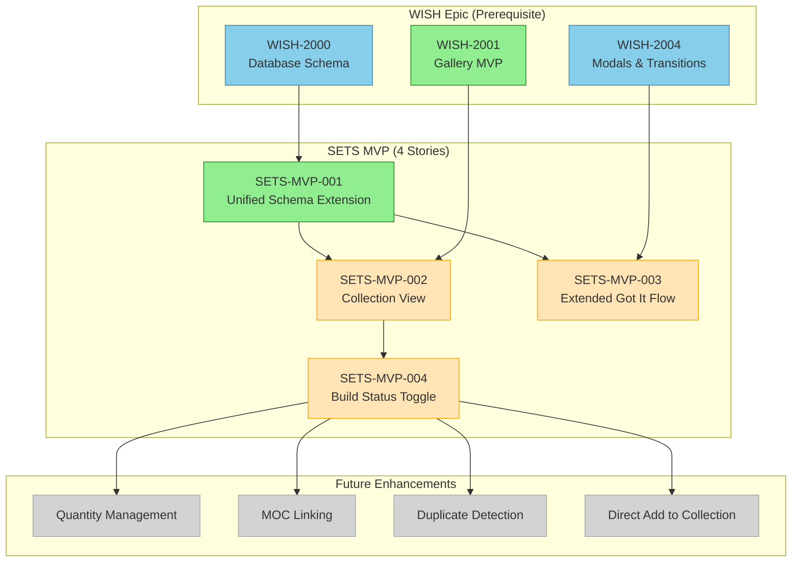

# SETS — Story Roadmap (MVP)

Visual representation of the simplified Sets MVP using the unified data model.

## Decision Summary

The original 17-story SETS epic has been replaced with 4 stories that extend the existing WISH feature. A wishlist item is fundamentally "a set that hasn't been purchased yet" — we use a single unified model with a `status` field instead of separate tables.

See [SETS-MVP-SUMMARY.md](./SETS-MVP-SUMMARY.md) for full rationale.

---

## Dependency Graph



**Legend:** Blue = Done | Green = Ready | Yellow = Blocked | Gray = Future

---

## Completion Order (Gantt View)

```mermaid
gantt
    title SETS MVP Execution Order
    dateFormat X
    axisFormat %s

    section Prerequisites
    WISH-2000 Schema        :done, w2000, 0, 1
    WISH-2001 Gallery       :active, w2001, 0, 1
    WISH-2004 Modals        :done, w2004, 0, 1

    section SETS MVP
    SETS-MVP-001 Schema     :s001, 1, 1
    SETS-MVP-002 Collection :s002, after s001, 1
    SETS-MVP-003 Got It     :s003, after s001, 1
    SETS-MVP-004 Toggle     :s004, after s002, 1

    section Future
    Quantity Management     :f001, after s004, 1
    MOC Linking             :f002, after s004, 1
```



---

## Critical Path

```
WISH-2000 → SETS-MVP-001 → SETS-MVP-002 → SETS-MVP-004
```

**Critical path length:** 4 stories (including prerequisite)

---

## Stories

### SETS-MVP-001: Unified Schema Extension

**Status:** Ready (blocked by WISH-2000 completion)
**Points:** 2
**Depends On:** WISH-2000

Add `status`, `buildStatus`, and purchase fields to the existing wishlist schema to support owned items.

**Key Changes:**
- `status: 'wishlist' | 'owned'` (default: 'wishlist')
- `buildStatus: 'in_pieces' | 'built'` (nullable)
- `purchaseDate`, `purchasePrice`, `purchaseTax`, `purchaseShipping`
- `statusChangedAt`

---

### SETS-MVP-002: Collection View

**Status:** Blocked
**Points:** 3
**Depends On:** SETS-MVP-001, WISH-2001

Collection page at `/collection` showing owned items using the same gallery infrastructure, filtered by `status = 'owned'`.

**Key Features:**
- Reuses WishlistGallery with status filter
- Build status badge on cards
- Basic stats (total sets, pieces, spent)
- No drag-and-drop (wishlist-only feature)

---

### SETS-MVP-003: Extended Got It Flow

**Status:** Blocked
**Points:** 3
**Depends On:** SETS-MVP-001, WISH-2004

Extend "Got it" modal to capture purchase details and update status instead of create+delete.

**Key Features:**
- Purchase details step (price, date, tax, shipping)
- Build status selection (default: in pieces)
- Simple UPDATE instead of atomic transaction
- Undo support (5s window)

---

### SETS-MVP-004: Build Status Toggle

**Status:** Blocked
**Points:** 2
**Depends On:** SETS-MVP-002

Toggle component to switch between "Built" and "In Pieces" with optimistic updates.

**Key Features:**
- Visual toggle on collection cards
- Optimistic UI updates
- Celebration animation (optional)
- Undo support

---

## Comparison: Original vs MVP

| Metric | Original SETS | SETS MVP | Reduction |
|--------|---------------|----------|-----------|
| Stories | 17 | 4 | 76% |
| Estimated Points | ~64 | ~10 | 84% |
| Critical Path | 4 stories | 4 stories | Same |
| New Tables | 1 (sets) | 0 | 100% |
| New APIs | 6 endpoints | 2 endpoints | 67% |

---

## Deferred Features

These features from the original SETS epic are deferred until user feedback validates need:

| Feature | Original Story | Priority | Notes |
|---------|----------------|----------|-------|
| Quantity stepper | SETS-010 | Medium | Add multiple rows for now |
| MOC linking | SETS-011 | Medium | Cross-epic dependency |
| Duplicate detection | SETS-018 | Low | UX prompt when adding |
| Direct add to collection | SETS-005, SETS-013 | Low | Use wishlist → got it flow |
| Advanced sort/filter | SETS-014 | Low | Purchase date sort is MVP |
| Tag management | SETS-015 | Low | Shared with wishlist |
| Mobile swipe gestures | SETS-020 | Low | Nice-to-have polish |

---

## Quick Reference

| Metric | Value |
|--------|-------|
| Total MVP Stories | 4 |
| Ready to Start | 1 (SETS-MVP-001) |
| Critical Path Length | 4 stories |
| Max Parallel | 2 stories (S002 + S003) |
| Estimated Total Points | ~10 |
| Prerequisites | WISH-2000, WISH-2001, WISH-2004 |

---

## Update Log

| Date | Change | Stories Affected |
|------|--------|------------------|
| 2026-01-25 | Initial 17-story roadmap | All original |
| 2026-01-30 | Replaced with 4-story MVP using unified model | All - major simplification |
