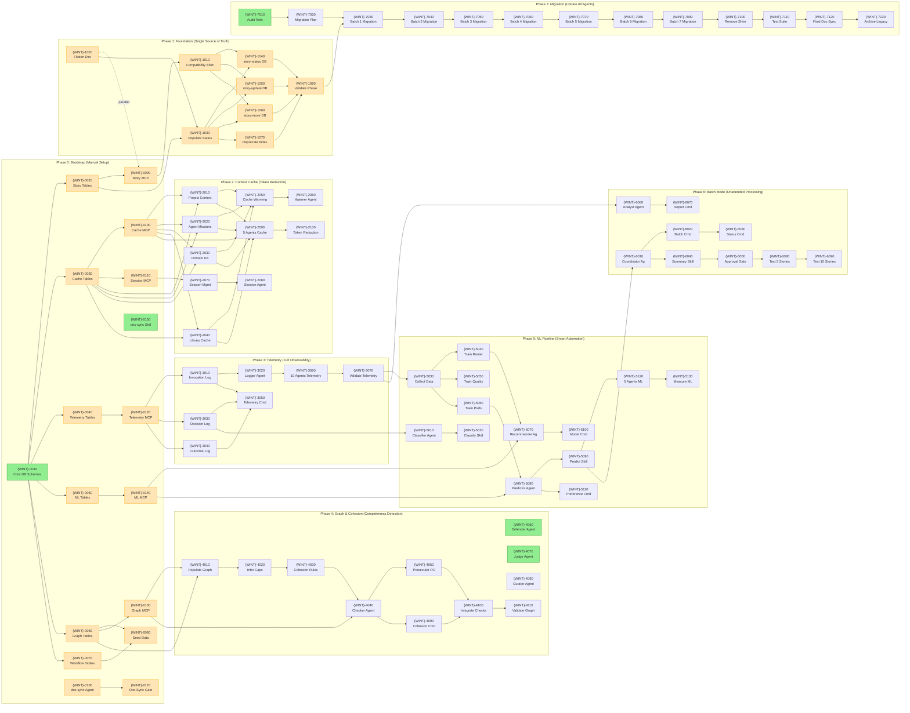

# WINT — Story Roadmap

Visual representation of story dependencies and execution order across 8 phases with 93 total stories.

---

## Dependency Graph

Shows which stories block downstream work.



**Legend:** Green = Ready | Orange = Blocked | Blue = Done

---

## Completion Order (Gantt View)

```mermaid
gantt
    title WINT Story Execution Order (Simplified)
    dateFormat X
    axisFormat %s

    section Phase 0
    WINT-0010 Schemas    :s0010, 0, 1
    WINT-0020-0070 MCP/Tables    :s0020, after s0010, 2
    WINT-0080-0150 Seeds/Skills    :s0080, after s0020, 2
    WINT-0160-0170 DocSync    :s0160, after s0080, 1

    section Phase 1
    WINT-1010-1030 Foundation    :s1010, after s0160, 2
    WINT-1040-1080 DB Commands    :s1040, after s1010, 2

    section Phase 2
    WINT-2010-2040 Context Cache    :s2010, after s1040, 2
    WINT-2050-2080 Cache Mgmt    :s2050, after s2010, 2
    WINT-2090-2100 Token Reduction    :s2090, after s2050, 2

    section Phase 3
    WINT-3010-3040 Telemetry    :s3010, after s2090, 2
    WINT-3050-3070 Telemetry Validation    :s3050, after s3010, 2

    section Phase 4
    WINT-4010-4030 Graph Setup    :s4010, after s3050, 2
    WINT-4040-4110 Cohesion Checks    :s4040, after s4010, 3

    section Phase 5
    WINT-5010-5030 ML Prep    :s5010, after s4040, 2
    WINT-5040-5090 ML Training    :s5040, after s5010, 2
    WINT-5100-5130 ML Integration    :s5100, after s5040, 2

    section Phase 6
    WINT-6010-6050 Batch Setup    :s6010, after s5100, 2
    WINT-6060-6090 Batch Testing    :s6060, after s6010, 2

    section Phase 7
    WINT-7010-7030 Migration Phase 1    :s7010, after s6060, 2
    WINT-7040-7090 Migration Phase 2    :s7040, after s7010, 3
    WINT-7100-7130 Migration Complete    :s7100, after s7040, 2
```



---

## Critical Path

The longest chain of dependent stories:

```
WINT-0010 → WINT-0020 → WINT-0090 → WINT-1010 →
WINT-1020 → WINT-1030 → WINT-1040 → WINT-1080 →
WINT-2010 → WINT-2090 → WINT-2100 → WINT-3010 →
WINT-3020 → WINT-3060 → WINT-3070 → WINT-5030 →
WINT-5040 → WINT-5070 → WINT-5090 → WINT-5120 →
WINT-5130 → WINT-6010 → WINT-6020 → WINT-6050 →
WINT-6080 → WINT-6090 → WINT-7020 → WINT-7030 →
WINT-7040 → WINT-7050 → WINT-7060 → WINT-7070 →
WINT-7080 → WINT-7090 → WINT-7100 → WINT-7110 →
WINT-7120 → WINT-7130
```

**Critical path length:** 39 stories

---

## Parallel Opportunities

| Parallel Group | Stories | After |
|---|---|---|
| Group 1 | WINT-0010 | — (start) |
| Group 2 | WINT-0020, 0030, 0040, 0050, 0060, 0070 | Group 1 |
| Group 3 | WINT-0080, 0090, 0100, 0110, 0120, 0130, 0140, 0150 | Group 2 |
| Group 4 | WINT-0160, 1020 | Group 3 |
| Group 5 | WINT-0170, 1010, 1030 | Group 4 |
| Group 6 | WINT-1040, 1050, 1060, 1070 | Group 5 |
| Group 7 | WINT-1080 | Group 6 |
| Group 8 | WINT-2010, 2020, 2030, 2040, 2070 | Group 7 |
| Group 9 | WINT-2050, 2080 | Group 8 |
| Group 10 | WINT-2060, 2090 | Group 9 |
| Group 11 | WINT-2100 | Group 10 |

**Maximum parallelization:** 6 stories at once

---

## Risk Indicators

| Story ID | Risk Level | Reason |
|---|---|---|
| WINT-0010 | High | Database migration could break existing KB functionality |
| WINT-5030 | Medium | Need 30-50 stories before ML training, may take weeks |
| WINT-5040, 5050, 5060 | Medium | Model accuracy targets (85% routing, 90% auto-accept) may not be achievable |
| WINT-1010 | Low | Compatibility shim performance during migration period |
| WINT-5090, 5120 | High | Auto-accept safety - must not allow dangerous decisions through |
| WINT-7030 to 7090 | High | 52 agents to migrate - large scope, discovery risk |
| WINT-3010, 3030 | Medium | High-frequency telemetry writes need batching strategy |
| WINT-4040, 4090 | Low | Graph query performance as graph grows |
| WINT-6010, 6020 | Medium | Batch mode error handling and partial failure recovery |
| WINT-0170, 7120 | Low | doc-sync latency could slow workflows |

---

## Quick Reference

| Metric | Value |
|---|---|
| Total Stories | 88 |
| Ready to Start | 6 |
| Critical Path Length | 39 stories |
| Max Parallel | 6 stories |
| Phases | 8 |
| High-Risk Stories | 6 |
| Sizing Warnings | 4 |

---

## Update Log

| Date | Change | Stories Affected |
|---|---|---|
| 2026-02-09 | Initial roadmap | All 93 stories |
