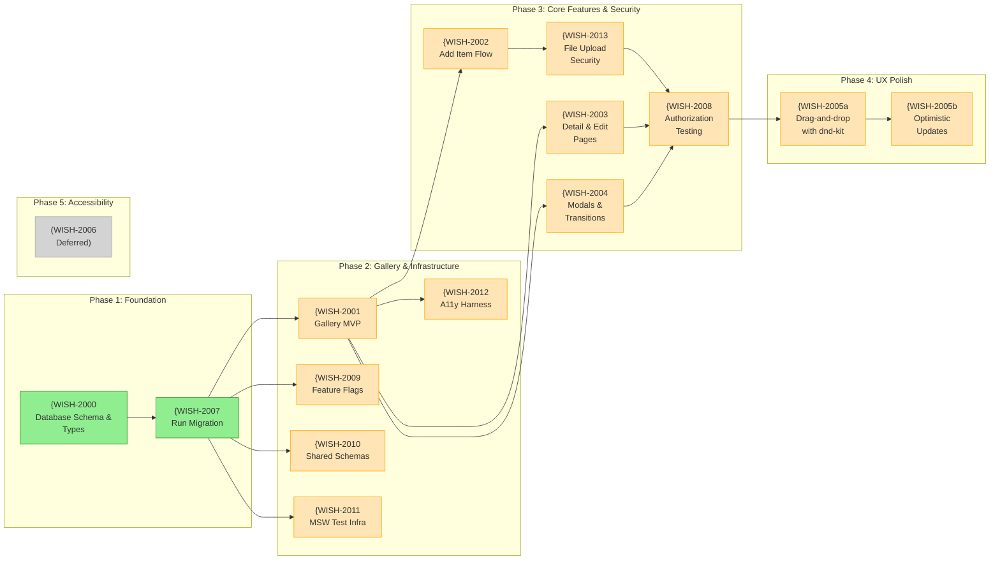

# WISH — Story Roadmap

Visual representation of story dependencies and execution order.

---

## Dependency Graph

Shows which stories block downstream work.



**Legend:** Green = Ready | Yellow = Blocked | Blue = Done

---

## Completion Order (Gantt View)

```mermaid
gantt
    title WISH Story Execution Order (Updated)
    dateFormat X
    axisFormat %s

    section Phase 1
    WISH-2000 Schema    :s001, 0, 1
    WISH-2007 Migration :s007, 1, 1

    section Phase 2
    WISH-2001 Gallery   :s002, 2, 1
    WISH-2009 Feature Flags :s009, 2, 1
    WISH-2010 Schemas   :s010, 2, 1
    WISH-2011 MSW Infra :s011, 2, 1
    WISH-2012 A11y Harness :s012, 2, 1

    section Phase 3
    WISH-2002 Add Item  :s003, 3, 1
    WISH-2003 Detail    :s004, 3, 1
    WISH-2004 Modals    :s005, 3, 1
    WISH-2013 Upload Security :s013, 3, 1
    WISH-2008 Authorization :s008, 3, 1

    section Phase 4
    WISH-2005a Drag-drop :s006a, 4, 1
    WISH-2005b Optimistic :s006b, 5, 1

    section Phase 5
    WISH-2006 A11y (Deferred) :crit, s006c, 6, 1
```



---

## Critical Path

The longest chain of dependent stories:

```
WISH-2000 → WISH-2007 → WISH-2001 → WISH-2002 → WISH-2013 → WISH-2008 → WISH-2005a → WISH-2005b
```

**Critical path length:** 8 stories

Note: WISH-2006 (Accessibility) is now deferred and not on the critical path for MVP.

---

## Parallel Opportunities

| Parallel Group | Stories | After |
|----------------|---------|-------|
| Group 1 | WISH-2000 | — (start) |
| Group 2 | WISH-2007 | Group 1 |
| Group 3 | WISH-2001, WISH-2009, WISH-2010, WISH-2011 | Group 2 |
| Group 4 | WISH-2012 | WISH-2001 |
| Group 5 | WISH-2002, WISH-2003, WISH-2004 | Group 3 |
| Group 6 | WISH-2013 | WISH-2002 |
| Group 7 | WISH-2008 | WISH-2013, WISH-2003, WISH-2004 |
| Group 8 | WISH-2005a | Group 7 |
| Group 9 | WISH-2005b | Group 8 |
| Group 10 | WISH-2006 (Deferred) | — |

**Maximum parallelization:** 5 stories at once (in Phase 2: WISH-2009, WISH-2010, WISH-2011 + WISH-2001 prep parallel)

---

## Risk Indicators

| Story | Risk Level | Reason |
|-------|------------|--------|
| WISH-2008 | Critical | Authorization layer must be implemented across all endpoints. Security-critical. |
| WISH-2013 | Critical | File upload security: virus scanning, type validation, S3 hardening required. |
| WISH-2004 | High | Got it flow data loss - transaction must create Set before deleting Wishlist item |
| WISH-2005a | High | dnd-kit integration and pagination awareness with optimistic updates |
| WISH-2005b | High | Optimistic state management with undo semantics across out-of-order operations |
| WISH-2001 | Medium | Integration with shared gallery package must maintain consistency |
| WISH-2002 | Medium | Depends on WISH-2013 for file upload security |
| WISH-2003 | Medium | Must implement authorization checks (WISH-2008) |
| WISH-2006 | Medium | Comprehensive accessibility testing requires VoiceOver and keyboard testing (Deferred) |
| WISH-2000 | Low | Schema definition is straightforward |
| WISH-2007 | Low | Migration must be run after schema is approved |
| WISH-2009 | Low | Standard feature flag infrastructure |
| WISH-2010 | Low | Standard schema consolidation |
| WISH-2011 | Low | Standard MSW mock setup |
| WISH-2012 | Low | Standard test harness |

---

## Swimlane View (by Domain)

| Domain | Stories | Phase |
|--------|---------|-------|
| Database | WISH-2000, WISH-2007 | 1 |
| Infrastructure | WISH-2009, WISH-2010, WISH-2011, WISH-2012 | 2 |
| Frontend - Gallery | WISH-2001 | 2 |
| Frontend - Forms | WISH-2002, WISH-2003 | 3 |
| Frontend - Interactions | WISH-2004 | 3 |
| Frontend - UX | WISH-2005a, WISH-2005b | 4 |
| Frontend - A11y | WISH-2006 | 5 (Deferred) |
| Backend - API | WISH-2001, WISH-2002, WISH-2003, WISH-2004, WISH-2005 | 2-4 |
| Security | WISH-2008, WISH-2013 | 3 |

---

## Quick Reference

| Metric | Value |
|--------|-------|
| Total Stories | 14 |
| MVP Stories | 13 |
| Deferred Stories | 1 (WISH-2006) |
| Ready to Start | 1 (WISH-2000) |
| Critical Path Length | 8 stories |
| Max Parallel | 5 stories |
| Phases | 5 |
| P0 Priority Stories | 6 (new security/infra) |
| Critical-Risk Stories | 2 (WISH-2008, WISH-2013) |
| High-Risk Stories | 3 (WISH-2004, WISH-2005a, WISH-2005b) |
| Stories with Sizing Warnings | 2 (WISH-2005a, WISH-2006) |

---

## Update Log

| Date | Change | Stories Affected |
|------|--------|------------------|
| 2026-01-25 | Initial roadmap | All |
| 2026-01-25 | Phase 4 Updates: Applied epic elaboration decisions | WISH-2005 split into 2005a/2005b, WISH-2006 deferred, 6 new P0 stories added (WISH-2008 through WISH-2013) |
