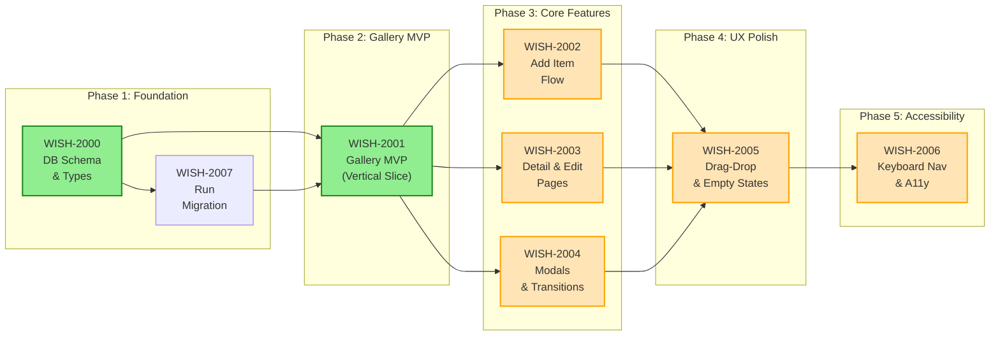

# WISH — Wishlist Story Roadmap

Visual representation of story dependencies and execution order.

---

## Dependency Graph

Shows which stories block downstream work.



**Legend:** Green = Ready | Yellow = Blocked | Blue = Done

---

## Completion Order (Gantt View)

```mermaid
gantt
    title WISH Story Execution Order
    dateFormat X
    axisFormat %s

    section Phase 1
    WISH-2000 DB Schema    :s001, 0, 1
    WISH-2007 Migration    :s007, after s001, 1

    section Phase 2
    WISH-2001 Gallery MVP  :s002, after s007, 1

    section Phase 3
    WISH-2002 Add Flow     :s003, after s002, 1
    WISH-2003 Detail/Edit  :s004, after s002, 1
    WISH-2004 Modals       :s005, after s002, 1

    section Phase 4
    WISH-2005 UX Polish    :s006, after s003 s004 s005, 1

    section Phase 5
    WISH-2006 Accessibility :s008, after s006, 1
```



---

## Critical Path

The longest chain of dependent stories that cannot be parallelized:

```
WISH-2000 → WISH-2007 → WISH-2001 → WISH-2002/WISH-2003/WISH-2004 → WISH-2005 → WISH-2006
```

**Critical path length:** 6 stories (sequential)
**Minimum timeline:** 6 development phases

---

## Parallel Opportunities

| Parallel Group | Stories | After | Notes |
|---|---|---|---|
| Group 1 | WISH-2000 | — (start) | Foundation - schema |
| Group 2 | WISH-2007 | Group 1 | Foundation - migration |
| Group 3 | WISH-2001 | Group 2 | Gallery MVP - vertical slice |
| Group 4 | WISH-2002, WISH-2003, WISH-2004 | Group 3 | Core CRUD - 3 parallel tracks |
| Group 5 | WISH-2005 | Group 4 | UX Polish |
| Group 6 | WISH-2006 | Group 5 | Accessibility |

**Maximum parallelization:** 3 stories at once (Phase 3 tracks: Add, Edit, Delete/Purchase)

---

## Risk Indicators

| Story | Risk Level | Reason | Mitigation |
|-------|-----------|--------|-----------|
| WISH-2000 | HIGH | Schema changes after migration are costly | Thorough PRD review before approval; capture all optional fields upfront |
| WISH-2001 | MEDIUM | First vertical slice; integration issues likely | Allocate extra debugging time; validate RTK Query setup early |
| WISH-2002 | MEDIUM | S3 image upload can fail/timeout | Implement presigned URL expiry handling; clear error messages; allow retry |
| WISH-2003 | MEDIUM | Partial updates need careful validation | Test all field combinations; validate on both client and server |
| WISH-2004 | HIGH | "Got It" transaction must be atomic | Use DB transaction; test rollback scenarios; never delete Wishlist if Set creation fails |
| WISH-2005 | MEDIUM | dnd-kit integration complexity | Start with desktop; add touch support incrementally; test on real mobile devices |
| WISH-2006 | MEDIUM | Roving tabindex is complex; screen reader testing requires specific tools | Use @repo/accessibility patterns; manual VoiceOver/NVDA testing; automated axe checks |

---

## Swimlane View (by Domain)

### Backend Services (API)

| Phase | Stories | Endpoints | Infrastructure |
|-------|---------|-----------|-----------------|
| 1 | WISH-2000 | — | wishlist_items table, indexes |
| 1 | WISH-2007 | — | Database migration |
| 2 | WISH-2001 | GET /api/wishlist, GET /api/wishlist/:id | RTK Query schemas |
| 3 | WISH-2002 | POST /api/wishlist | S3 presigned URLs |
| 3 | WISH-2003 | PATCH /api/wishlist/:id | — |
| 3 | WISH-2004 | DELETE /api/wishlist/:id, POST /api/wishlist/:id/purchased | Atomic transaction |
| 4 | WISH-2005 | PATCH /api/wishlist/reorder | — |

### Frontend Services (React)

| Phase | Stories | Pages | Components | Features |
|-------|---------|-------|------------|----------|
| 2 | WISH-2001 | Gallery, Detail | WishlistCard, GalleryLayout | Store filters, search, sort, pagination |
| 3 | WISH-2002 | Add Item | WishlistForm | Image upload, all field types |
| 3 | WISH-2003 | Edit Item | WishlistForm (pre-populated) | Partial updates, optimistic |
| 3 | WISH-2004 | — | DeleteConfirmModal, GotItModal | Delete + Purchase modals, undo |
| 4 | WISH-2005 | Gallery (enhanced) | DraggableWishlistCard, EmptyStates | Drag-and-drop, loading skeletons |
| 5 | WISH-2006 | All | Accessibility utilities | Keyboard nav, screen reader support |

---

## Quick Reference

| Metric | Value |
|--------|-------|
| Total Stories | 7 |
| Ready to Start | 1 (WISH-2000) |
| Critical Path Length | 6 stories |
| Max Parallel | 3 stories |
| Phases | 5 |
| Total Estimated Points | 40 |
| MVP Stories | 5 (phases 1-3 core) |

---

## Story Status Summary

| Status | Count | Stories |
|--------|-------|---------|
| Done | 1 | WISH-2003 |
| Approved | 3 | WISH-2000, WISH-2002, WISH-2004, WISH-2007 |
| Ready for Review | 2 | WISH-2001 |
| Draft | 2 | WISH-2005, WISH-2006 |

---

## Key Success Criteria

### MVP Success (Phases 1-3)
- [ ] All endpoints deployed and working
- [ ] Gallery displays wishlist items with filtering
- [ ] Add, view, and delete flows working end-to-end
- [ ] "Got it" flow creates Set and removes from Wishlist

### Full Feature Success (Phases 4-5)
- [ ] Drag-and-drop reordering implemented
- [ ] All accessibility keyboard shortcuts working
- [ ] Screen reader support verified
- [ ] WCAG AA compliance achieved
- [ ] E2E tests pass
- [ ] Performance acceptable on mobile

---

## Update Log

| Date | Change | Stories Affected |
|------|--------|------------------|
| 2026-01-24 | Initial roadmap created | All (WISH-2000 through WISH-2006) |

---

## Dependencies on Other Epics

| Story | External Dependency | Status | Impact |
|-------|-------------------|--------|--------|
| WISH-2004 | Sets Gallery (WISH integration) | Not started | "Got it" flow creates Set item |
| WISH-2006 | Accessibility patterns | In progress | Roving tabindex utilities |

---

## Notes

- WISH-2003 is already done (PR #350), can be skipped to Phase 4
- WISH-2001 has sizing warning (multiple domains) - allocate extra time
- WISH-2004 has sizing warning (multiple features) - consider splitting if needed during elaboration
- All stories should include comprehensive test coverage (unit + E2E)
- Accessibility requirements are strict (WCAG AA) - plan accordingly

