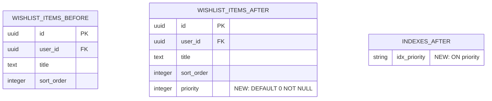

# WISH-20390: Visual Schema Diff Tool for PR Reviews

## Follow-up Context

**Parent Story:** WISH-20180
**Source:** QA Discovery Notes (Enhancement Opportunities - Finding #4)
**Original Finding:** "Visual schema diff tool - Show table/column changes graphically in PR reviews"
**Category:** Enhancement Opportunity
**Impact:** Medium
**Effort:** Low

This follow-up was identified during QA Elaboration of WISH-20180 as a valuable enhancement to improve the developer experience when reviewing schema changes. While WISH-20180 provides automated text-based validation results, a visual representation of schema changes would make PR reviews faster and less error-prone by providing an at-a-glance understanding of database structure modifications.

## Context

WISH-20180 implements automated CI validation of database schema changes, posting text-based validation results as PR comments. These comments include breaking change detection, policy compliance checks, and migration validation. However, text-based diffs of SQL migration files can be difficult to parse, especially for complex changes involving multiple tables, columns, or indexes.

Schema changes are often reviewed by multiple stakeholders (engineers, DBAs, product managers) who may not be equally familiar with SQL syntax. A visual diff showing:
- Tables added/removed/modified
- Columns added/removed/modified with type information
- Indexes created/dropped
- Foreign key relationships added/removed

...would significantly improve review velocity and comprehension. Industry tools like PlanetScale's branching UI and Hasura's schema visualizer demonstrate the value of graphical schema representations.

Without visual schema diffs, reviewers must:
- Parse SQL ALTER statements manually to understand changes
- Mentally reconstruct the before/after state of the database
- Risk missing subtle but important changes (e.g., index removals, type changes)
- Spend more time in code review on schema understanding vs. impact analysis

This story implements a visual schema diff generator that runs as part of the WISH-20180 CI validation workflow and posts a graphical representation of schema changes to PR comments.

## Goal

Implement a visual schema diff tool that generates graphical representations of database schema changes for PR reviews. The tool should integrate with the WISH-20180 CI workflow to automatically post visual diffs as PR comments, improving review velocity and comprehension for schema changes.

## Non-goals

- Interactive schema exploration UI (static visual diff only)
- Schema versioning/branching system (PlanetScale-style workflow)
- Historical schema change visualization (only current PR diff)
- Real-time schema comparison against production database
- ER diagram generation for entire database (only diff of changes)
- Support for non-PostgreSQL databases (PostgreSQL-only for now)

## Scope

### Visual Diff Generator

1. **Schema Diff Parser** (`packages/backend/database-schema/scripts/generate-schema-diff.ts`)
   - Parse SQL migration files to extract schema changes
   - Identify tables, columns, indexes, constraints added/removed/modified
   - Detect type changes, nullability changes, default value changes
   - Output structured diff data (JSON format)

2. **Visual Renderer** (Mermaid.js or similar diagram library)
   - Generate diagram showing before/after state of affected tables
   - Highlight added elements (green), removed elements (red), modified elements (yellow)
   - Show column types, constraints, indexes visually
   - Render foreign key relationships if affected by changes

3. **CI Integration** (extends `.github/workflows/schema-validation.yml` from WISH-20180)
   - Run schema diff generator after validation script
   - Generate visual diff as SVG or Mermaid diagram
   - Embed visual diff in PR comment alongside validation results
   - Handle edge cases (multiple migrations, complex changes)

### Packages Affected

- `packages/backend/database-schema/scripts/` - Visual diff generator script
- `.github/workflows/schema-validation.yml` - CI workflow update to include visual diff
- `packages/backend/database-schema/docs/` - Documentation for visual diff tool

### Cross-References

- WISH-20180: Parent story - CI validation of schema changes
- WISH-2057: Schema evolution policies that inform visual diff display

## Acceptance Criteria

### Schema Diff Parser (AC 1-5)

- [ ] AC 1: Parser extracts table additions/removals from SQL migration files
- [ ] AC 2: Parser extracts column additions/removals/modifications with type information
- [ ] AC 3: Parser extracts index additions/removals with column references
- [ ] AC 4: Parser extracts constraint additions/removals (FK, unique, check)
- [ ] AC 5: Parser outputs structured diff data in JSON format for rendering

### Visual Renderer (AC 6-10)

- [ ] AC 6: Renderer generates diagram showing affected tables with before/after state
- [ ] AC 7: Renderer highlights added elements in green, removed elements in red, modified in yellow
- [ ] AC 8: Renderer displays column types, nullability, defaults in visual format
- [ ] AC 9: Renderer shows indexes and constraints associated with tables
- [ ] AC 10: Renderer produces diagram in Mermaid format or SVG for embedding in PR comment

### CI Integration (AC 11-15)

- [ ] AC 11: Visual diff generator runs as part of schema-validation.yml workflow (after WISH-20180 validation)
- [ ] AC 12: Generated visual diff is embedded in PR comment below validation results
- [ ] AC 13: Visual diff displays correctly in GitHub PR comment UI (diagram renders properly)
- [ ] AC 14: Visual diff handles multiple migrations in single PR (aggregates changes or shows separate diagrams)
- [ ] AC 15: Visual diff gracefully handles parse failures (shows text diff fallback with error message)

### Documentation and Examples (AC 16-18)

- [ ] AC 16: Documentation added to `packages/backend/database-schema/docs/VISUAL-SCHEMA-DIFF.md` explaining usage
- [ ] AC 17: Example visual diffs included in documentation for common change patterns (add column, drop table, modify type)
- [ ] AC 18: Error handling documented (unparseable SQL, missing tables, etc.)

## Reuse Plan

### Existing Tools

- **WISH-20180 CI Workflow**: Extend existing schema validation workflow to include visual diff step
- **GitHub Actions**: Use existing PR comment action to post visual diff
- **SQL Parser**: Reuse parser from WISH-20180 (pg-query-parser or sql-parser-cst)

### Industry Patterns

- **Mermaid.js**: Popular diagram-as-code library supported natively in GitHub markdown
- **PlanetScale Schema Diff**: Reference for visual schema change representation
- **Hasura Schema Explorer**: Inspiration for graphical table/column display
- **Atlas Schema Diff**: Example of CLI-based schema diff visualization

### Libraries to Consider

- **Mermaid.js**: Diagram rendering (supported in GitHub markdown)
- **D3.js**: Alternative for custom SVG rendering if Mermaid insufficient
- **pg-query-parser**: SQL parsing (already used in WISH-20180)

## Architecture Notes

### Visual Diff Example (Mermaid Format)

For a migration that adds a column and an index:

```sql
-- Migration: 0042_add_priority_column.sql
ALTER TABLE wishlist_items ADD COLUMN priority INTEGER DEFAULT 0 NOT NULL;
CREATE INDEX CONCURRENTLY idx_priority ON wishlist_items(priority);
```

Generated Mermaid diagram:



### Diff Data Structure

The parser will output JSON describing changes:

```json
{
  "tables": {
    "wishlist_items": {
      "status": "modified",
      "columns": {
        "priority": {
          "action": "added",
          "type": "INTEGER",
          "nullable": false,
          "default": "0"
        }
      },
      "indexes": {
        "idx_priority": {
          "action": "added",
          "columns": ["priority"],
          "concurrent": true
        }
      }
    }
  }
}
```

### CI Workflow Integration

Update `.github/workflows/schema-validation.yml`:

```yaml
- name: Validate schema changes
  run: pnpm --filter @repo/database-schema validate:schema

- name: Generate visual schema diff
  if: always()
  run: pnpm --filter @repo/database-schema generate:schema-diff

- name: Post validation results with visual diff
  if: always()
  uses: actions/github-script@v6
  with:
    script: |
      const fs = require('fs')
      const validation = JSON.parse(fs.readFileSync('./validation-results.json'))
      const visualDiff = fs.readFileSync('./schema-diff.mermaid', 'utf-8')

      const body = `
      ## Schema Validation Results
      ${validation.summary}

      ## Visual Schema Diff
      \`\`\`mermaid
      ${visualDiff}
      \`\`\`
      `

      github.rest.issues.createComment({
        issue_number: context.issue.number,
        owner: context.repo.owner,
        repo: context.repo.repo,
        body: body
      })
```

## Test Plan

### Parser Tests

**Test 1: Column Addition**
- Create migration with `ADD COLUMN` statement
- Run diff generator
- Verify JSON output includes column in "added" state with correct type/constraints
- Verify visual diff highlights column in green

**Test 2: Table Removal**
- Create migration with `DROP TABLE` statement
- Run diff generator
- Verify JSON output marks table as "removed"
- Verify visual diff highlights table in red

**Test 3: Index Creation**
- Create migration with `CREATE INDEX CONCURRENTLY`
- Run diff generator
- Verify JSON output includes index in "added" state
- Verify visual diff shows index associated with correct table

**Test 4: Column Type Change**
- Create migration with `ALTER COLUMN TYPE`
- Run diff generator
- Verify JSON output marks column as "modified" with before/after types
- Verify visual diff highlights column in yellow with type change

### Renderer Tests

**Test 5: Mermaid Diagram Generation**
- Provide JSON diff with table/column changes
- Run renderer
- Verify valid Mermaid syntax output
- Verify diagram renders correctly in GitHub preview

**Test 6: Multiple Tables**
- Provide JSON diff affecting 3 tables
- Run renderer
- Verify all tables shown in diagram
- Verify relationships (FK) displayed if affected

### CI Integration Tests

**Test 7: PR Comment with Visual Diff**
- Create PR with schema change
- Trigger CI workflow
- Verify PR comment includes both validation results and visual diff
- Verify Mermaid diagram renders in GitHub UI

**Test 8: Multiple Migrations**
- Create PR with 2 migrations affecting different tables
- Run diff generator
- Verify visual diff aggregates both changes or shows separate diagrams
- Verify clear labeling of which migration caused which changes

### Edge Cases

**Edge 1: Unparseable SQL**
- Create migration with syntax error or complex SQL
- Run diff generator
- Verify graceful fallback to text diff with error message
- Verify CI doesn't fail entirely

**Edge 2: No Schema Changes**
- Create PR modifying only documentation in schema package
- Run diff generator
- Verify visual diff shows "No schema changes detected"
- Verify no broken diagram in PR comment

**Edge 3: Large Schema Change**
- Create migration affecting 10+ tables with 50+ column changes
- Run diff generator
- Verify visual diff is readable (may need pagination/grouping)
- Verify performance is acceptable (< 10 seconds to generate)

## Risk Notes

### MVP-Critical Risks

**Risk 1: Diagram Rendering Complexity**
- Complex schema changes may produce unreadable diagrams
- **Mitigation**: Group related changes, paginate large diffs, provide text fallback

**Risk 2: SQL Parsing Edge Cases**
- Complex SQL (CTEs, multi-statement migrations) may not parse correctly
- **Mitigation**: Graceful fallback to text diff, document unsupported patterns

### Non-MVP Risks

**Risk 3: GitHub Comment Size Limit**
- Very large visual diffs may exceed GitHub PR comment size limits
- **Mitigation**: Truncate diagram with link to full diff artifact, or split into multiple comments

**Risk 4: Diagram Library Dependency**
- Mermaid.js may have breaking changes or GitHub support may change
- **Mitigation**: Abstract renderer interface, support multiple output formats (SVG fallback)

## Definition of Done

- [ ] All 18 Acceptance Criteria verified
- [ ] Schema diff parser implemented with unit tests
- [ ] Visual renderer generates valid Mermaid diagrams
- [ ] CI workflow updated to include visual diff step
- [ ] PR comment integration tested with sample schema changes
- [ ] Documentation added to `packages/backend/database-schema/docs/VISUAL-SCHEMA-DIFF.md`
- [ ] Edge case handling tested (unparseable SQL, multiple migrations, large diffs)
- [ ] Code review completed
- [ ] Story marked complete

## Token Budget

### Phase Summary

| Phase | Estimated | Actual | Delta | Notes |
|-------|-----------|--------|-------|-------|
| Story Gen | ~3k | — | — | Follow-up generation |
| Implementation | ~6k | — | — | Parser + renderer + CI integration |
| Review | ~2k | — | — | Testing and documentation |
| **Total** | ~11k | — | — | — |

### Actual Measurements

| Date | Phase | Before | After | Delta | Notes |
|------|-------|--------|-------|-------|-------|

## Agent Log

Append-only.

| Timestamp (America/Denver) | Agent | Action | Outputs |
|---|---|---|---|
| 2026-01-31 11:00 | pm-story-followup-leader | Created follow-up story from WISH-20180 finding #4 | WISH-20390.md |

---

## Future Enhancement Notes

Once visual schema diff is implemented, consider:
- Interactive schema exploration UI for deeper drilling into changes
- Historical schema change visualization (timeline of database evolution)
- Schema branching system for testing migrations in isolated environments
- Real-time schema comparison against production database
- Support for other database systems (MySQL, SQLite) beyond PostgreSQL

---

## Open Questions

_Should be empty or non-blocking for backlog story_

None - all dependencies and requirements clear. Implementation approach (Mermaid.js) is well-supported by GitHub and straightforward to integrate.
