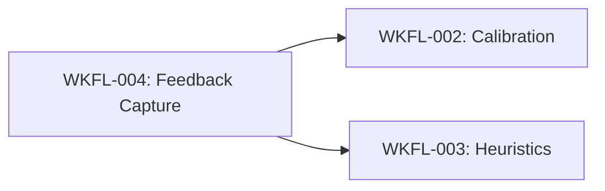

# Story Seed: WKFL-004

## Reality Context

### Baseline Status
- Loaded: No
- Date: N/A
- Gaps: No active baseline exists for workflow-learning epic. This is expected for new meta-system features.

### Relevant Existing Features

| Feature | Status | Relevance |
|---------|--------|-----------|
| Knowledge Base MCP Server | Active | WKFL-004 will write feedback entries via kb_add |
| Verification YAML Format | Active | Source of finding IDs that feedback references |
| MCP Tool Infrastructure | Active | Existing kb_add and kb_search patterns to follow |
| Command File Patterns | Active | Examples in `.claude/commands/` for command structure |

### Active In-Progress Work

| Story | Phase | Overlap Risk |
|-------|-------|--------------|
| None | N/A | No active workflow-learning stories in progress |

### Constraints to Respect

**From Story Dependencies:**
- No dependencies - WKFL-004 is a foundation story
- Blocks WKFL-002 and WKFL-003, which will consume feedback data

**From Architecture:**
- KB schema uses Zod-first types (all schema in `apps/api/knowledge-base/src/__types__/index.ts`)
- MCP tools must follow tool-handler pattern with logging, error sanitization, performance measurement
- New entry types require updating `KnowledgeEntryTypeSchema` enum
- All commands must be documented in `.claude/commands/` with frontmatter

---

## Retrieved Context

### Related KB Infrastructure

**Database Schema (`apps/api/knowledge-base/src/db/schema.ts`):**
- `knowledgeEntries` table with flexible schema
- `entryType` field supports: 'note', 'decision', 'constraint', 'runbook', 'lesson'
- `tags` field as TEXT[] for categorization
- `storyId` field for linking to stories
- Full JSONB support for flexible metadata in `content` field

**Existing Entry Types:**
```typescript
KnowledgeEntryTypeSchema = z.enum([
  'note',
  'decision',
  'constraint',
  'runbook',
  'lesson',
])
```

**MCP Tool Handlers (`apps/api/knowledge-base/src/mcp-server/tool-handlers.ts`):**
- Pattern: thin wrapper around CRUD operations from `src/crud-operations/index.ts`
- Includes logging via @repo/logger, correlation IDs, error sanitization
- Access control via `checkAccess(agentRole, toolName)`
- Performance measurement and timeouts
- All tools export schema from `tool-schemas.ts`

**Existing KB Tools:**
- `kb_add` - Add entry with type, content, tags, storyId
- `kb_search` - Search with query, tags, role filtering
- `kb_add_lesson` - Specialized for lesson entries
- `kb_add_decision` - Specialized for decision entries

### Related Command Patterns

**Command Structure (from `.claude/commands/story-status.md`):**
```markdown
---
created: YYYY-MM-DD
updated: YYYY-MM-DD
version: X.Y.Z
type: utility | orchestrator
---

/command-name {ARG1} {ARG2} [--flag]

Brief description. Implementation notes.

## Usage
Examples

## Arguments
Table of arguments

## Implementation
How it works
```

**Existing Commands:**
- `/story-status` - Read-only utility, no KB writes
- `/qa-verify-story` - Orchestrator with multiple phases
- `/dev-implement-story` - Orchestrator spawning sub-agents

### Related VERIFICATION.yaml Structure

**Finding ID Format (from WISH-2045 VERIFICATION.yaml):**
```yaml
code_review:
  security:
    findings: []
  # No findings in WISH-2045, but structure is:
  # findings:
  #   - id: SEC-042
  #     agent: code-review-security
  #     severity: high
  #     description: "..."
```

**Finding IDs appear in various review sections:**
- `code_review.security.findings[]` - Security findings (SEC-NNN)
- `code_review.architecture.findings[]` - Architecture findings (ARCH-NNN)
- `qa_verify.findings[]` - QA findings (QA-NNN)

### Reuse Candidates

**Must Reuse:**
- KB schema extension (add `feedback` entry type)
- `kb_add` tool for writing feedback entries
- `kb_search` with tag filtering for querying feedback
- Zod schema validation for all inputs
- Command file frontmatter pattern

**May Create:**
- `/feedback` command file
- Feedback-specific Zod schemas
- Optional: post-gate feedback prompt integration

---

## Knowledge Context

### Lessons Learned

**From KB Infrastructure Stories:**
- **[KNOW-0051]** MCP tools must include Zod schemas in `tool-schemas.ts`
  - *Applies because*: New feedback capture needs schema validation

- **[KNOW-0052]** Search tools require correlation IDs and timeout handling
  - *Applies because*: Feedback queries will be used by calibration analysis

- **[KNOW-006]** Bulk import pattern for batch KB writes
  - *Applies because*: May want to capture multiple feedback items at once

- **[KB Integration Guide]** Agent frontmatter must declare `kb_tools: [...]`
  - *Applies because*: Any agent using feedback should declare KB tool usage

### Blockers to Avoid (from past stories)

- Don't create new tables without migration strategy (use existing `knowledge_entries` with new entryType)
- Don't bypass Zod validation (all inputs must validate)
- Don't hardcode finding ID patterns (parse dynamically from VERIFICATION.yaml)
- Don't skip correlation IDs in MCP tool calls (required for tracing)

### Architecture Decisions (ADRs)

**ADRs Reviewed:** 6 ADRs exist in ADR-LOG.md

**Relevant to WKFL-004:**
- **ADR-005: Testing Strategy** - UAT must use real services
  - *Not directly applicable* - WKFL-004 is a CLI command/backend-only feature

- **ADR-006: E2E Tests Required** - E2E tests in dev phase
  - *Not directly applicable* - WKFL-004 has no UI component

**No ADR violations detected** - This is a workflow infrastructure story with no frontend/API interaction patterns that would conflict with established ADRs.

### Patterns to Follow

**From VERIFICATION.yaml Format:**
```yaml
findings:
  - id: "{AGENT}-{NUM}"     # Finding ID format
    agent: "agent-name"      # Agent that generated finding
    severity: "critical|high|medium|low"
    description: "..."
```

**From story.yaml technical_notes:**
```yaml
# Feedback KB Schema Structure
type: feedback
finding_id: SEC-042
agent_id: code-review-security
story_id: WISH-2045
feedback_type: false_positive | helpful | missing | severity_wrong
original_severity: high
suggested_severity: medium  # if severity_wrong
note: "User's reason for feedback"
created_at: timestamp
tags:
  - feedback
  - agent:{agent_id}
  - story:{story_id}
  - type:{feedback_type}
  - date:YYYY-MM
```

**From KB Tool Handler Pattern:**
- Thin wrapper around CRUD operations
- Log all tool invocations with correlation ID
- Sanitize errors before returning to user
- Measure performance for timeout detection
- Access control checks before execution

### Patterns to Avoid

- Don't create standalone tables (extend existing KB schema)
- Don't duplicate KB tool patterns (reuse existing tool-handler infrastructure)
- Don't skip error handling (all MCP tools must handle failures gracefully)
- Don't hardcode agent/story/finding IDs (parse from context)

---

## Conflict Analysis

No conflicts detected.

---

## Story Seed

### Title
Human Feedback Capture

### Description

**Context:**
Agent findings in VERIFICATION.yaml are generated automatically but lack human validation. When agents mark findings as "high severity" or "security-critical," there's no mechanism to capture whether these findings were:
- Actually addressed (helpful)
- False positives (intentional behavior)
- Missing important context
- Incorrectly categorized (wrong severity)

This missing feedback loop prevents learning and calibration - agents can't improve if they don't know when they're wrong.

**Problem:**
Without explicit feedback capture:
- False positives waste developer time on every story
- Agents don't learn which patterns are safe to ignore
- Severity calibration (WKFL-002) has no ground truth data
- Heuristic evolution (WKFL-003) lacks training data
- Developer corrections are lost knowledge (not captured anywhere)

**Solution Direction:**
Create a `/feedback` command that:
1. Accepts finding IDs from VERIFICATION.yaml
2. Captures feedback type (false positive, helpful, missing, severity wrong)
3. Stores feedback in Knowledge Base with full context
4. Links feedback to agent, story, and finding for future analysis
5. Makes feedback queryable for calibration and heuristic improvement

This builds the foundation for data-driven agent improvement (consumed by WKFL-002 and WKFL-003).

### Initial Acceptance Criteria

- [ ] AC-1: `/feedback {FINDING-ID} --false-positive 'reason'` captures to KB
  - Command accepts finding ID (e.g., SEC-042) from VERIFICATION.yaml
  - Parses VERIFICATION.yaml to extract agent_id, story_id, severity
  - Creates KB entry with type='feedback', feedback_type='false_positive'
  - Confirms to user: "Feedback captured for SEC-042"

- [ ] AC-2: `/feedback {FINDING-ID} --helpful 'note'` captures to KB
  - Same flow as AC-1 but with feedback_type='helpful'
  - Note field is optional for helpful feedback
  - Stores positive reinforcement for agent calibration

- [ ] AC-3: Feedback linked to agent, story, and finding
  - KB entry includes: agent_id, story_id, finding_id fields
  - Tags include: ['feedback', 'agent:{name}', 'story:{id}', 'type:{feedback_type}']
  - Timestamp (created_at) auto-populated

- [ ] AC-4: Queryable via kb_search with feedback tags
  - `kb_search({query: 'false positive security', tags: ['feedback']})` returns results
  - Tag filtering works: `tags: ['feedback', 'agent:code-review-security']`
  - Query combines text search + tag filtering

- [ ] AC-5: Multiple feedback types supported
  - --false-positive: Finding is not an issue (intentional behavior)
  - --helpful: Finding was genuinely useful and addressed
  - --missing: Finding missed something important
  - --severity-wrong: Severity level was incorrect (requires --suggested-severity)
  - Each type validates required fields (e.g., severity_wrong requires suggested_severity)

### Non-Goals

- Auto-adjust agent thresholds (WKFL-002/003 will consume this data)
- Interactive feedback prompts during workflow phases (post-hoc only)
- Sentiment analysis or NLP on feedback notes
- Real-time feedback during code review (capture after gate decision)
- UI for browsing feedback (CLI-only for now)

### Reuse Plan

**Components:**
- Existing `knowledge_entries` table (add 'feedback' entry type)
- `kb_add` for writing feedback entries
- `kb_search` for querying feedback history

**Patterns:**
- Command file pattern from `.claude/commands/`
- MCP tool handler pattern from `tool-handlers.ts`
- Zod-first schema validation
- YAML parsing for VERIFICATION.yaml

**Packages:**
- `apps/api/knowledge-base` for schema/MCP tools
- `.claude/commands/` for /feedback command
- No new external dependencies needed

---

## Recommendations for Subsequent Phases

### For Test Plan Writer

**Key Testing Areas:**

1. **Finding ID Resolution:**
   - Test with valid finding IDs from VERIFICATION.yaml
   - Test with invalid finding IDs (should fail gracefully)
   - Test with finding IDs from different review sections (security, architecture, QA)

2. **Feedback Type Validation:**
   - Test all 4 feedback types with required fields
   - Test severity_wrong without suggested_severity (should fail)
   - Test missing required note field (optional for helpful, required for others)

3. **KB Integration:**
   - Verify KB entries created with correct schema
   - Verify tags are properly formatted
   - Verify kb_search can retrieve feedback by tags
   - Test bulk feedback capture (multiple findings)

4. **VERIFICATION.yaml Parsing:**
   - Test with various VERIFICATION.yaml formats
   - Test with missing findings section
   - Test with malformed YAML (should fail gracefully)

5. **Edge Cases:**
   - Empty note string
   - Finding ID not in current VERIFICATION.yaml
   - Duplicate feedback on same finding (should allow or warn?)
   - Very long feedback notes (test limits)

**Test Data Requirements:**
- Mock VERIFICATION.yaml with findings from multiple agents
- Mock KB with existing feedback entries for query tests
- Test fixtures for all feedback types

### For UI/UX Advisor

Not applicable - this is a CLI command with no user-facing UI component.

**Optional Future Enhancement:**
After /qa-gate completes, could prompt:
```
Gate complete. Any feedback on findings?

[SEC-042] No Zod validation (high) - false positive? helpful?
[ARCH-015] API boundary issue (medium) - false positive? helpful?

Type finding ID to give feedback, or press Enter to skip.
```

This is marked as "Optional" in story.yaml and is NOT required for initial implementation.

### For Dev Feasibility

**Implementation Considerations:**

1. **Command Structure:**
   - Location: `.claude/commands/feedback.md`
   - Pattern: Utility command (not orchestrator)
   - Spawns: No sub-agents needed (direct KB write)
   - Flow: Parse args → Load VERIFICATION.yaml → Extract context → Write KB entry → Confirm

2. **KB Schema Extension:**
   - Add 'feedback' to `KnowledgeEntryTypeSchema` enum
   - Define `FeedbackContentSchema` in `__types__/index.ts`:
     ```typescript
     const FeedbackContentSchema = z.object({
       finding_id: z.string(),
       agent_id: z.string(),
       story_id: z.string(),
       feedback_type: z.enum(['false_positive', 'helpful', 'missing', 'severity_wrong']),
       original_severity: z.enum(['critical', 'high', 'medium', 'low']).optional(),
       suggested_severity: z.enum(['critical', 'high', 'medium', 'low']).optional(),
       note: z.string(),
       created_at: z.string().datetime(),
     })
     ```
   - Store in KB with type='feedback', content=FeedbackContentSchema

3. **VERIFICATION.yaml Parsing:**
   - Read VERIFICATION.yaml from story's _implementation/ directory
   - Parse finding by ID across all review sections
   - Extract: agent_id, severity, description for context
   - Handle missing or malformed YAML gracefully

4. **KB Write Flow:**
   - Use existing `kb_add` tool (no new tool needed)
   - Tags array: `['feedback', `agent:${agent_id}`, `story:${story_id}`, `type:${feedback_type}`, `date:${YYYY-MM}`]`
   - Correlation ID from command context
   - Log all writes for traceability

5. **Command Arguments:**
   - Positional: `{FINDING-ID}` (required)
   - Flags: `--false-positive`, `--helpful`, `--missing`, `--severity-wrong` (mutually exclusive)
   - Optional: `--note "text"`, `--suggested-severity {level}`
   - Validation: Exactly one feedback type flag required

6. **Error Handling:**
   - Finding ID not found in VERIFICATION.yaml → "Finding {ID} not found in VERIFICATION.yaml"
   - No VERIFICATION.yaml exists → "Story has no VERIFICATION.yaml yet"
   - KB write failure → "Failed to capture feedback: {error}"
   - Invalid severity level → "Suggested severity must be: critical, high, medium, low"

**Data Flow Diagram:**
```
User → /feedback SEC-042 --false-positive "reason"
  ↓
Parse args & validate
  ↓
Load VERIFICATION.yaml from story _implementation/
  ↓
Find SEC-042 in findings[] → extract agent_id, severity
  ↓
Build KB entry: type='feedback', content={...}, tags=[...]
  ↓
kb_add(entry)
  ↓
Confirm: "Feedback captured for SEC-042"
```

**Potential Blockers:**
- VERIFICATION.yaml format may vary between stories (need robust parsing)
- Finding IDs may not be unique across multiple VERIFICATION.yaml files (need story scoping)
- KB write failures need retry logic or clear error messages

**Effort Estimate:**
- Command file (`.claude/commands/feedback.md`): ~3k tokens
- KB schema extension (FeedbackContentSchema): ~2k tokens
- VERIFICATION.yaml parsing logic: ~5k tokens
- Argument parsing and validation: ~4k tokens
- KB write integration: ~3k tokens
- Error handling and logging: ~3k tokens
- Testing: ~10k tokens
- **Total: ~30k tokens** (within story budget of 30k)

---

## Additional Context

### Dependency Chain



**Blocks:**
- WKFL-002 (Confidence Calibration) - Needs feedback data for calibration scoring
- WKFL-003 (Emergent Heuristics) - Needs feedback data to evolve decision rules

**Enables:**
- Data-driven agent improvement
- False positive tracking
- Calibration ground truth
- Heuristic training data

### Open Questions for Elaboration

1. **Finding ID Uniqueness:** Are finding IDs unique per story, or can SEC-042 appear in multiple stories? If multiple, how do we scope the feedback command?

2. **Multiple Feedback:** Can users provide feedback on the same finding multiple times (e.g., initially helpful, later realize it's false positive)? Should we allow or prevent duplicates?

3. **Bulk Feedback:** Should `/feedback` support batch mode (e.g., `--file feedback.yaml` with multiple findings)? Or one-at-a-time only?

4. **Post-Gate Integration:** The optional post-gate prompt (story.yaml line 130-141) - should this be in initial scope or deferred? It adds complexity but improves UX.

5. **Feedback Editing:** Once captured, can feedback be edited/deleted? Or is it append-only?

6. **Anonymous vs Attributed:** Should feedback include user attribution (who provided it)? Or anonymous?

7. **VERIFICATION.yaml Location:** Command assumes finding is in current story's VERIFICATION.yaml. What if user wants to give feedback on finding from different story?

### Integration Points

**Consumed By:**
- WKFL-002: Queries `kb_search({tags: ['feedback']})` for calibration analysis
- WKFL-003: Queries `kb_search({tags: ['feedback', 'type:false_positive']})` for heuristic evolution

**Consumes:**
- VERIFICATION.yaml: Source of finding IDs, agent context, severity
- KB MCP Server: Writes feedback entries, provides query interface

**Output Format:**
- KB entries with type='feedback'
- Queryable via `kb_search` with tag filtering
- YAML-compatible content structure for easy parsing

---

**STORY-SEED COMPLETE**
