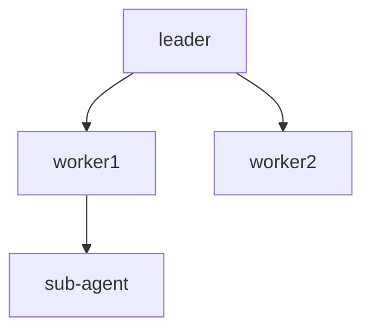

# WKFL-005 Story Seed

Generated inline (no baseline reality file available).

## Reality Context

### Existing Documentation Patterns

**Primary Documentation:**
- `docs/FULL_WORKFLOW.md` - Redirects to split docs in `docs/workflow/`
- `docs/workflow/README.md` - Overview, commands, state diagrams
- `docs/workflow/phases.md` - Detailed phase documentation
- `docs/workflow/agent-system.md` - Agent architecture
- `docs/workflow/changelog.md` - Version history

**Documentation Structure:**
- Split into focused files for easier maintenance
- Heavy use of Mermaid diagrams for flow visualization
- Table-based agent listings with outputs

### Agent Frontmatter Standard

Location: `.claude/agents/_shared/FRONTMATTER.md`

Required fields:
```yaml
---
created: YYYY-MM-DD
updated: YYYY-MM-DD
version: X.Y.Z
---
```

Optional fields for agents:
```yaml
type: orchestrator | leader | worker
triggers: ["/command-name"]
name: agent-name
description: Brief purpose
model: haiku | sonnet | opus
tools: [Read, Grep, ...]
```

### Agent File Locations

- 90+ agents in `.claude/agents/*.agent.md`
- Pattern-based naming: `{domain}-{purpose}-{type}.agent.md`
- Examples: `pm-story-generation-leader.agent.md`, `dev-implement-backend-coder.agent.md`

### Command File Locations

- 23+ commands in `.claude/commands/*.md`
- Pattern-based naming: `{command-name}.md`
- Examples: `pm-story.md`, `dev-implement-story.md`, `elab-story.md`

### Relevant Patterns

**Multi-Agent Pipelines:**
- Leaders spawn workers using Task tool
- Workers output to specific files (e.g., `_pm/TEST-PLAN.md`)
- Orchestrators aggregate results

**Mermaid Diagram Patterns:**


**Section Mapping:**
- PM agents → Phase 2
- Elab agents → Phase 3
- Dev agents → Phase 4
- QA agents → Phases 6/7

## Retrieved Context

### Similar Tools/Agents

**Existing Documentation Agents:**
- `dev-documentation-leader.agent.md` - Creates PROOF docs after implementation
- `dev-implement-learnings.agent.md` - Captures lessons learned

**Pattern:** Documentation agents typically run as post-processing steps

### Reuse Candidates

**Must Reuse:**
1. `.claude/agents/_shared/FRONTMATTER.md` - Frontmatter parsing standard
2. `docs/workflow/*.md` structure - Target documentation
3. Existing Mermaid diagram patterns

**May Create:**
1. `doc-sync.agent.md` - New agent
2. `/doc-sync` command file
3. `SYNC-REPORT.md` schema

## Conflicts

**None identified** - This is a new capability with no blocking conflicts.

## Recommendations

### Test Plan
- Focus on file change detection accuracy
- Verify frontmatter parsing correctness
- Test Mermaid diagram regeneration
- Validate changelog versioning logic

### UI/UX Notes
- N/A - No UI surface

### Protected Features
- None - New feature
