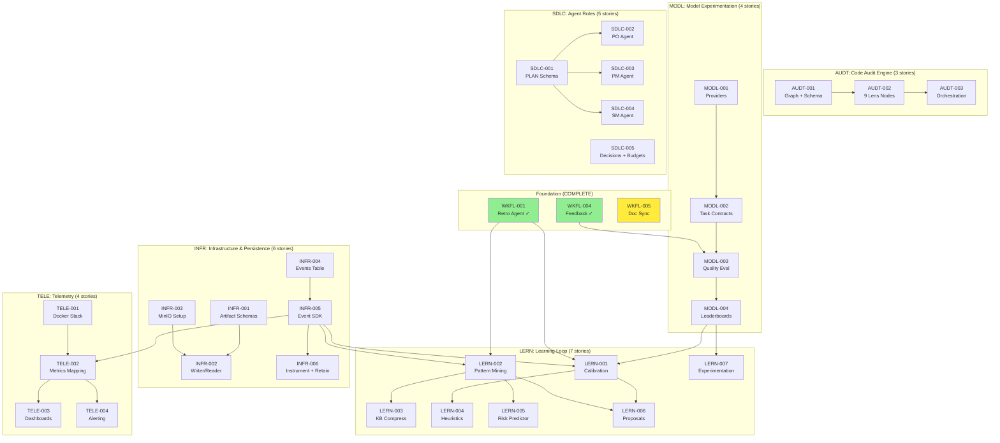
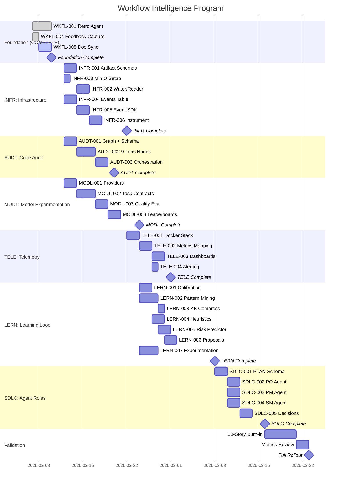

# Workflow Intelligence Program — Roadmap

## Dependency Graph



## Epic Execution Order

```
Phase 0: Foundation ─────────────── COMPLETE
              │
              ├──── Phase 1A: INFR ─── no blockers, start immediately
              ├──── Phase 1B: AUDT ─── no blockers, start immediately
              └──── Phase 1C: MODL ─── no blockers, start immediately
                        │
                        ├── Phase 2: TELE ─── needs INFR events
                        │
                        └── Phase 3: LERN ─── needs INFR + MODL
                                │
                                └── Phase 4: SDLC ─── capstone
```

### Parallelism

INFR, AUDT, and MODL have **no cross-dependencies** and can run simultaneously. This is the biggest time savings — 3 epics in parallel instead of sequential.

| Phase | Epics | Can Parallel? | Depends On |
|-------|-------|--------------|------------|
| 0 | Foundation | N/A | COMPLETE |
| 1 | INFR, AUDT, MODL | Yes (all 3) | Foundation |
| 2 | TELE | No (single) | INFR events |
| 3 | LERN | No (single) | INFR + MODL |
| 4 | SDLC | No (single) | All above |

## Visual Timeline



## Success Milestones

| Milestone | Criteria | Epic |
|-----------|----------|------|
| M0: Foundation | Data capture working | COMPLETE |
| M1: Infrastructure | Events flow, artifacts persist | INFR |
| M2: Audit Running | Code-only audit produces FINDINGS | AUDT |
| M3: Multi-Model | Providers + selector + leaderboard | MODL |
| M4: Observable | Dashboards + alerts from real events | TELE |
| M5: Learning Active | Calibration + patterns via Task Contract | LERN |
| M6: Self-Improving | First heuristic/improvement proposal | LERN |
| M7: Governed | Agent roles execute within budgets | SDLC |
| M8: Validated | 10 stories, all metrics met | Validation |

## Validation Period

### 10-Story Burn-in

| Story # | Components Active | Expected Outputs |
|---------|------------------|------------------|
| 1-3 | INFR + AUDT (code-only) | Events, artifacts, FINDINGS.yaml |
| 4-6 | + MODL + TELE | Leaderboard entries, dashboards |
| 7-9 | + LERN | Calibration, patterns, convergence |
| 10 | + SDLC | Proposals, predictions, governed runs |

### Target Metrics

| Metric | Target | How to Measure |
|--------|--------|----------------|
| Audit findings precision | >80% | Human feedback on findings |
| Model selector convergence | <50 runs | Leaderboard convergence |
| Non-Claude usage | >60% | Leaderboard model distribution |
| Cost reduction | >50% | Provider cost tracking |
| Quality maintained | No degradation | Gate pass rates |
