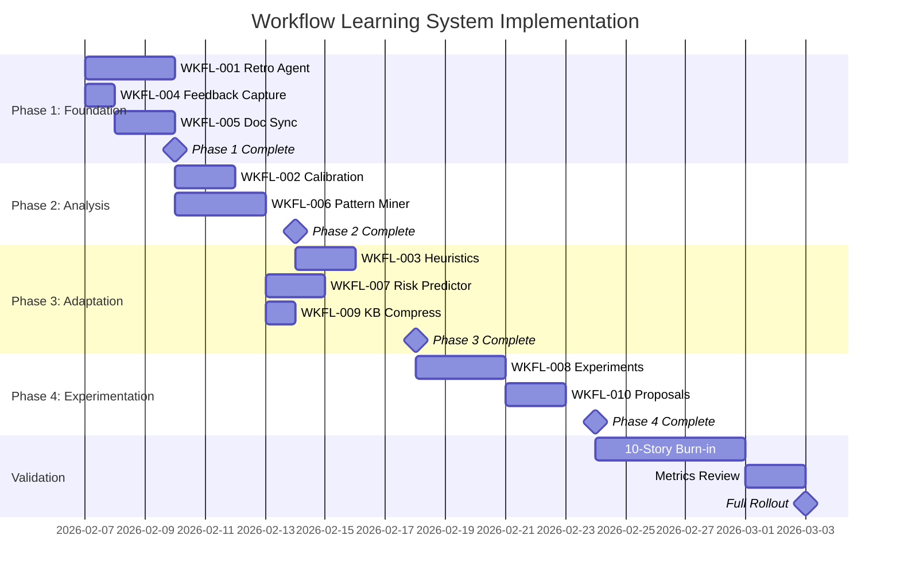
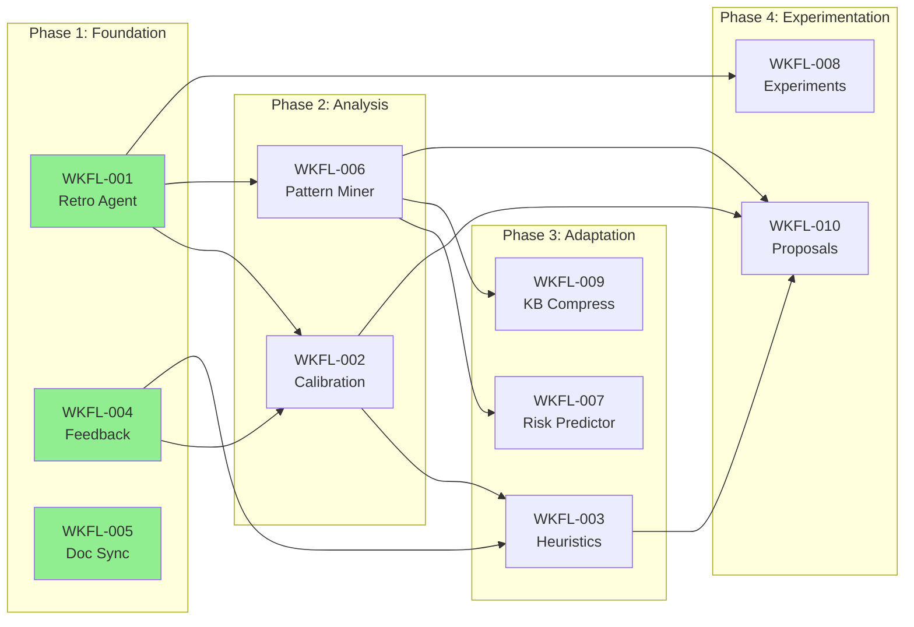

# WKFL Roadmap

## Visual Timeline



## Dependency Graph



## Phase Details

### Phase 1: Foundation (Days 1-4)

**Goal:** Establish consistent data capture for all learning.

| Story | Parallel? | Critical Path? |
|-------|-----------|----------------|
| WKFL-001 | Yes (with 004, 005) | Yes |
| WKFL-004 | Yes | No |
| WKFL-005 | Yes | No |

**Exit Criteria:**
- [ ] OUTCOME.yaml generated for every completed story
- [ ] `/feedback` command functional
- [ ] Doc sync running on file changes
- [ ] At least 3 stories completed with outcomes captured

**Risks:**
- OUTCOME schema may need iteration (mitigate: version from start)
- Feedback adoption may be low (mitigate: prompt after gate)

---

### Phase 2: Analysis (Days 5-8)

**Goal:** Start deriving insights from captured data.

| Story | Parallel? | Critical Path? |
|-------|-----------|----------------|
| WKFL-002 | Yes (with 006) | Yes |
| WKFL-006 | Yes | Yes |

**Exit Criteria:**
- [ ] First calibration report generated
- [ ] First pattern mining run completed
- [ ] At least 10 stories in outcome dataset
- [ ] Patterns KB category populated

**Dependencies:**
- Requires outcomes from Phase 1 (min 5-10 stories)
- Feedback data enhances calibration but not required

---

### Phase 3: Adaptation (Days 9-13)

**Goal:** System starts self-improving based on data.

| Story | Parallel? | Critical Path? |
|-------|-----------|----------------|
| WKFL-003 | No (needs 002) | No |
| WKFL-007 | Yes (needs 006) | No |
| WKFL-009 | Yes (needs 006) | No |

**Exit Criteria:**
- [ ] First heuristic adjustment proposed
- [ ] Risk predictions included in story generation
- [ ] KB compression run completed
- [ ] Agent hints injected into at least 2 agents

**Dependencies:**
- WKFL-003 needs calibration data from WKFL-002
- WKFL-007 needs patterns from WKFL-006

---

### Phase 4: Experimentation (Days 14-18)

**Goal:** Full learning flywheel active.

| Story | Parallel? | Critical Path? |
|-------|-----------|----------------|
| WKFL-008 | No (needs 001) | Yes |
| WKFL-010 | No (needs 008) | Yes |

**Exit Criteria:**
- [ ] First experiment defined and running
- [ ] First improvement proposal generated
- [ ] Proposal tracking in place
- [ ] Metrics dashboard functional

**Dependencies:**
- WKFL-008 needs outcome tracking from WKFL-001
- WKFL-010 aggregates from WKFL-002, WKFL-006

---

## Validation Period (Days 19-25)

### 10-Story Burn-in

Run the full learning system on 10 real stories:

| Story # | Learning Components Active | Expected Outputs |
|---------|---------------------------|------------------|
| 1-3 | Foundation only | Outcomes, feedback |
| 4-6 | + Analysis | Calibration, patterns |
| 7-9 | + Adaptation | Predictions, hints |
| 10 | + Experimentation | Proposals |

### Metrics Review

| Metric | Target | How to Measure |
|--------|--------|----------------|
| Outcome capture rate | 100% | Count OUTCOME.yaml files |
| Calibration accuracy (high) | >90% | CALIBRATION-*.yaml |
| Pattern discovery | 5+ patterns | PATTERNS-*.yaml |
| Prediction accuracy | >60% | Predicted vs actual |
| Proposal quality | 50%+ accepted | Proposal tracking |

---

## Rollout Strategy

### Gradual Enablement

```yaml
# Week 1: Foundation
enabled_components:
  - outcome_capture
  - feedback_command
  - doc_sync

# Week 2: Add Analysis
enabled_components:
  - outcome_capture
  - feedback_command
  - doc_sync
  - calibration        # NEW
  - pattern_miner      # NEW

# Week 3: Add Adaptation
enabled_components:
  - outcome_capture
  - feedback_command
  - doc_sync
  - calibration
  - pattern_miner
  - heuristic_evolver  # NEW
  - risk_predictor     # NEW
  - kb_compressor      # NEW

# Week 4: Full System
enabled_components:
  - all
```

### Rollback Triggers

| Condition | Action |
|-----------|--------|
| Gate pass rate drops >10% | Disable adaptation components |
| Proposal rejection >90% | Disable WKFL-010 |
| KB bloat >2x baseline | Disable writes, run compress |
| Calibration drift >20% | Reset thresholds to defaults |

---

## Success Milestones

| Milestone | Criteria | Target Date |
|-----------|----------|-------------|
| M1: Data Flowing | All 3 foundation components active | Day 4 |
| M2: Insights Appearing | First calibration + patterns | Day 8 |
| M3: Self-Improvement | First heuristic proposal | Day 13 |
| M4: Full Flywheel | Experiment + proposal pipeline | Day 18 |
| M5: Validated | 10 stories through system | Day 25 |
| M6: Production | Full confidence, no rollbacks | Day 30 |

---

## Resource Requirements

| Resource | Quantity | Notes |
|----------|----------|-------|
| Stories to process | 10-20 | For training and validation |
| KB storage | ~500 entries | Lessons, patterns, calibration |
| Agent runs | ~50/week | Retro, calibration, patterns |
| Token budget | ~200K/week | For learning agent runs |

---

## Post-Rollout

### Ongoing Operations

| Job | Frequency | Duration |
|-----|-----------|----------|
| Retro agent | Per story completion | 2-3 min |
| Calibration | Weekly | 5 min |
| Pattern mining | Weekly | 10 min |
| KB compression | Monthly | 5 min |
| Improvement proposals | Weekly | 10 min |

### Continuous Improvement

- Review proposals weekly
- Update agent hints from patterns
- Adjust thresholds from calibration
- Expand experiments based on proposals
