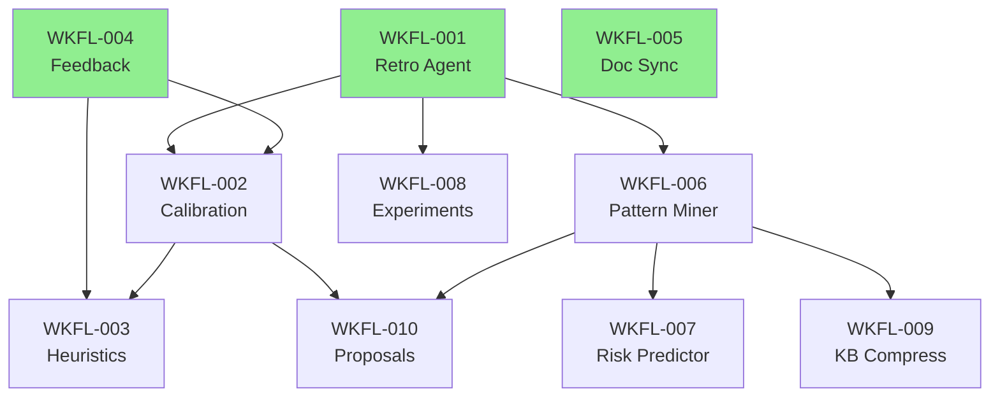

# WKFL Stories Index

## Progress Summary

| Status | Count |
|--------|-------|
| Pending | 4 |
| Created | 0 |
| In Elaboration | 0 |
| Ready to Work | 2 |
| In Progress | 0 |
| Ready for QA | 0 |
| In QA | 0 |
| In UAT | 1 |
| Completed | 2 |
| **Total** | **10** |

## Ready to Start (No Blockers)

(None - all available stories are in progress or UAT)

## Phase 1: Foundation

### WKFL-001: Meta-Learning Loop (Retro Agent)

**Status:** `completed`
**Priority:** P0 (Foundation)
**Dependencies:** None
**Blocks:** WKFL-002, WKFL-006, WKFL-008

**Description:**
Create a retrospective agent that runs after every story completion to analyze outcomes and propose workflow improvements.

**Scope:**
- Create `OUTCOME.yaml` schema and writer (captures all story metrics)
- Create `workflow-retro.agent.md` (sonnet) that analyzes outcomes
- Create `/workflow-retro` command (or auto-trigger on `/wt-finish`)
- Output: `RETRO-{story-id}.yaml` with analysis and proposals
- KB integration: Write significant findings via `kb_add_lesson`

**Key Deliverables:**
- `OUTCOME.yaml` schema in `.claude/schemas/outcome-schema.md` - COMPLETE
- Outcome writer integration in `dev-documentation-leader.agent.md` - COMPLETE
- `workflow-retro.agent.md` with analysis logic - COMPLETE
- `/workflow-retro` command - COMPLETE
- KB writes for patterns detected - COMPLETE
- `WORKFLOW-RECOMMENDATIONS.md` - COMPLETE

**Acceptance Criteria:**
- [x] Every completed story generates `OUTCOME.yaml`
- [x] Retro agent runs (manual or auto) after completion
- [x] Analysis compares estimated vs actual (tokens, cycles)
- [x] Repeated failure patterns are detected and logged to KB
- [x] Proposals are written to `WORKFLOW-RECOMMENDATIONS.md`

**Implementation Notes:**
- Implemented 2026-02-07
- See `PROOF-WKFL-001.md` for full verification details

---

### WKFL-004: Human Feedback Capture

**Status:** `completed`
**Priority:** P0 (Foundation)
**Dependencies:** None
**Blocks:** None (unblocked WKFL-002, WKFL-003)

**Description:**
Add `/feedback` command to capture explicit human judgment on agent findings, enabling calibration and heuristic improvement.

**Scope:**
- Create `/feedback` command with subcommands
- KB schema for feedback entries
- Integration with finding IDs from VERIFICATION.yaml

**Key Deliverables:**
- `.claude/commands/feedback.md`
- KB schema: `feedback` entry type
- Feedback aggregation queries

**Acceptance Criteria:**
- [x] `/feedback SEC-042 --false-positive "reason"` captures to KB
- [x] `/feedback ARCH-015 --helpful "note"` captures to KB
- [x] Feedback linked to agent, story, and finding
- [x] Queryable via `kb_search` with `tags: ["feedback"]`

**Verification Notes:**
- QA PASS: 2026-02-07T17:31:00Z
- All 5 acceptance criteria verified
- 38 tests passing (27 unit, 11 integration)
- Schema implementation complete at `src/__types__/index.ts`
- Command documentation complete at `.claude/commands/feedback.md`

---

### WKFL-005: Doc Sync Agent

**Status:** `uat`
**Priority:** P0 (Foundation)
**Dependencies:** None
**Blocks:** None
**Elaborated:** 2026-02-07 (PASS)
**Implemented:** 2026-02-07 (PASS)
**QA Verified:** 2026-02-07 (PASS)

**Description:**
Create an agent that automatically updates FULL_WORKFLOW.md when agents or commands change, preventing documentation drift.

**Scope:**
- Create `doc-sync.agent.md` (haiku) - COMPLETE
- File change detection for `.claude/agents/` and `.claude/commands/` - COMPLETE
- Mermaid diagram regeneration - COMPLETE
- Changelog entry drafting - COMPLETE

**Key Deliverables:**
- `doc-sync.agent.md` - COMPLETE (10KB, 340 lines, 7 phases)
- `/doc-sync` command - COMPLETE (7.6KB, comprehensive usage docs)
- `SYNC-REPORT.md` output format - COMPLETE (6 required sections)

**Acceptance Criteria (QA Verified):**
- [x] Adding new agent updates "Agents & Sub-Agents" sections
- [x] Mermaid diagrams regenerated on structure change
- [x] Changelog entry drafted with correct version bump
- [x] Reports what sections were updated
- [x] SYNC-REPORT.md shows all changes
- [x] Runs via command or pre-commit hook

**Verification Notes:**
- All 6/6 acceptance criteria PASS
- 100% functional coverage
- Architecture compliant
- Design quality: EXCELLENT
- Ready for production use

---

## Phase 2: Analysis

### WKFL-002: Confidence Calibration

**Status:** `ready-to-work`
**Priority:** P1 (Analysis)
**Dependencies:** WKFL-001
**Blocks:** WKFL-003, WKFL-010

**Description:**
Track stated confidence vs actual outcomes, compute calibration scores per agent, and auto-adjust confidence thresholds.

**Scope:**
- Create `confidence-calibrator.agent.md` (haiku)
- Schema for calibration entries in KB
- Weekly calibration job
- Threshold adjustment recommendations

**Key Deliverables:**
- Calibration tracking schema
- `confidence-calibrator.agent.md`
- `/calibration-report` command
- `CALIBRATION-{date}.yaml` output

**Acceptance Criteria:**
- [ ] Track: agent, finding, stated confidence, actual outcome
- [ ] Compute accuracy per agent per confidence level
- [ ] Alert when "high" accuracy drops below 90%
- [ ] Generate threshold adjustment recommendations
- [ ] Recommendations are actionable (specific threshold changes)

---

### WKFL-006: Cross-Story Pattern Mining

**Status:** `pending`
**Priority:** P1 (Analysis)
**Dependencies:** WKFL-001
**Blocks:** WKFL-007, WKFL-009, WKFL-010

**Description:**
Weekly job that mines patterns across all story outcomes to identify recurring issues, anti-patterns, and successful approaches.

**Scope:**
- Create `pattern-miner.agent.md` (sonnet)
- Query all OUTCOME.yaml and VERIFICATION.yaml from last N days
- Cluster similar findings
- Output distilled patterns

**Key Deliverables:**
- `pattern-miner.agent.md`
- `/pattern-mine` command (or weekly cron)
- `PATTERNS-{month}.yaml` output
- `ANTI-PATTERNS.md` for team reference
- `AGENT-HINTS.yaml` for injection into prompts

**Acceptance Criteria:**
- [ ] Analyze minimum 10 stories per mining run
- [ ] Identify file/path patterns that correlate with failures
- [ ] Identify AC patterns that correlate with under-specification
- [ ] Cluster similar findings (embedding similarity > 0.85)
- [ ] Output actionable patterns for agent enhancement

---

## Phase 3: Adaptation

### WKFL-003: Emergent Heuristic Discovery

**Status:** `ready-to-work`
**Priority:** P2 (Adaptation)
**Dependencies:** WKFL-002
**Blocks:** WKFL-010
**Elaborated:** 2026-02-07 (CONDITIONAL PASS)

**Description:**
Analyze decision outcomes to discover which patterns should be auto-accepted vs escalated, evolving autonomy tiers based on data.

**Scope:**
- Create `heuristic-evolver.agent.md` (sonnet)
- Track auto-accept success rate per pattern
- Generate tier promotion/demotion proposals
- Safe rollout mechanism

**Key Deliverables:**
- Decision outcome tracking schema
- `heuristic-evolver.agent.md`
- Tier adjustment proposals in `HEURISTIC-PROPOSALS.yaml`
- Integration with `.claude/config/decision-classification.yaml`

**Acceptance Criteria:**
- [ ] Track: pattern, auto_accepted, user_outcome (confirmed/overridden)
- [ ] Compute success rate per pattern (min 5 samples)
- [ ] Propose promotion when success rate > 95%
- [ ] Propose demotion when success rate < 80%
- [ ] All changes are proposals, not auto-applied

---

### WKFL-007: Story Risk Predictor

**Status:** `pending`
**Priority:** P2 (Adaptation)
**Dependencies:** WKFL-006
**Blocks:** None

**Description:**
Before elaboration, predict story risk (split likelihood, review cycles, token cost) based on historical patterns.

**Scope:**
- Create `risk-predictor.agent.md` (haiku)
- Feature extraction from story (AC count, scope, similar stories)
- Prediction model (heuristic-based initially)
- Integration with `/pm-story generate` output

**Key Deliverables:**
- `risk-predictor.agent.md`
- Prediction schema in story output
- Similar story finder (KB query)

**Acceptance Criteria:**
- [ ] Predict split_risk (0-1) based on AC count and scope
- [ ] Predict review_cycles based on complexity signals
- [ ] Predict token_estimate based on similar stories
- [ ] Include similar_stories array for reference
- [ ] Accuracy tracked for model improvement

---

### WKFL-009: Knowledge Compressor

**Status:** `pending`
**Priority:** P2 (Adaptation)
**Dependencies:** WKFL-006
**Blocks:** None

**Description:**
Monthly job to cluster, deduplicate, and compress KB entries, maintaining a high-signal knowledge base.

**Scope:**
- Create `kb-compressor.agent.md` (haiku)
- Embedding-based clustering (similarity > 0.9)
- Merge into canonical entries
- Archive originals with pointers

**Key Deliverables:**
- `kb-compressor.agent.md`
- `/kb-compress` command (or monthly cron)
- Compression report with before/after stats

**Acceptance Criteria:**
- [ ] Cluster similar lessons (embedding similarity > 0.9)
- [ ] Merge clusters into canonical lessons
- [ ] Archive originals with pointer to canonical
- [ ] Report: entries before, after, token savings
- [ ] No loss of unique information

---

## Phase 4: Experimentation

### WKFL-008: Workflow Experimentation Framework

**Status:** `pending`
**Priority:** P3 (Experimentation)
**Dependencies:** WKFL-001
**Blocks:** None

**Description:**
A/B test workflow variations (fast-track, parallel review, etc.) with metrics tracking and controlled rollout.

**Scope:**
- Create experiments config schema
- Create `experiment-analyzer.agent.md` (sonnet)
- Traffic routing mechanism
- Metric comparison and winner detection

**Key Deliverables:**
- `.claude/config/experiments.yaml` schema
- `experiment-analyzer.agent.md`
- `/experiment-report` command
- Rollout mechanism for winners

**Acceptance Criteria:**
- [ ] Define experiments with traffic split (e.g., 20%)
- [ ] Tag stories with experiment variant
- [ ] Track metrics per variant (gate_pass_rate, cycle_time, etc.)
- [ ] Statistical comparison (min 10 stories per variant)
- [ ] Generate rollout recommendation

---

### WKFL-010: Improvement Proposal Generator

**Status:** `pending`
**Priority:** P3 (Experimentation)
**Dependencies:** WKFL-006, WKFL-002
**Blocks:** None

**Description:**
Weekly proactive analysis that generates actionable improvement proposals based on all learning system outputs.

**Scope:**
- Create `improvement-proposer.agent.md` (sonnet)
- Aggregate inputs from calibration, patterns, experiments
- Generate prioritized proposals
- Track proposal outcomes

**Key Deliverables:**
- `improvement-proposer.agent.md`
- `/improvement-proposals` command
- `IMPROVEMENT-PROPOSALS-{date}.md` output

**Acceptance Criteria:**
- [ ] Analyze: calibration gaps, pattern anti-patterns, experiment results
- [ ] Generate proposals with effort/impact ratings
- [ ] Prioritize by impact/effort ratio
- [ ] Track: proposed, accepted, rejected, implemented
- [ ] Learn from acceptance patterns to improve proposals

---

## Dependency Graph

Legend: Green = No dependencies (ready to start)

---

## Execution Plan

### Sprint 1: Foundation
- **WKFL-001** (Retro Agent) - 2-3 days
- **WKFL-004** (Feedback) - 1 day
- **WKFL-005** (Doc Sync) - 1-2 days

### Sprint 2: Analysis
- **WKFL-002** (Calibration) - 2 days
- **WKFL-006** (Pattern Miner) - 2-3 days

### Sprint 3: Adaptation
- **WKFL-003** (Heuristics) - 2 days
- **WKFL-007** (Risk Predictor) - 1-2 days
- **WKFL-009** (KB Compress) - 1 day

### Sprint 4: Experimentation
- **WKFL-008** (Experiments) - 3 days
- **WKFL-010** (Proposals) - 2 days

**Total estimated effort:** ~4 sprints / 2-3 weeks
