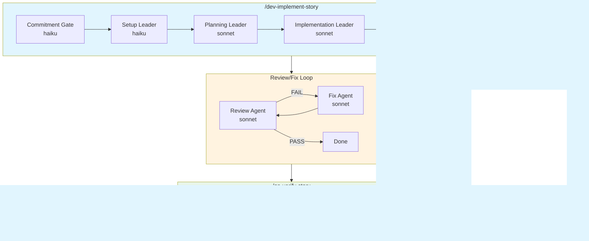

# Dev → Review → QA Workflow Redesign

**Date**: 2026-02-01
**Purpose**: Propose evidence-first architecture with token savings rationale.

---

## 1. Design Goals

| Goal | Metric | Target |
|------|--------|--------|
| Reduce token usage | Tokens per story | -40% (~120k savings) |
| Minimize re-reads | Story file reads | 3 max (was 15+) |
| Enable deterministic resume | Artifact coverage | 100% phases |
| Evidence-first verification | EVIDENCE.yaml usage | Review + QA rely on it |

---

## 2. Before/After Architecture

### BEFORE: Current Flow



**Problems:**
- Each agent reads story file independently (~7k tokens × 15 = 105k)
- No shared artifact for what was done
- Review/QA re-discover implementation details
- No structured resume mechanism

### AFTER: Evidence-First Flow


**Improvements:**
- EVIDENCE.yaml is the single source of truth
- Story file read only in Setup + Planning (2 reads)
- Review/QA read EVIDENCE.yaml, not story
- All phases have deterministic resume via CHECKPOINT.yaml

---

## 3. New Phase Boundaries

### /dev-implement-story Phases

| Phase | Leader | Model | Reads | Writes | Signal |
|-------|--------|-------|-------|--------|--------|
| 0 | `dev-setup-leader` | haiku | Story frontmatter only | CHECKPOINT.yaml, SCOPE.yaml | SETUP COMPLETE |
| 1 | `dev-plan-leader` | sonnet | Story ACs, SCOPE.yaml, KB | PLAN.yaml, KNOWLEDGE-CONTEXT.yaml | PLANNING COMPLETE |
| 2 | `dev-execute-leader` | sonnet | PLAN.yaml, KNOWLEDGE-CONTEXT.yaml | EVIDENCE.yaml, code changes | EXECUTION COMPLETE |
| 3 | `dev-proof-leader` | haiku | EVIDENCE.yaml only | PROOF-{STORY}.md | PROOF COMPLETE |

**Token Savings:**
- Phase 0: Story frontmatter (~500 tokens) vs full story (~7,000) = **6,500 saved**
- Phase 2: PLAN.yaml (~1,000) vs story+plan (~12,000) = **11,000 saved**
- Phase 3: EVIDENCE.yaml (~2,000) vs story+logs (~15,000) = **13,000 saved**

### /dev-code-review Phases

| Phase | Leader | Model | Reads | Writes | Signal |
|-------|--------|-------|-------|--------|--------|
| 0 | `review-setup-leader` | haiku | EVIDENCE.yaml, SCOPE.yaml | Worker selection | SETUP COMPLETE |
| 1 | `review-workers` (parallel) | haiku | Touched files only | Worker YAML outputs | REVIEWS COMPLETE |
| 2 | `review-aggregate-leader` | haiku | Worker outputs | REVIEW.yaml | REVIEW PASS/FAIL |

**Token Savings:**
- Workers use haiku (was sonnet) = **~50% cost reduction**
- Workers read touched files list from EVIDENCE.yaml, not logs
- Selective worker spawning based on SCOPE.yaml

### /qa-verify-story Phases

| Phase | Leader | Model | Reads | Writes | Signal |
|-------|--------|-------|-------|--------|--------|
| 0 | `qa-verify-setup-leader` | haiku | EVIDENCE.yaml, REVIEW.yaml | Precondition check | SETUP COMPLETE |
| 1 | `qa-verify-verification-leader` | sonnet | EVIDENCE.yaml, KNOWLEDGE-CONTEXT.yaml | QA-VERIFY.yaml | VERIFICATION COMPLETE |
| 2 | `qa-verify-completion-leader` | haiku | QA-VERIFY.yaml | Status update, KB write | QA PASS/FAIL |

**Token Savings:**
- Phase 1: EVIDENCE.yaml (~2,000) vs story+proof+logs (~20,000) = **18,000 saved**
- Only opens detailed files when EVIDENCE shows MISSING status

---

## 4. New Artifact Contracts

### CHECKPOINT.yaml

```yaml
schema: 1
story_id: "{STORY_ID}"
feature_dir: "{FEATURE_DIR}"
timestamp: "2026-02-01T10:00:00Z"

current_phase: setup | plan | execute | proof | review | qa
last_successful_phase: null | setup | plan | execute | proof | review
iteration: 0  # review/fix iteration

resume_hints:
  skip_phases: []
  partial_state: {}
```

### SCOPE.yaml

```yaml
schema: 1
story_id: "{STORY_ID}"

touches:
  backend: true
  frontend: false
  packages: true
  db: false
  contracts: false
  ui: false

touched_paths_globs:
  - "packages/backend/**"
  - "apps/api/**"

risk_flags:
  auth: false
  payments: false
  migrations: false
  external_apis: false
```

### PLAN.yaml

```yaml
schema: 1
story_id: "{STORY_ID}"
timestamp: "2026-02-01T10:00:00Z"

steps:
  - id: 1
    description: "Create core function"
    files: ["packages/backend/*/src/function.ts"]
  - id: 2
    description: "Add handler"
    files: ["apps/api/*/handlers/endpoint.ts"]

files_to_change:
  - path: "packages/backend/*/src/function.ts"
    action: create
  - path: "apps/api/*/handlers/endpoint.ts"
    action: create

commands_to_run:
  - command: "pnpm build"
    when: "after all code changes"
  - command: "pnpm test"
    when: "after all code changes"

acceptance_criteria_map:
  - ac_id: "AC1"
    planned_evidence: "Unit test: function.test.ts"
  - ac_id: "AC2"
    planned_evidence: "HTTP test: endpoint.http"
```

### KNOWLEDGE-CONTEXT.yaml

```yaml
schema: 1
story_id: "{STORY_ID}"
timestamp: "2026-02-01T10:00:00Z"

lessons_applied:
  - story: "STORY-016"
    lesson: "Write tests alongside implementation"
    applies_because: "Backend story with multiple functions"

adrs_checked:
  - id: "ADR-001"
    constraint: "API paths: /api/v2/{domain}"
    applies: true

attack_vectors:
  - "API path mismatch between frontend/backend"

do_not_repeat:
  - "Skipping tests until final verification"
```

### EVIDENCE.yaml (Single Source of Truth)

```yaml
schema: 1
story_id: "{STORY_ID}"
version: 1
timestamp: "2026-02-01T10:00:00Z"

acceptance_criteria:
  - ac_id: "AC1"
    status: PASS
    evidence_items:
      - type: test
        path: "packages/backend/*/src/__tests__/function.test.ts"
        description: "Unit tests pass"
      - type: command
        command: "pnpm test --filter @repo/package"
        result: "PASS"

  - ac_id: "AC2"
    status: MISSING
    evidence_items: []
    reason: "HTTP test not yet created"

touched_files:
  - path: "packages/backend/*/src/function.ts"
    action: created
    lines: 45
  - path: "apps/api/*/handlers/endpoint.ts"
    action: created
    lines: 32

commands_run:
  - command: "pnpm build"
    result: "SUCCESS"
    timestamp: "2026-02-01T10:05:00Z"
  - command: "pnpm test"
    result: "SUCCESS"
    timestamp: "2026-02-01T10:06:00Z"

endpoints_exercised:
  - method: "GET"
    path: "/api/v2/resource"
    status: 200

notable_decisions:
  - "Used existing pattern from @repo/gallery-core"

known_deviations:
  - "Skipped OpenSearch indexing per story non-goals"

token_summary:
  setup: { in: 1500, out: 800 }
  plan: { in: 8000, out: 3000 }
  execute: { in: 25000, out: 15000 }
  proof: { in: 3000, out: 2000 }
```

### REVIEW.yaml

```yaml
schema: 1
story_id: "{STORY_ID}"
timestamp: "2026-02-01T10:00:00Z"
iteration: 1

verdict: PASS | FAIL

workers_run: [lint, style, syntax, security, typecheck, build]
workers_skipped: []

ranked_patches:
  - priority: 1
    file: "packages/backend/*/src/function.ts"
    issue: "Unused import"
    severity: low
    auto_fixable: true

findings:
  lint:
    verdict: PASS
    errors: 0
  style:
    verdict: PASS
    violations: 0
  syntax:
    verdict: PASS
    blocking: 0
  security:
    verdict: PASS
    critical: 0
  typecheck:
    verdict: PASS
    errors: 0
  build:
    verdict: PASS
    errors: 0
```

### QA-VERIFY.yaml

```yaml
schema: 1
story_id: "{STORY_ID}"
timestamp: "2026-02-01T10:00:00Z"

verdict: PASS | FAIL

tests_executed: true
test_results:
  unit: { pass: 24, fail: 0 }
  integration: { pass: 0, fail: 0 }
  e2e: { pass: 0, fail: 0 }
  http: { pass: 12, fail: 0 }

coverage: 96.5
coverage_meets_threshold: true

acs_verified:
  - ac_id: "AC1"
    status: PASS
    evidence_ref: "EVIDENCE.yaml:acceptance_criteria[0]"
  - ac_id: "AC2"
    status: PASS
    evidence_ref: "EVIDENCE.yaml:acceptance_criteria[1]"

architecture_compliant: true

issues: []
```

---

## 5. Agent Mapping: Before → After

### Agents to Keep (Modify)

| Current Agent | New Agent | Changes |
|--------------|-----------|---------|
| `dev-setup-leader` | `dev-setup-leader` | Output YAML, read frontmatter only |
| `qa-verify-verification-leader` | `qa-verify-verification-leader` | Read EVIDENCE.yaml first |
| `qa-verify-completion-leader` | `qa-verify-completion-leader` | Trigger KB write-back |
| `knowledge-context-loader` | `knowledge-context-loader` | Output KNOWLEDGE-CONTEXT.yaml |
| `kb-writer` | `kb-writer` | Called by QA completion |

### Agents to Merge/Replace

| Current Agent(s) | New Agent | Rationale |
|-----------------|-----------|-----------|
| `dev-implement-planning-leader` + workers | `dev-plan-leader` | Single leader outputs PLAN.yaml |
| `dev-implement-implementation-leader` + coders | `dev-execute-leader` | Orchestrates slice coders, merges to EVIDENCE.yaml |
| `dev-documentation-leader` | `dev-proof-leader` | Generates PROOF from EVIDENCE.yaml only |
| `commitment-gate-agent` | Removed | Gate check moved to setup leader |

### Agents to Create

| New Agent | Purpose | Model |
|-----------|---------|-------|
| `dev-plan-leader` | Generate PLAN.yaml with knowledge context | sonnet |
| `dev-execute-leader` | Orchestrate coders, produce EVIDENCE.yaml | sonnet |
| `dev-proof-leader` | Generate PROOF from EVIDENCE.yaml | haiku |
| `review-setup-leader` | Diff-aware worker selection | haiku |
| `review-aggregate-leader` | Merge worker outputs to REVIEW.yaml | haiku |

### Review Workers → Haiku + YAML-Only

| Current | Model | Change |
|---------|-------|--------|
| `code-review-lint` | sonnet | → haiku, YAML output |
| `code-review-style-compliance` | sonnet | → haiku, YAML output |
| `code-review-syntax` | sonnet | → haiku, YAML output |
| `code-review-security` | sonnet | → haiku, YAML output |
| `code-review-typecheck` | sonnet | → haiku, YAML output |
| `code-review-build` | sonnet | → haiku, YAML output |

---

## 6. Migration Plan

### Phase 1: Schema Introduction (Non-Breaking)

1. Create new Zod schemas in `packages/backend/orchestrator/`:
   - `CHECKPOINT.yaml` schema
   - `SCOPE.yaml` schema
   - `PLAN.yaml` schema
   - `KNOWLEDGE-CONTEXT.yaml` schema
   - `EVIDENCE.yaml` schema
   - `REVIEW.yaml` schema
   - `QA-VERIFY.yaml` schema

2. Update `knowledge-context-loader` to output `KNOWLEDGE-CONTEXT.yaml`

3. **No command changes yet** - existing workflow continues to work

### Phase 2: Dev Implementation Refactor

1. Create new phase leaders:
   - `dev-plan-leader.agent.md` (replaces planning-leader + workers)
   - `dev-execute-leader.agent.md` (replaces implementation-leader + coders)
   - `dev-proof-leader.agent.md` (replaces documentation-leader)

2. Update `dev-setup-leader`:
   - Output CHECKPOINT.yaml + SCOPE.yaml
   - Read only story frontmatter

3. Modify `/dev-implement-story.md`:
   - Use new phase leaders
   - Pass artifacts between phases

4. **Keep old agents until new ones validated**

### Phase 3: Code Review Refactor

1. Create new leaders:
   - `review-setup-leader.agent.md`
   - `review-aggregate-leader.agent.md`

2. Update review workers:
   - Change model to haiku
   - Output YAML only
   - Read touched files from EVIDENCE.yaml

3. Modify `/dev-code-review.md`:
   - Use new phase structure
   - Output REVIEW.yaml

### Phase 4: QA Verify Refactor

1. Update `qa-verify-setup-leader`:
   - Read EVIDENCE.yaml + REVIEW.yaml

2. Update `qa-verify-verification-leader`:
   - Evidence-first AC verification
   - Use KNOWLEDGE-CONTEXT.yaml for edge cases

3. Update `qa-verify-completion-leader`:
   - Trigger KB write-back
   - Output QA-VERIFY.yaml

4. Modify `/qa-verify-story.md`:
   - Use evidence-first flow

### Phase 5: Integration Testing

1. Run full workflow on test story:
   - `/dev-implement-story` → `/qa-verify-story`

2. Validate token savings:
   - Compare before/after token logs

3. Validate resume works:
   - Interrupt at each phase, resume from checkpoint

### Phase 6: Cleanup

1. Archive old agents to `_archive/`
2. Remove duplicate code paths
3. Update documentation

---

## 7. Decision Log

| Decision | Rationale (Token Savings) |
|----------|---------------------------|
| EVIDENCE.yaml as single source | Review/QA read 2k tokens vs 20k+ |
| Haiku for review workers | 50% cost reduction, sufficient for checks |
| Story frontmatter only in setup | 6,500 tokens saved per story |
| KNOWLEDGE-CONTEXT.yaml persisted | Avoid 3-5 KB queries per story |
| PLAN.yaml instead of IMPLEMENTATION-PLAN.md | Structured, machine-readable |
| Merge commitment gate into setup | Avoid separate agent spawn |
| Remove plan-validator worker | Inline validation in plan leader |

---

## 8. Risk Mitigation

| Risk | Mitigation |
|------|------------|
| New artifacts break existing stories | Schema versioning, backward compat |
| Review workers too weak with haiku | Monitor quality, escalate if needed |
| Evidence bundle too verbose | Cap at 5KB, reference files don't inline |
| Migration breaks active stories | Keep old agents during transition |
| KB unavailable | Silent fallback in knowledge-context-loader |

---

## 9. Success Metrics

| Metric | Current | Target | Measurement |
|--------|---------|--------|-------------|
| Story file reads | 15+ | 3 | Count in token logs |
| Tokens per story | ~300k | ~180k | TOKEN-SUMMARY.md |
| Review/fix iterations | 3 avg | 2 avg | CHECKPOINT.yaml |
| Resume success rate | ~70% | ~95% | Manual tracking |
| QA verify time | High | -30% | Elapsed time |
